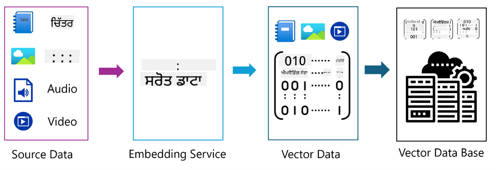
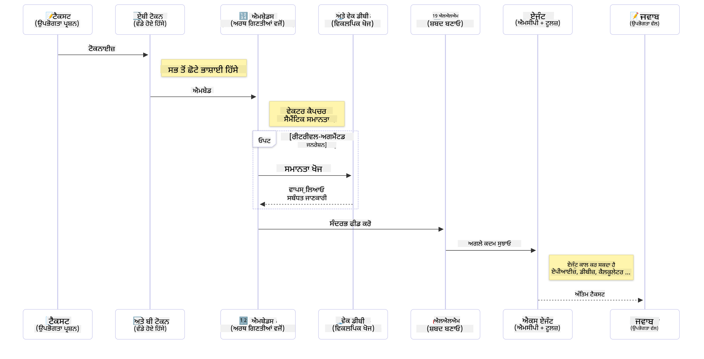

<!--
CO_OP_TRANSLATOR_METADATA:
{
  "original_hash": "75bfb080ca725e8a9aa9c80cae25fba1",
  "translation_date": "2025-07-29T08:56:00+00:00",
  "source_file": "01-IntroToGenAI/README.md",
  "language_code": "pa"
}
-->
# ਜਨਰੇਟਿਵ AI - ਜਾਵਾ ਐਡੀਸ਼ਨ ਦਾ ਪਰਚੇ

## ਤੁਸੀਂ ਕੀ ਸਿੱਖੋਗੇ

- **ਜਨਰੇਟਿਵ AI ਦੇ ਮੁੱਢਲੇ ਸਿਧਾਂਤ**, ਜਿਸ ਵਿੱਚ LLMs, ਪ੍ਰੌੰਪਟ ਇੰਜੀਨੀਅਰਿੰਗ, ਟੋਕਨ, ਐਮਬੈਡਿੰਗ ਅਤੇ ਵੈਕਟਰ ਡੇਟਾਬੇਸ ਸ਼ਾਮਲ ਹਨ  
- **ਜਾਵਾ AI ਵਿਕਾਸ ਟੂਲਾਂ ਦੀ ਤੁਲਨਾ**, ਜਿਸ ਵਿੱਚ Azure OpenAI SDK, Spring AI, ਅਤੇ OpenAI Java SDK ਸ਼ਾਮਲ ਹਨ  
- **ਮਾਡਲ ਕਾਂਟੈਕਸਟ ਪ੍ਰੋਟੋਕੋਲ** ਅਤੇ AI ਏਜੰਟ ਕਮਿਊਨਿਕੇਸ਼ਨ ਵਿੱਚ ਇਸ ਦੀ ਭੂਮਿਕਾ ਦੀ ਖੋਜ  

## ਸਮੱਗਰੀ ਦੀ ਸੂਚੀ

- [ਪ੍ਰਸਤਾਵਨਾ](../../../01-IntroToGenAI)  
- [ਜਨਰੇਟਿਵ AI ਸੰਕਲਪਾਂ 'ਤੇ ਇੱਕ ਛੋਟਾ ਰੀਫ੍ਰੈਸ਼](../../../01-IntroToGenAI)  
- [ਪ੍ਰੌੰਪਟ ਇੰਜੀਨੀਅਰਿੰਗ ਸਮੀਖਿਆ](../../../01-IntroToGenAI)  
- [ਟੋਕਨ, ਐਮਬੈਡਿੰਗ ਅਤੇ ਏਜੰਟ](../../../01-IntroToGenAI)  
- [ਜਾਵਾ ਲਈ AI ਵਿਕਾਸ ਟੂਲ ਅਤੇ ਲਾਇਬ੍ਰੇਰੀਆਂ](../../../01-IntroToGenAI)  
  - [OpenAI Java SDK](../../../01-IntroToGenAI)  
  - [Spring AI](../../../01-IntroToGenAI)  
  - [Azure OpenAI Java SDK](../../../01-IntroToGenAI)  
- [ਸੰਖੇਪ](../../../01-IntroToGenAI)  
- [ਅਗਲੇ ਕਦਮ](../../../01-IntroToGenAI)  

## ਪ੍ਰਸਤਾਵਨਾ

ਜਨਰੇਟਿਵ AI ਫਾਰ ਬਿਗਿਨਰਜ਼ - ਜਾਵਾ ਐਡੀਸ਼ਨ ਦੇ ਪਹਿਲੇ ਅਧਿਆਇ ਵਿੱਚ ਤੁਹਾਡਾ ਸਵਾਗਤ ਹੈ! ਇਹ ਬੁਨਿਆਦੀ ਪਾਠ ਤੁਹਾਨੂੰ ਜਨਰੇਟਿਵ AI ਦੇ ਮੁੱਖ ਸੰਕਲਪਾਂ ਅਤੇ ਜਾਵਾ ਦੀ ਵਰਤੋਂ ਕਰਕੇ ਇਨ੍ਹਾਂ ਨਾਲ ਕੰਮ ਕਰਨ ਦੇ ਤਰੀਕੇ ਨਾਲ ਜਾਣੂ ਕਰਵਾਉਂਦਾ ਹੈ। ਤੁਸੀਂ AI ਐਪਲੀਕੇਸ਼ਨ ਦੇ ਅਹਿਮ ਹਿੱਸਿਆਂ ਬਾਰੇ ਸਿੱਖੋਗੇ, ਜਿਸ ਵਿੱਚ ਲਾਰਜ ਲੈਂਗਵੇਜ ਮਾਡਲ (LLMs), ਟੋਕਨ, ਐਮਬੈਡਿੰਗ ਅਤੇ AI ਏਜੰਟ ਸ਼ਾਮਲ ਹਨ। ਅਸੀਂ ਇਸ ਕੋਰਸ ਦੌਰਾਨ ਵਰਤਣ ਵਾਲੇ ਜਾਵਾ ਟੂਲਿੰਗ ਦੀ ਵੀ ਖੋਜ ਕਰਾਂਗੇ।  

### ਜਨਰੇਟਿਵ AI ਸੰਕਲਪਾਂ 'ਤੇ ਇੱਕ ਛੋਟਾ ਰੀਫ੍ਰੈਸ਼

ਜਨਰੇਟਿਵ AI ਇੱਕ ਕਿਸਮ ਦੀ ਕ੍ਰਿਤ੍ਰਿਮ ਬੁੱਧੀ ਹੈ ਜੋ ਡਾਟਾ ਤੋਂ ਸਿੱਖੇ ਪੈਟਰਨ ਅਤੇ ਸੰਬੰਧਾਂ ਦੇ ਆਧਾਰ 'ਤੇ ਨਵਾਂ ਸਮੱਗਰੀ ਬਣਾਉਂਦੀ ਹੈ, ਜਿਵੇਂ ਕਿ ਟੈਕਸਟ, ਚਿੱਤਰ ਜਾਂ ਕੋਡ। ਜਨਰੇਟਿਵ AI ਮਾਡਲ ਮਨੁੱਖੀ ਜਿਵੇਂ ਜਵਾਬ ਦੇਣ, ਸੰਦਰਭ ਨੂੰ ਸਮਝਣ ਅਤੇ ਕਈ ਵਾਰ ਮਨੁੱਖੀ ਜਿਵੇਂ ਲੱਗਣ ਵਾਲੀ ਸਮੱਗਰੀ ਬਣਾਉਣ ਦੀ ਸਮਰੱਥਾ ਰੱਖਦੇ ਹਨ।  

ਜਦੋਂ ਤੁਸੀਂ ਆਪਣੀਆਂ ਜਾਵਾ AI ਐਪਲੀਕੇਸ਼ਨ ਵਿਕਸਿਤ ਕਰਦੇ ਹੋ, ਤਾਂ ਤੁਸੀਂ **ਜਨਰੇਟਿਵ AI ਮਾਡਲਾਂ** ਨਾਲ ਕੰਮ ਕਰਕੇ ਸਮੱਗਰੀ ਬਣਾਉਂਦੇ ਹੋ। ਜਨਰੇਟਿਵ AI ਮਾਡਲਾਂ ਦੀਆਂ ਕੁਝ ਸਮਰੱਥਾਵਾਂ ਵਿੱਚ ਸ਼ਾਮਲ ਹਨ:  

- **ਟੈਕਸਟ ਜਨਰੇਸ਼ਨ**: ਚੈਟਬੋਟ, ਸਮੱਗਰੀ ਅਤੇ ਟੈਕਸਟ ਪੂਰਨਤਾ ਲਈ ਮਨੁੱਖੀ ਜਿਵੇਂ ਟੈਕਸਟ ਬਣਾਉਣਾ।  
- **ਚਿੱਤਰ ਜਨਰੇਸ਼ਨ ਅਤੇ ਵਿਸ਼ਲੇਸ਼ਣ**: ਹਕੀਕਤੀ ਚਿੱਤਰ ਬਣਾਉਣਾ, ਫੋਟੋਆਂ ਨੂੰ ਸੁਧਾਰਨਾ ਅਤੇ ਵਸਤੂਆਂ ਦੀ ਪਛਾਣ ਕਰਨਾ।  
- **ਕੋਡ ਜਨਰੇਸ਼ਨ**: ਕੋਡ ਸਨਿੱਪਟ ਜਾਂ ਸਕ੍ਰਿਪਟ ਲਿਖਣਾ।  

ਕਈ ਵਾਰ, ਵੱਖ-ਵੱਖ ਕੰਮਾਂ ਲਈ ਅਨੁਕੂਲ ਮਾਡਲਾਂ ਦੀ ਵਰਤੋਂ ਕੀਤੀ ਜਾਂਦੀ ਹੈ। ਉਦਾਹਰਣ ਲਈ, **ਸਮਾਲ ਲੈਂਗਵੇਜ ਮਾਡਲ (SLMs)** ਅਤੇ **ਲਾਰਜ ਲੈਂਗਵੇਜ ਮਾਡਲ (LLMs)** ਦੋਵੇਂ ਟੈਕਸਟ ਜਨਰੇਸ਼ਨ ਨੂੰ ਸੰਭਾਲ ਸਕਦੇ ਹਨ, ਜਦੋਂ ਕਿ LLMs ਆਮ ਤੌਰ 'ਤੇ ਜਟਿਲ ਕੰਮਾਂ ਲਈ ਬਿਹਤਰ ਪ੍ਰਦਰਸ਼ਨ ਦਿੰਦੇ ਹਨ। ਚਿੱਤਰ-ਸਬੰਧੀ ਕੰਮਾਂ ਲਈ, ਤੁਸੀਂ ਵਿਸ਼ੇਸ਼ ਵਿਜ਼ਨ ਮਾਡਲ ਜਾਂ ਮਲਟੀ-ਮੋਡਲ ਮਾਡਲਾਂ ਦੀ ਵਰਤੋਂ ਕਰਦੇ ਹੋ।  

  

ਹਾਲਾਂਕਿ, ਇਹ ਮਾਡਲ ਹਮੇਸ਼ਾ ਸਹੀ ਜਵਾਬ ਨਹੀਂ ਦਿੰਦੇ। ਤੁਸੀਂ ਸ਼ਾਇਦ ਸੁਣਿਆ ਹੋਵੇਗਾ ਕਿ ਮਾਡਲ "ਹੈਲੂਸੀਨੇਟ" ਕਰਦੇ ਹਨ ਜਾਂ ਗਲਤ ਜਾਣਕਾਰੀ ਨੂੰ ਅਧਿਕਾਰਤ ਢੰਗ ਨਾਲ ਪੇਸ਼ ਕਰਦੇ ਹਨ। ਪਰ ਤੁਸੀਂ ਮਾਡਲ ਨੂੰ ਸਪਸ਼ਟ ਹਦਾਇਤਾਂ ਅਤੇ ਸੰਦਰਭ ਦੇ ਕੇ ਬਿਹਤਰ ਜਵਾਬ ਜਨਰੇਟ ਕਰਨ ਵਿੱਚ ਮਦਦ ਕਰ ਸਕਦੇ ਹੋ। ਇਹ **ਪ੍ਰੌੰਪਟ ਇੰਜੀਨੀਅਰਿੰਗ** ਦੇ ਜ਼ਰੀਏ ਸੰਭਵ ਹੈ।  

#### ਪ੍ਰੌੰਪਟ ਇੰਜੀਨੀਅਰਿੰਗ ਸਮੀਖਿਆ

ਪ੍ਰੌੰਪਟ ਇੰਜੀਨੀਅਰਿੰਗ ਮਾਡਲਾਂ ਨੂੰ ਚਾਹੇ ਗਏ ਨਤੀਜਿਆਂ ਵੱਲ ਦਿਸ਼ਾ ਦੇਣ ਲਈ ਪ੍ਰਭਾਵਸ਼ਾਲੀ ਇਨਪੁਟ ਡਿਜ਼ਾਈਨ ਕਰਨ ਦੀ ਪ੍ਰਕਿਰਿਆ ਹੈ। ਇਸ ਵਿੱਚ ਸ਼ਾਮਲ ਹੈ:  

- **ਸਪਸ਼ਟਤਾ**: ਹਦਾਇਤਾਂ ਨੂੰ ਸਪਸ਼ਟ ਅਤੇ ਅਸੰਭਾਵਿਤ ਬਣਾਉਣਾ।  
- **ਸੰਦਰਭ**: ਜ਼ਰੂਰੀ ਪਿਛੋਕੜ ਜਾਣਕਾਰੀ ਪ੍ਰਦਾਨ ਕਰਨਾ।  
- **ਪਾਬੰਦੀਆਂ**: ਕੋਈ ਵੀ ਸੀਮਾਵਾਂ ਜਾਂ ਫਾਰਮੈਟ ਨਿਰਧਾਰਤ ਕਰਨਾ।  

ਪ੍ਰੌੰਪਟ ਇੰਜੀਨੀਅਰਿੰਗ ਲਈ ਕੁਝ ਬਿਹਤਰ ਅਭਿਆਸਾਂ ਵਿੱਚ ਪ੍ਰੌੰਪਟ ਡਿਜ਼ਾਈਨ, ਸਪਸ਼ਟ ਹਦਾਇਤਾਂ, ਕੰਮ ਦੀ ਵਿਵਰਣ, ਇੱਕ-ਸ਼ਾਟ ਅਤੇ ਕੁਝ-ਸ਼ਾਟ ਲਰਨਿੰਗ, ਅਤੇ ਪ੍ਰੌੰਪਟ ਟਿਊਨਿੰਗ ਸ਼ਾਮਲ ਹਨ। ਵੱਖ-ਵੱਖ ਪ੍ਰੌੰਪਟਾਂ ਦੀ ਜਾਂਚ ਕਰਨਾ ਤੁਹਾਡੇ ਵਿਸ਼ੇਸ਼ ਉਪਯੋਗਤਾ ਲਈ ਸਭ ਤੋਂ ਵਧੀਆ ਕੰਮ ਕਰਨ ਵਾਲੇ ਪ੍ਰੌੰਪਟ ਨੂੰ ਲੱਭਣ ਲਈ ਜ਼ਰੂਰੀ ਹੈ।  

ਐਪਲੀਕੇਸ਼ਨ ਵਿਕਸਿਤ ਕਰਦੇ ਸਮੇਂ, ਤੁਸੀਂ ਵੱਖ-ਵੱਖ ਪ੍ਰੌੰਪਟ ਕਿਸਮਾਂ ਨਾਲ ਕੰਮ ਕਰਦੇ ਹੋ:  
- **ਸਿਸਟਮ ਪ੍ਰੌੰਪਟ**: ਮਾਡਲ ਦੇ ਵਿਵਹਾਰ ਲਈ ਬੇਸ ਨਿਯਮ ਅਤੇ ਸੰਦਰਭ ਸੈਟ ਕਰਦੇ ਹਨ।  
- **ਯੂਜ਼ਰ ਪ੍ਰੌੰਪਟ**: ਤੁਹਾਡੇ ਐਪਲੀਕੇਸ਼ਨ ਯੂਜ਼ਰਾਂ ਤੋਂ ਆਉਣ ਵਾਲਾ ਇਨਪੁਟ ਡਾਟਾ।  
- **ਅਸਿਸਟੈਂਟ ਪ੍ਰੌੰਪਟ**: ਸਿਸਟਮ ਅਤੇ ਯੂਜ਼ਰ ਪ੍ਰੌੰਪਟ ਦੇ ਆਧਾਰ 'ਤੇ ਮਾਡਲ ਦੇ ਜਵਾਬ।  

> **ਹੋਰ ਸਿੱਖੋ**: [GenAI for Beginners ਕੋਰਸ ਦੇ ਪ੍ਰੌੰਪਟ ਇੰਜੀਨੀਅਰਿੰਗ ਅਧਿਆਇ](https://github.com/microsoft/generative-ai-for-beginners/tree/main/04-prompt-engineering-fundamentals) ਵਿੱਚ ਪ੍ਰੌੰਪਟ ਇੰਜੀਨੀਅਰਿੰਗ ਬਾਰੇ ਹੋਰ ਜਾਣਕਾਰੀ ਪ੍ਰਾਪਤ ਕਰੋ।  

#### ਟੋਕਨ, ਐਮਬੈਡਿੰਗ ਅਤੇ ਏਜੰਟ

ਜਨਰੇਟਿਵ AI ਮਾਡਲਾਂ ਨਾਲ ਕੰਮ ਕਰਦੇ ਸਮੇਂ, ਤੁਸੀਂ **ਟੋਕਨ**, **ਐਮਬੈਡਿੰਗ**, **ਏਜੰਟ**, ਅਤੇ **ਮਾਡਲ ਕਾਂਟੈਕਸਟ ਪ੍ਰੋਟੋਕੋਲ (MCP)** ਵਰਗੇ ਸ਼ਬਦਾਂ ਨਾਲ ਜਾਣੂ ਹੋਵੋਗੇ। ਇਨ੍ਹਾਂ ਸੰਕਲਪਾਂ ਦਾ ਵਿਸਤ੍ਰਿਤ ਜਾਇਜ਼ਾ:  

- **ਟੋਕਨ**: ਟੋਕਨ ਮਾਡਲ ਵਿੱਚ ਟੈਕਸਟ ਦਾ ਸਭ ਤੋਂ ਛੋਟਾ ਯੂਨਿਟ ਹੁੰਦਾ ਹੈ। ਇਹ ਸ਼ਬਦ, ਅੱਖਰ ਜਾਂ ਸਬਵਰਡ ਹੋ ਸਕਦੇ ਹਨ। ਟੋਕਨ ਟੈਕਸਟ ਡਾਟਾ ਨੂੰ ਇੱਕ ਫਾਰਮੈਟ ਵਿੱਚ ਦਰਸਾਉਣ ਲਈ ਵਰਤੇ ਜਾਂਦੇ ਹਨ ਜੋ ਮਾਡਲ ਸਮਝ ਸਕਦਾ ਹੈ। ਉਦਾਹਰਣ ਲਈ, "The quick brown fox jumped over the lazy dog" ਵਾਕ ਨੂੰ ["The", " quick", " brown", " fox", " jumped", " over", " the", " lazy", " dog"] ਜਾਂ ["The", " qu", "ick", " br", "own", " fox", " jump", "ed", " over", " the", " la", "zy", " dog"] ਵਾਂਗ ਟੋਕਨਾਈਜ਼ ਕੀਤਾ ਜਾ ਸਕਦਾ ਹੈ।  

  

ਟੋਕਨਾਈਜ਼ੇਸ਼ਨ ਟੈਕਸਟ ਨੂੰ ਇਨ੍ਹਾਂ ਛੋਟੇ ਯੂਨਿਟਾਂ ਵਿੱਚ ਤੋੜਨ ਦੀ ਪ੍ਰਕਿਰਿਆ ਹੈ। ਇਹ ਮਹੱਤਵਪੂਰਨ ਹੈ ਕਿਉਂਕਿ ਮਾਡਲ ਕੱਚੇ ਟੈਕਸਟ ਦੀ ਬਜਾਏ ਟੋਕਨ 'ਤੇ ਕੰਮ ਕਰਦੇ ਹਨ। ਪ੍ਰੌੰਪਟ ਵਿੱਚ ਟੋਕਨ ਦੀ ਗਿਣਤੀ ਮਾਡਲ ਦੇ ਜਵਾਬ ਦੀ ਲੰਬਾਈ ਅਤੇ ਗੁਣਵੱਤਾ ਨੂੰ ਪ੍ਰਭਾਵਿਤ ਕਰਦੀ ਹੈ, ਕਿਉਂਕਿ ਮਾਡਲਾਂ ਦੇ ਕਾਂਟੈਕਸਟ ਵਿੰਡੋ ਲਈ ਟੋਕਨ ਸੀਮਾਵਾਂ ਹੁੰਦੀਆਂ ਹਨ (ਜਿਵੇਂ GPT-4o ਲਈ ਕੁੱਲ ਕਾਂਟੈਕਸਟ 128K ਟੋਕਨ, ਜਿਸ ਵਿੱਚ ਇਨਪੁਟ ਅਤੇ ਆਉਟਪੁਟ ਦੋਵੇਂ ਸ਼ਾਮਲ ਹਨ)।  

  ਜਾਵਾ ਵਿੱਚ, ਤੁਸੀਂ OpenAI SDK ਵਰਗੀਆਂ ਲਾਇਬ੍ਰੇਰੀਆਂ ਦੀ ਵਰਤੋਂ ਕਰਕੇ ਟੋਕਨਾਈਜ਼ੇਸ਼ਨ ਨੂੰ ਆਟੋਮੈਟਿਕ ਤਰੀਕੇ ਨਾਲ ਸੰਭਾਲ ਸਕਦੇ ਹੋ।  

- **ਐਮਬੈਡਿੰਗ**: ਐਮਬੈਡਿੰਗ ਟੋਕਨ ਦੇ ਵੈਕਟਰ ਪ੍ਰਤੀਨਿਧਾਨ ਹਨ ਜੋ ਅਰਥਮਈ ਮਤਲਬ ਨੂੰ ਕੈਪਚਰ ਕਰਦੇ ਹਨ। ਇਹ ਸੰਖਿਆਤਮਕ ਪ੍ਰਤੀਨਿਧਾਨ (ਆਮ ਤੌਰ 'ਤੇ ਫਲੋਟਿੰਗ-ਪੌਇੰਟ ਨੰਬਰਾਂ ਦੇ ਐਰੇ) ਹਨ ਜੋ ਮਾਡਲਾਂ ਨੂੰ ਸ਼ਬਦਾਂ ਦੇ ਸੰਬੰਧਾਂ ਨੂੰ ਸਮਝਣ ਅਤੇ ਸੰਦਰਭਕ ਤੌਰ 'ਤੇ ਸਬੰਧਿਤ ਜਵਾਬ ਜਨਰੇਟ ਕਰਨ ਦੀ ਆਗਿਆ ਦਿੰਦੇ ਹਨ। ਸਮਾਨ ਸ਼ਬਦਾਂ ਦੇ ਸਮਾਨ ਐਮਬੈਡਿੰਗ ਹੁੰਦੇ ਹਨ, ਜਿਸ ਨਾਲ ਮਾਡਲ ਨੂੰ ਸਮਾਨਾਰਥਕ ਸ਼ਬਦ ਅਤੇ ਅਰਥਮਈ ਸੰਬੰਧਾਂ ਨੂੰ ਸਮਝਣ ਵਿੱਚ ਮਦਦ ਮਿਲਦੀ ਹੈ।  

  

  ਜਾਵਾ ਵਿੱਚ, ਤੁਸੀਂ OpenAI SDK ਜਾਂ ਹੋਰ ਲਾਇਬ੍ਰੇਰੀਆਂ ਦੀ ਵਰਤੋਂ ਕਰਕੇ ਐਮਬੈਡਿੰਗ ਜਨਰੇਟ ਕਰ ਸਕਦੇ ਹੋ। ਇਹ ਐਮਬੈਡਿੰਗ ਸੈਮਾਂਟਿਕ ਖੋਜ ਵਰਗੇ ਕੰਮਾਂ ਲਈ ਮਹੱਤਵਪੂਰਨ ਹਨ, ਜਿੱਥੇ ਤੁਸੀਂ ਅਰਥ ਦੇ ਆਧਾਰ 'ਤੇ ਸਮਾਨ ਸਮੱਗਰੀ ਲੱਭਣਾ ਚਾਹੁੰਦੇ ਹੋ ਨਾ ਕਿ ਸਿਰਫ਼ ਸਹੀ ਟੈਕਸਟ ਮੈਚ।  

- **ਵੈਕਟਰ ਡੇਟਾਬੇਸ**: ਵੈਕਟਰ ਡੇਟਾਬੇਸ ਐਮਬੈਡਿੰਗ ਲਈ ਅਨੁਕੂਲ ਸਟੋਰੇਜ ਸਿਸਟਮ ਹਨ। ਇਹ ਸਮਾਨਤਾ ਖੋਜ ਲਈ ਕੁਸ਼ਲਤਾ ਪ੍ਰਦਾਨ ਕਰਦੇ ਹਨ ਅਤੇ ਵੱਡੇ ਡਾਟਾਸੈਟਾਂ ਤੋਂ ਸੈਮਾਂਟਿਕ ਸਮਾਨਤਾ ਦੇ ਆਧਾਰ 'ਤੇ ਸਬੰਧਿਤ ਜਾਣਕਾਰੀ ਲੱਭਣ ਲਈ ਰੀਟਰੀਵਲ-ਅਗਮੈਂਟਡ ਜਨਰੇਸ਼ਨ (RAG) ਪੈਟਰਨ ਲਈ ਮਹੱਤਵਪੂਰਨ ਹਨ।  

  

> **ਨੋਟ**: ਇਸ ਕੋਰਸ ਵਿੱਚ ਅਸੀਂ ਵੈਕਟਰ ਡੇਟਾਬੇਸ ਨੂੰ ਕਵਰ ਨਹੀਂ ਕਰਾਂਗੇ, ਪਰ ਇਹ ਜ਼ਿਕਰ ਕਰਨ ਯੋਗ ਹਨ ਕਿਉਂਕਿ ਇਹ ਅਸਲ ਦੁਨੀਆ ਦੇ ਐਪਲੀਕੇਸ਼ਨ ਵਿੱਚ ਆਮ ਤੌਰ 'ਤੇ ਵਰਤੇ ਜਾਂਦੇ ਹਨ।  

- **ਏਜੰਟ ਅਤੇ MCP**: AI ਕੰਪੋਨੈਂਟ ਜੋ ਮਾਡਲਾਂ, ਟੂਲਾਂ ਅਤੇ ਬਾਹਰੀ ਸਿਸਟਮਾਂ ਨਾਲ ਸਵੈ-ਚਾਲਤ ਤਰੀਕੇ ਨਾਲ ਸੰਚਾਰ ਕਰਦੇ ਹਨ। ਮਾਡਲ ਕਾਂਟੈਕਸਟ ਪ੍ਰੋਟੋਕੋਲ (MCP) ਏਜੰਟਾਂ ਨੂੰ ਬਾਹਰੀ ਡਾਟਾ ਸਰੋਤਾਂ ਅਤੇ ਟੂਲਾਂ ਤੱਕ ਸੁਰੱਖਿਅਤ ਪਹੁੰਚ ਪ੍ਰਦਾਨ ਕਰਨ ਲਈ ਇੱਕ ਮਿਆਰੀਕ੍ਰਿਤ ਤਰੀਕਾ ਪ੍ਰਦਾਨ ਕਰਦਾ ਹੈ। [MCP for Beginners](https://github.com/microsoft/mcp-for-beginners) ਕੋਰਸ ਵਿੱਚ ਹੋਰ ਸਿੱਖੋ।  

ਜਾਵਾ AI ਐਪਲੀਕੇਸ਼ਨ ਵਿੱਚ, ਤੁਸੀਂ ਟੋਕਨ ਨੂੰ ਟੈਕਸਟ ਪ੍ਰੋਸੈਸਿੰਗ ਲਈ, ਐਮਬੈਡਿੰਗ ਨੂੰ ਸੈਮਾਂਟਿਕ ਖੋਜ ਅਤੇ RAG ਲਈ, ਵੈਕਟਰ ਡੇਟਾਬੇਸ ਨੂੰ ਡਾਟਾ ਰੀਟਰੀਵਲ ਲਈ, ਅਤੇ MCP ਦੇ ਨਾਲ ਏਜੰਟਾਂ ਨੂੰ ਬਾਹਰੀ ਟੂਲਾਂ ਦੀ ਵਰਤੋਂ ਕਰਨ ਵਾਲੇ ਬੁੱਧੀਮਾਨ ਸਿਸਟਮ ਬਣਾਉਣ ਲਈ ਵਰਤਦੇ ਹੋ।  

  

### ਜਾਵਾ ਲਈ AI ਵਿਕਾਸ ਟੂਲ ਅਤੇ ਲਾਇਬ੍ਰੇਰੀਆਂ

ਜਾਵਾ AI ਵਿਕਾਸ ਲਈ ਸ਼ਾਨਦਾਰ ਟੂਲਿੰਗ ਪ੍ਰਦਾਨ ਕਰਦਾ ਹੈ। ਇਸ ਕੋਰਸ ਦੌਰਾਨ ਅਸੀਂ ਤਿੰਨ ਮੁੱਖ ਲਾਇਬ੍ਰੇਰੀਆਂ ਦੀ ਖੋਜ ਕਰਾਂਗੇ - OpenAI Java SDK, Azure OpenAI SDK, ਅਤੇ Spring AI।  

ਇਹاں ਇੱਕ ਸੂਚੀਬੱਧ ਸਾਰਣੀ ਹੈ ਜੋ ਦਿਖਾਉਂਦੀ ਹੈ ਕਿ ਹਰ ਅਧਿਆਇ ਦੇ ਉਦਾਹਰਣਾਂ ਵਿੱਚ ਕਿਹੜਾ SDK ਵਰਤਿਆ ਗਿਆ ਹੈ:  

| ਅਧਿਆਇ | ਉਦਾਹਰਣ | SDK |  
|---------|--------|-----|  
| 02-SetupDevEnvironment | github-models | OpenAI Java SDK |  
| 02-SetupDevEnvironment | basic-chat-azure | Spring AI Azure OpenAI |  
| 03-CoreGenerativeAITechniques | examples | Azure OpenAI SDK |  
| 04-PracticalSamples | petstory | OpenAI Java SDK |  
| 04-PracticalSamples | foundrylocal | OpenAI Java SDK |  
| 04-PracticalSamples | calculator | Spring AI MCP SDK + LangChain4j |  

**SDK ਦਸਤਾਵੇਜ਼ ਲਿੰਕ:**  
- [Azure OpenAI Java SDK](https://github.com/Azure/azure-sdk-for-java/tree/azure-ai-openai_1.0.0-beta.16/sdk/openai/azure-ai-openai)  
- [Spring AI](https://docs.spring.io/spring-ai/reference/)  
- [OpenAI Java SDK](https://github.com/openai/openai-java)  
- [LangChain4j](https://docs.langchain4j.dev/)  

#### OpenAI Java SDK

OpenAI SDK OpenAI API ਲਈ ਅਧਿਕਾਰਤ ਜਾਵਾ ਲਾਇਬ੍ਰੇਰੀ ਹੈ। ਇਹ OpenAI ਦੇ ਮਾਡਲਾਂ ਨਾਲ ਸੰਚਾਰ ਕਰਨ ਲਈ ਇੱਕ ਸਧਾਰਨ ਅਤੇ ਸਥਿਰ ਇੰਟਰਫੇਸ ਪ੍ਰਦਾਨ ਕਰਦਾ ਹੈ, ਜਿਸ ਨਾਲ ਜਾਵਾ ਐਪਲੀਕੇਸ਼ਨ ਵਿੱਚ AI ਸਮਰੱਥਾਵਾਂ ਨੂੰ ਸ਼ਾਮਲ ਕਰਨਾ ਆਸਾਨ ਬਣ ਜਾਂਦਾ ਹੈ। ਅਧਿਆਇ 2 ਦੇ GitHub ਮਾਡਲ ਉਦਾਹਰਣ, ਅਧਿਆਇ 4 ਦੇ Pet Story ਐਪਲੀਕੇਸ਼ਨ ਅਤੇ Foundry Local ਉਦਾਹਰਣ OpenAI SDK ਪਹੁੰਚ ਨੂੰ ਦਰਸਾਉਂਦੇ ਹਨ।  

#### Spring AI

Spring AI ਇੱਕ ਵਿਸਤ੍ਰਿਤ ਫਰੇਮਵਰਕ ਹੈ ਜੋ Spring ਐਪਲੀਕੇਸ਼ਨ ਵਿੱਚ AI ਸਮਰੱਥਾਵਾਂ ਲਿਆਉਂਦਾ ਹੈ, ਵੱਖ-ਵੱਖ AI ਪ੍ਰਦਾਤਾਵਾਂ 'ਤੇ ਇੱਕ ਸਥਿਰ ਅਬਸਟਰੈਕਸ਼ਨ ਲੇਅਰ ਪ੍ਰਦਾਨ ਕਰਦਾ ਹੈ। ਇਹ Spring ਪਰਿਵਾਰ ਨਾਲ ਬੇਹਤਰੀਨ ਤਰੀਕੇ ਨਾਲ ਇੰਟਿਗ੍ਰੇਟ ਹੁੰਦਾ ਹੈ, ਜਿਸ ਨਾਲ AI ਸਮਰੱਥਾਵਾਂ ਵਾਲੀਆਂ ਉੱਨਤ ਜਾਵਾ ਐਪਲੀਕੇਸ਼ਨ ਬਣਾਉਣਾ ਆਸਾਨ ਬਣ ਜਾਂਦਾ ਹੈ।  

Spring AI ਦੀ ਤਾਕਤ ਇਸਦੀ Spring ਪਰਿਵਾਰ ਨਾਲ ਬੇਹਤਰੀਨ ਇੰਟਿਗ੍ਰ

**ਅਸਵੀਕਰਤਾ**:  
ਇਹ ਦਸਤਾਵੇਜ਼ AI ਅਨੁਵਾਦ ਸੇਵਾ [Co-op Translator](https://github.com/Azure/co-op-translator) ਦੀ ਵਰਤੋਂ ਕਰਕੇ ਅਨੁਵਾਦ ਕੀਤਾ ਗਿਆ ਹੈ। ਜਦੋਂ ਕਿ ਅਸੀਂ ਸਹੀ ਹੋਣ ਦਾ ਯਤਨ ਕਰਦੇ ਹਾਂ, ਕਿਰਪਾ ਕਰਕੇ ਧਿਆਨ ਦਿਓ ਕਿ ਸਵੈਚਾਲਿਤ ਅਨੁਵਾਦਾਂ ਵਿੱਚ ਗਲਤੀਆਂ ਜਾਂ ਅਸੁਣਭਵਤਾਵਾਂ ਹੋ ਸਕਦੀਆਂ ਹਨ। ਇਸ ਦੀ ਮੂਲ ਭਾਸ਼ਾ ਵਿੱਚ ਮੌਜੂਦ ਮੂਲ ਦਸਤਾਵੇਜ਼ ਨੂੰ ਪ੍ਰਮਾਣਿਕ ਸਰੋਤ ਮੰਨਿਆ ਜਾਣਾ ਚਾਹੀਦਾ ਹੈ। ਮਹੱਤਵਪੂਰਨ ਜਾਣਕਾਰੀ ਲਈ, ਪੇਸ਼ੇਵਰ ਮਨੁੱਖੀ ਅਨੁਵਾਦ ਦੀ ਸਿਫਾਰਸ਼ ਕੀਤੀ ਜਾਂਦੀ ਹੈ। ਇਸ ਅਨੁਵਾਦ ਦੇ ਪ੍ਰਯੋਗ ਤੋਂ ਪੈਦਾ ਹੋਣ ਵਾਲੇ ਕਿਸੇ ਵੀ ਗਲਤਫਹਮੀਆਂ ਜਾਂ ਗਲਤ ਵਿਆਖਿਆਵਾਂ ਲਈ ਅਸੀਂ ਜ਼ਿੰਮੇਵਾਰ ਨਹੀਂ ਹਾਂ।