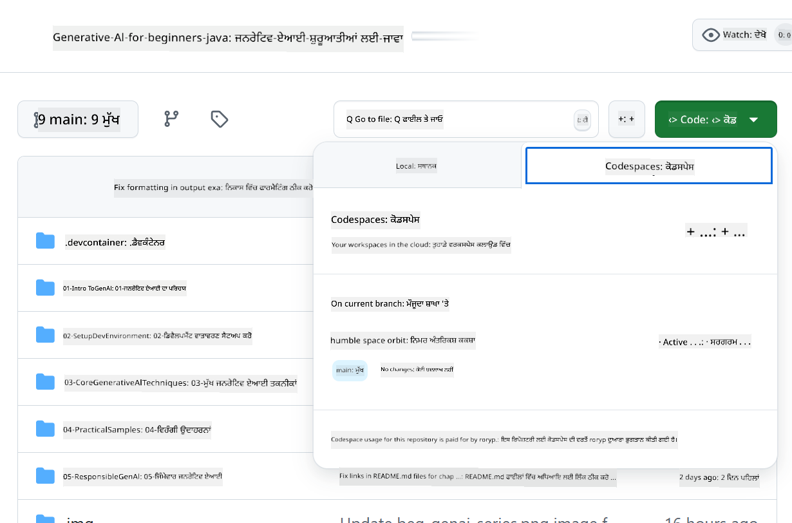

<!--
CO_OP_TRANSLATOR_METADATA:
{
  "original_hash": "e00bbea0f95c611aa3bec676d23e8b43",
  "translation_date": "2025-07-21T18:02:42+00:00",
  "source_file": "02-SetupDevEnvironment/getting-started-azure-openai.md",
  "language_code": "pa"
}
-->
# ਐਜ਼ਰ ਓਪਨਏਆਈ ਲਈ ਡਿਵੈਲਪਮੈਂਟ ਵਾਤਾਵਰਣ ਸੈਟਅੱਪ ਕਰਨਾ

> **ਤੁਰੰਤ ਸ਼ੁਰੂਆਤ**: ਇਹ ਗਾਈਡ ਐਜ਼ਰ ਓਪਨਏਆਈ ਸੈਟਅੱਪ ਲਈ ਹੈ। ਮੁਫ਼ਤ ਮਾਡਲਾਂ ਨਾਲ ਤੁਰੰਤ ਸ਼ੁਰੂਆਤ ਲਈ, [GitHub ਮਾਡਲਜ਼ ਵਿਥ ਕੋਡਸਪੇਸਜ਼](./README.md#quick-start-cloud) ਵਰਤੋ।

ਇਹ ਗਾਈਡ ਤੁਹਾਨੂੰ ਇਸ ਕੋਰਸ ਵਿੱਚ ਆਪਣੇ ਜਾਵਾ ਏਆਈ ਐਪਸ ਲਈ ਐਜ਼ਰ ਏਆਈ ਫਾਊਂਡਰੀ ਮਾਡਲ ਸੈਟਅੱਪ ਕਰਨ ਵਿੱਚ ਮਦਦ ਕਰੇਗੀ।

## ਸੂਚੀ

- [ਤੁਰੰਤ ਸੈਟਅੱਪ ਝਲਕ](../../../02-SetupDevEnvironment)
- [ਪਹਿਲਾ ਕਦਮ: ਐਜ਼ਰ ਏਆਈ ਫਾਊਂਡਰੀ ਸਰੋਤ ਬਣਾਓ](../../../02-SetupDevEnvironment)
  - [ਹੱਬ ਅਤੇ ਪ੍ਰੋਜੈਕਟ ਬਣਾਓ](../../../02-SetupDevEnvironment)
  - [GPT-4o-mini ਮਾਡਲ ਡਿਪਲੌਇ ਕਰੋ](../../../02-SetupDevEnvironment)
- [ਦੂਜਾ ਕਦਮ: ਆਪਣਾ ਕੋਡਸਪੇਸ ਬਣਾਓ](../../../02-SetupDevEnvironment)
- [ਤੀਜਾ ਕਦਮ: ਆਪਣਾ ਵਾਤਾਵਰਣ ਸੰਰਚਿਤ ਕਰੋ](../../../02-SetupDevEnvironment)
- [ਚੌਥਾ ਕਦਮ: ਆਪਣਾ ਸੈਟਅੱਪ ਟੈਸਟ ਕਰੋ](../../../02-SetupDevEnvironment)
- [ਅਗਲਾ ਕੀ ਹੈ?](../../../02-SetupDevEnvironment)
- [ਸਰੋਤ](../../../02-SetupDevEnvironment)
- [ਵਾਧੂ ਸਰੋਤ](../../../02-SetupDevEnvironment)

## ਤੁਰੰਤ ਸੈਟਅੱਪ ਝਲਕ

1. ਐਜ਼ਰ ਏਆਈ ਫਾਊਂਡਰੀ ਸਰੋਤ ਬਣਾਓ (ਹੱਬ, ਪ੍ਰੋਜੈਕਟ, ਮਾਡਲ)
2. ਜਾਵਾ ਡਿਵੈਲਪਮੈਂਟ ਕੰਟੇਨਰ ਨਾਲ ਕੋਡਸਪੇਸ ਬਣਾਓ
3. ਆਪਣੀ .env ਫਾਈਲ ਨੂੰ ਐਜ਼ਰ ਓਪਨਏਆਈ ਪ੍ਰਮਾਣ ਪੱਤਰਾਂ ਨਾਲ ਸੰਰਚਿਤ ਕਰੋ
4. ਉਦਾਹਰਣ ਪ੍ਰੋਜੈਕਟ ਨਾਲ ਆਪਣਾ ਸੈਟਅੱਪ ਟੈਸਟ ਕਰੋ

## ਪਹਿਲਾ ਕਦਮ: ਐਜ਼ਰ ਏਆਈ ਫਾਊਂਡਰੀ ਸਰੋਤ ਬਣਾਓ

### ਹੱਬ ਅਤੇ ਪ੍ਰੋਜੈਕਟ ਬਣਾਓ

1. [ਐਜ਼ਰ ਏਆਈ ਫਾਊਂਡਰੀ ਪੋਰਟਲ](https://ai.azure.com/) 'ਤੇ ਜਾਓ ਅਤੇ ਸਾਈਨ ਇਨ ਕਰੋ।
2. **+ Create** → **New hub** 'ਤੇ ਕਲਿਕ ਕਰੋ (ਜਾਂ **Management** → **All hubs** → **+ New hub** 'ਤੇ ਜਾਓ)।
3. ਆਪਣਾ ਹੱਬ ਸੰਰਚਿਤ ਕਰੋ:
   - **ਹੱਬ ਦਾ ਨਾਮ**: ਜਿਵੇਂ "MyAIHub"
   - **ਸਬਸਕ੍ਰਿਪਸ਼ਨ**: ਆਪਣੀ ਐਜ਼ਰ ਸਬਸਕ੍ਰਿਪਸ਼ਨ ਚੁਣੋ
   - **ਰਿਸੋਰਸ ਗਰੁੱਪ**: ਨਵਾਂ ਬਣਾਓ ਜਾਂ ਮੌਜੂਦਾ ਚੁਣੋ
   - **ਸਥਿਤੀ**: ਆਪਣੇ ਨਜ਼ਦੀਕੀ ਸਥਾਨ ਦੀ ਚੋਣ ਕਰੋ
   - **ਸਟੋਰੇਜ ਅਕਾਊਂਟ**: ਡਿਫਾਲਟ ਵਰਤੋ ਜਾਂ ਕਸਟਮ ਸੰਰਚਿਤ ਕਰੋ
   - **ਕੀ ਵੌਲਟ**: ਡਿਫਾਲਟ ਵਰਤੋ ਜਾਂ ਕਸਟਮ ਸੰਰਚਿਤ ਕਰੋ
   - **ਅਗਲਾ** → **ਸਮੀਖਿਆ + ਬਣਾਓ** → **ਬਣਾਓ** 'ਤੇ ਕਲਿਕ ਕਰੋ।
4. ਬਣਾਉਣ ਤੋਂ ਬਾਅਦ, **+ New project** 'ਤੇ ਕਲਿਕ ਕਰੋ (ਜਾਂ ਹੱਬ ਓਵਰਵਿਊ ਤੋਂ **Create project**)।
   - **ਪ੍ਰੋਜੈਕਟ ਦਾ ਨਾਮ**: ਜਿਵੇਂ "GenAIJava"
   - **ਬਣਾਓ** 'ਤੇ ਕਲਿਕ ਕਰੋ।

### GPT-4o-mini ਮਾਡਲ ਡਿਪਲੌਇ ਕਰੋ

1. ਆਪਣੇ ਪ੍ਰੋਜੈਕਟ ਵਿੱਚ, **Model catalog** 'ਤੇ ਜਾਓ ਅਤੇ **gpt-4o-mini** ਲੱਭੋ।
   - *ਵਿਕਲਪ: **Deployments** → **+ Create deployment** 'ਤੇ ਜਾਓ।*
2. gpt-4o-mini ਮਾਡਲ ਕਾਰਡ 'ਤੇ **Deploy** 'ਤੇ ਕਲਿਕ ਕਰੋ।
3. ਡਿਪਲੌਇਮੈਂਟ ਸੰਰਚਿਤ ਕਰੋ:
   - **ਡਿਪਲੌਇਮੈਂਟ ਦਾ ਨਾਮ**: "gpt-4o-mini"
   - **ਮਾਡਲ ਵਰਜਨ**: ਨਵਾਂਤਮ ਵਰਜਨ ਵਰਤੋ
   - **ਡਿਪਲੌਇਮੈਂਟ ਕਿਸਮ**: ਸਟੈਂਡਰਡ
4. **Deploy** 'ਤੇ ਕਲਿਕ ਕਰੋ।
5. ਡਿਪਲੌਇ ਹੋਣ ਤੋਂ ਬਾਅਦ, **Deployments** ਟੈਬ 'ਤੇ ਜਾਓ ਅਤੇ ਇਹ ਮੁੱਲ ਕਾਪੀ ਕਰੋ:
   - **ਡਿਪਲੌਇਮੈਂਟ ਦਾ ਨਾਮ** (ਜਿਵੇਂ "gpt-4o-mini")
   - **ਟਾਰਗੇਟ URI** (ਜਿਵੇਂ `https://your-hub-name.openai.azure.com/`) 
      > **ਮਹੱਤਵਪੂਰਨ**: ਸਿਰਫ ਬੇਸ URL ਕਾਪੀ ਕਰੋ (ਜਿਵੇਂ `https://myhub.openai.azure.com/`) ਨਾ ਕਿ ਪੂਰਾ ਐਂਡਪੌਇੰਟ ਪਾਥ।
   - **ਕੀ** (Keys and Endpoint ਸੈਕਸ਼ਨ ਤੋਂ)

> **ਹਾਲੇ ਵੀ ਸਮੱਸਿਆ ਹੈ?** ਅਧਿਕਾਰਤ [ਐਜ਼ਰ ਏਆਈ ਫਾਊਂਡਰੀ ਡੌਕਯੂਮੈਂਟੇਸ਼ਨ](https://learn.microsoft.com/azure/ai-foundry/how-to/create-projects?tabs=ai-foundry&pivots=hub-project) 'ਤੇ ਜਾਓ।

## ਦੂਜਾ ਕਦਮ: ਆਪਣਾ ਕੋਡਸਪੇਸ ਬਣਾਓ

1. ਇਸ ਰਿਪੋਜ਼ਟਰੀ ਨੂੰ ਆਪਣੇ GitHub ਅਕਾਊਂਟ ਵਿੱਚ ਫੋਰਕ ਕਰੋ।
   > **ਨੋਟ**: ਜੇ ਤੁਸੀਂ ਬੇਸਿਕ ਕੰਫਿਗਰੇਸ਼ਨ ਸੋਧਣਾ ਚਾਹੁੰਦੇ ਹੋ ਤਾਂ [ਡਿਵ ਕੰਟੇਨਰ ਕੰਫਿਗਰੇਸ਼ਨ](../../../.devcontainer/devcontainer.json) ਵੇਖੋ।
2. ਆਪਣੇ ਫੋਰਕ ਕੀਤੇ ਰਿਪੋ ਵਿੱਚ, **Code** → **Codespaces** ਟੈਬ 'ਤੇ ਕਲਿਕ ਕਰੋ।
3. **...** → **New with options...** 'ਤੇ ਕਲਿਕ ਕਰੋ।

4. **ਡਿਵ ਕੰਟੇਨਰ ਕੰਫਿਗਰੇਸ਼ਨ** ਚੁਣੋ:
   - **Generative AI Java Development Environment**
5. **ਕੋਡਸਪੇਸ ਬਣਾਓ** 'ਤੇ ਕਲਿਕ ਕਰੋ।

## ਤੀਜਾ ਕਦਮ: ਆਪਣਾ ਵਾਤਾਵਰਣ ਸੰਰਚਿਤ ਕਰੋ

ਜਦੋਂ ਤੁਹਾਡਾ ਕੋਡਸਪੇਸ ਤਿਆਰ ਹੋ ਜਾਵੇ, ਤਾਂ ਆਪਣੇ ਐਜ਼ਰ ਓਪਨਏਆਈ ਪ੍ਰਮਾਣ ਪੱਤਰ ਸੈਟਅੱਪ ਕਰੋ:

1. **ਰਿਪੋਜ਼ਟਰੀ ਰੂਟ ਤੋਂ ਉਦਾਹਰਣ ਪ੍ਰੋਜੈਕਟ 'ਤੇ ਜਾਓ:**
   ```bash
   cd 02-SetupDevEnvironment/src/basic-chat-azure
   ```

2. **ਆਪਣੀ .env ਫਾਈਲ ਬਣਾਓ:**
   ```bash
   cp .env.example .env
   ```

3. **ਆਪਣੀ .env ਫਾਈਲ ਨੂੰ ਆਪਣੇ ਐਜ਼ਰ ਓਪਨਏਆਈ ਪ੍ਰਮਾਣ ਪੱਤਰਾਂ ਨਾਲ ਸੋਧੋ:**
   ```bash
   # Your Azure OpenAI API key (from Azure AI Foundry portal)
   AZURE_AI_KEY=your-actual-api-key-here
   
   # Your Azure OpenAI endpoint URL (e.g., https://myhub.openai.azure.com/)
   AZURE_AI_ENDPOINT=https://your-hub-name.openai.azure.com/
   ```

   > **ਸੁਰੱਖਿਆ ਨੋਟ**: 
   > - ਕਦੇ ਵੀ ਆਪਣੀ `.env` ਫਾਈਲ ਨੂੰ ਵਰਜਨ ਕੰਟਰੋਲ ਵਿੱਚ ਕਮਿਟ ਨਾ ਕਰੋ।
   > - `.env` ਫਾਈਲ ਪਹਿਲਾਂ ਹੀ `.gitignore` ਵਿੱਚ ਸ਼ਾਮਲ ਹੈ।
   > - ਆਪਣੇ API ਕੁੰਜੀਆਂ ਸੁਰੱਖਿਅਤ ਰੱਖੋ ਅਤੇ ਉਨ੍ਹਾਂ ਨੂੰ ਨਿਯਮਿਤ ਤੌਰ 'ਤੇ ਬਦਲੋ।

## ਚੌਥਾ ਕਦਮ: ਆਪਣਾ ਸੈਟਅੱਪ ਟੈਸਟ ਕਰੋ

ਉਦਾਹਰਣ ਐਪਲੀਕੇਸ਼ਨ ਚਲਾਓ ਅਤੇ ਆਪਣੀ ਐਜ਼ਰ ਓਪਨਏਆਈ ਕਨੈਕਸ਼ਨ ਟੈਸਟ ਕਰੋ:

```bash
mvn clean spring-boot:run
```

ਤੁਹਾਨੂੰ GPT-4o-mini ਮਾਡਲ ਤੋਂ ਜਵਾਬ ਮਿਲਣਾ ਚਾਹੀਦਾ ਹੈ!

> **VS Code ਯੂਜ਼ਰਜ਼**: ਤੁਸੀਂ `F5` ਦਬਾ ਕੇ ਵੀ ਐਪਲੀਕੇਸ਼ਨ ਚਲਾ ਸਕਦੇ ਹੋ। ਲਾਂਚ ਕੰਫਿਗਰੇਸ਼ਨ ਪਹਿਲਾਂ ਹੀ ਤੁਹਾਡੀ `.env` ਫਾਈਲ ਨੂੰ ਆਟੋਮੈਟਿਕਲੋਡ ਕਰਨ ਲਈ ਸੈਟ ਹੈ।

> **ਪੂਰਾ ਉਦਾਹਰਣ**: ਵਿਸਥਾਰ ਲਈ [End-to-End Azure OpenAI Example](./src/basic-chat-azure/README.md) ਵੇਖੋ।

## ਅਗਲਾ ਕੀ ਹੈ?

**ਸੈਟਅੱਪ ਪੂਰਾ!** ਹੁਣ ਤੁਹਾਡੇ ਕੋਲ ਹੈ:
- gpt-4o-mini ਨਾਲ ਐਜ਼ਰ ਓਪਨਏਆਈ ਡਿਪਲੌਇਡ
- ਸਥਾਨਕ .env ਫਾਈਲ ਸੰਰਚਨਾ
- ਜਾਵਾ ਡਿਵੈਲਪਮੈਂਟ ਵਾਤਾਵਰਣ ਤਿਆਰ

**ਅਗਲੇ ਅਧਿਆਇ 'ਤੇ ਜਾਓ** [ਅਧਿਆਇ 3: ਕੋਰ ਜਨਰੇਟਿਵ ਏਆਈ ਤਕਨੀਕਾਂ](../03-CoreGenerativeAITechniques/README.md) ਅਤੇ ਏਆਈ ਐਪਲੀਕੇਸ਼ਨ ਬਣਾਉਣਾ ਸ਼ੁਰੂ ਕਰੋ!

## ਸਰੋਤ

- [ਐਜ਼ਰ ਏਆਈ ਫਾਊਂਡਰੀ ਡੌਕਯੂਮੈਂਟੇਸ਼ਨ](https://learn.microsoft.com/azure/ai-services/)
- [Spring AI Azure OpenAI ਡੌਕਯੂਮੈਂਟੇਸ਼ਨ](https://docs.spring.io/spring-ai/reference/api/clients/azure-openai-chat.html)
- [ਐਜ਼ਰ ਓਪਨਏਆਈ ਜਾਵਾ SDK](https://learn.microsoft.com/java/api/overview/azure/ai-openai-readme)

## ਵਾਧੂ ਸਰੋਤ

- [VS Code ਡਾਊਨਲੋਡ ਕਰੋ](https://code.visualstudio.com/Download)
- [ਡੌਕਰ ਡੈਸਕਟਾਪ ਪ੍ਰਾਪਤ ਕਰੋ](https://www.docker.com/products/docker-desktop)
- [ਡਿਵ ਕੰਟੇਨਰ ਕੰਫਿਗਰੇਸ਼ਨ](../../../.devcontainer/devcontainer.json)

**ਅਸਵੀਕਾਰਨਾ**:  
ਇਹ ਦਸਤਾਵੇਜ਼ AI ਅਨੁਵਾਦ ਸੇਵਾ [Co-op Translator](https://github.com/Azure/co-op-translator) ਦੀ ਵਰਤੋਂ ਕਰਕੇ ਅਨੁਵਾਦ ਕੀਤਾ ਗਿਆ ਹੈ। ਜਦੋਂ ਕਿ ਅਸੀਂ ਸਹੀ ਹੋਣ ਦੀ ਕੋਸ਼ਿਸ਼ ਕਰਦੇ ਹਾਂ, ਕਿਰਪਾ ਕਰਕੇ ਧਿਆਨ ਦਿਓ ਕਿ ਸਵੈਚਾਲਿਤ ਅਨੁਵਾਦਾਂ ਵਿੱਚ ਗਲਤੀਆਂ ਜਾਂ ਅਸੁਚਤਤਾਵਾਂ ਹੋ ਸਕਦੀਆਂ ਹਨ। ਇਸ ਦੀ ਮੂਲ ਭਾਸ਼ਾ ਵਿੱਚ ਮੌਜੂਦ ਅਸਲ ਦਸਤਾਵੇਜ਼ ਨੂੰ ਅਧਿਕਾਰਤ ਸਰੋਤ ਮੰਨਿਆ ਜਾਣਾ ਚਾਹੀਦਾ ਹੈ। ਮਹੱਤਵਪੂਰਨ ਜਾਣਕਾਰੀ ਲਈ, ਪੇਸ਼ੇਵਰ ਮਨੁੱਖੀ ਅਨੁਵਾਦ ਦੀ ਸਿਫਾਰਸ਼ ਕੀਤੀ ਜਾਂਦੀ ਹੈ। ਇਸ ਅਨੁਵਾਦ ਦੀ ਵਰਤੋਂ ਤੋਂ ਪੈਦਾ ਹੋਣ ਵਾਲੇ ਕਿਸੇ ਵੀ ਗਲਤਫਹਿਮੀ ਜਾਂ ਗਲਤ ਵਿਆਖਿਆ ਲਈ ਅਸੀਂ ਜ਼ਿੰਮੇਵਾਰ ਨਹੀਂ ਹਾਂ।