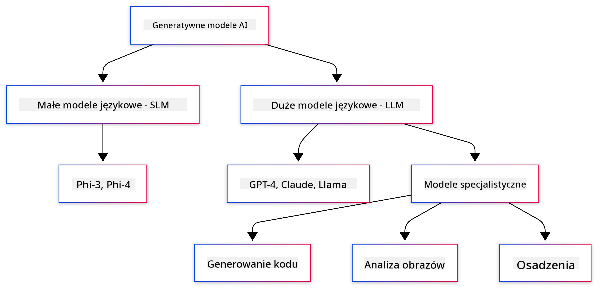
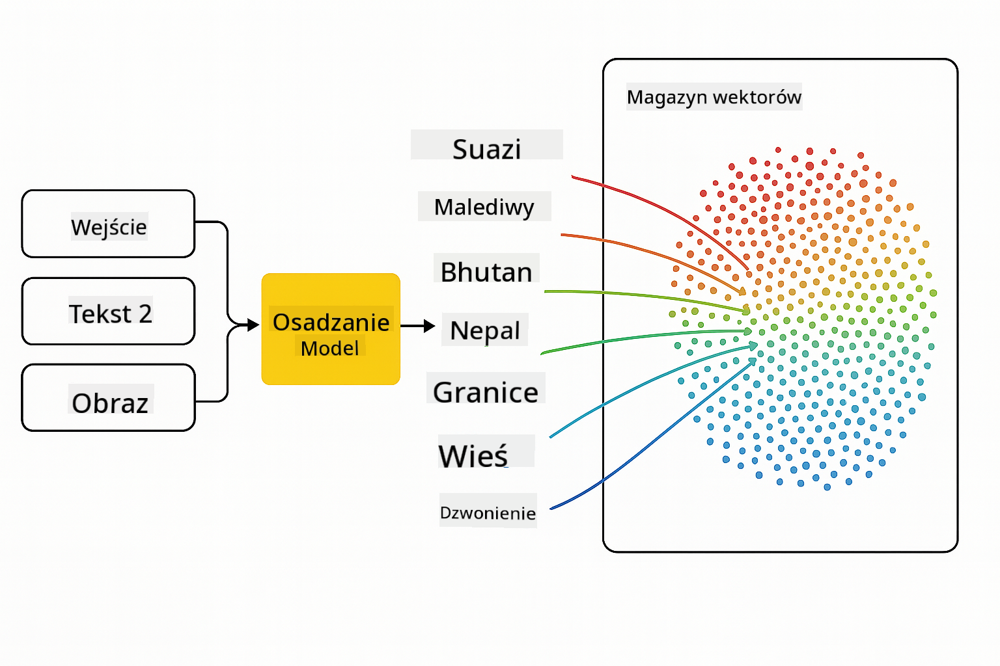
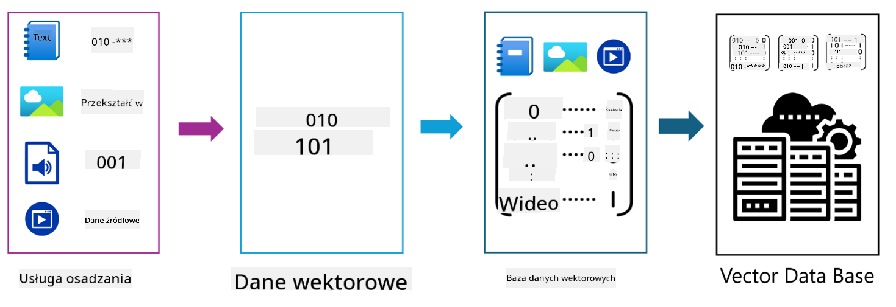

<!--
CO_OP_TRANSLATOR_METADATA:
{
  "original_hash": "75bfb080ca725e8a9aa9c80cae25fba1",
  "translation_date": "2025-07-29T09:08:55+00:00",
  "source_file": "01-IntroToGenAI/README.md",
  "language_code": "pl"
}
-->
# Wprowadzenie do Generatywnej Sztucznej Inteligencji - Edycja Java

## Czego się nauczysz

- **Podstawy generatywnej AI**, w tym LLM, inżynieria promptów, tokeny, osadzenia i bazy danych wektorowych
- **Porównanie narzędzi do rozwoju AI w Javie**, takich jak Azure OpenAI SDK, Spring AI i OpenAI Java SDK
- **Odkrycie protokołu Model Context Protocol** i jego roli w komunikacji agentów AI

## Spis treści

- [Wprowadzenie](../../../01-IntroToGenAI)
- [Szybkie przypomnienie o koncepcjach generatywnej AI](../../../01-IntroToGenAI)
- [Przegląd inżynierii promptów](../../../01-IntroToGenAI)
- [Tokeny, osadzenia i agenci](../../../01-IntroToGenAI)
- [Narzędzia i biblioteki do rozwoju AI w Javie](../../../01-IntroToGenAI)
  - [OpenAI Java SDK](../../../01-IntroToGenAI)
  - [Spring AI](../../../01-IntroToGenAI)
  - [Azure OpenAI Java SDK](../../../01-IntroToGenAI)
- [Podsumowanie](../../../01-IntroToGenAI)
- [Kolejne kroki](../../../01-IntroToGenAI)

## Wprowadzenie

Witamy w pierwszym rozdziale kursu Generatywna AI dla Początkujących - Edycja Java! Ta lekcja wprowadzająca zapozna Cię z podstawowymi koncepcjami generatywnej AI i sposobami pracy z nimi w Javie. Dowiesz się o kluczowych elementach budowy aplikacji AI, takich jak duże modele językowe (LLM), tokeny, osadzenia i agenci AI. Przyjrzymy się również głównym narzędziom dla Javy, które będziesz używać w trakcie tego kursu.

### Szybkie przypomnienie o koncepcjach generatywnej AI

Generatywna AI to rodzaj sztucznej inteligencji, która tworzy nowe treści, takie jak tekst, obrazy czy kod, na podstawie wzorców i relacji wyuczonych z danych. Modele generatywnej AI potrafią generować odpowiedzi przypominające ludzkie, rozumieć kontekst, a czasem nawet tworzyć treści, które wydają się być stworzone przez człowieka.

Podczas tworzenia aplikacji AI w Javie będziesz pracować z **modelami generatywnej AI**, aby tworzyć treści. Niektóre z możliwości modeli generatywnej AI obejmują:

- **Generowanie tekstu**: Tworzenie tekstów przypominających ludzkie dla chatbotów, treści i uzupełniania tekstu.
- **Generowanie i analiza obrazów**: Tworzenie realistycznych obrazów, ulepszanie zdjęć i wykrywanie obiektów.
- **Generowanie kodu**: Pisanie fragmentów kodu lub skryptów.

Istnieją różne typy modeli zoptymalizowane do różnych zadań. Na przykład zarówno **małe modele językowe (SLM)**, jak i **duże modele językowe (LLM)** mogą obsługiwać generowanie tekstu, przy czym LLM zazwyczaj oferują lepszą wydajność w przypadku złożonych zadań. Do zadań związanych z obrazami używa się wyspecjalizowanych modeli wizji lub modeli multimodalnych.

Oczywiście odpowiedzi generowane przez te modele nie zawsze są idealne. Pewnie słyszałeś o przypadkach, gdy modele "halucynują" lub generują błędne informacje w sposób autorytatywny. Możesz jednak pomóc modelowi generować lepsze odpowiedzi, dostarczając mu jasne instrukcje i kontekst. Właśnie tutaj wkracza **inżynieria promptów**.

#### Przegląd inżynierii promptów

Inżynieria promptów to praktyka projektowania skutecznych danych wejściowych, które kierują modele AI w stronę pożądanych wyników. Obejmuje:

- **Jasność**: Tworzenie instrukcji, które są zrozumiałe i jednoznaczne.
- **Kontekst**: Dostarczanie niezbędnych informacji w tle.
- **Ograniczenia**: Określanie wszelkich ograniczeń lub formatów.

Niektóre najlepsze praktyki w inżynierii promptów obejmują projektowanie promptów, jasne instrukcje, rozbijanie zadań, uczenie jedno- i wieloprzykładowe oraz dostrajanie promptów. Testowanie różnych promptów jest kluczowe, aby znaleźć to, co działa najlepiej w Twoim przypadku użycia.

Podczas tworzenia aplikacji będziesz pracować z różnymi typami promptów:
- **Prompty systemowe**: Ustalają podstawowe zasady i kontekst dla zachowania modelu.
- **Prompty użytkownika**: Dane wejściowe od użytkowników Twojej aplikacji.
- **Prompty asystenta**: Odpowiedzi modelu na podstawie promptów systemowych i użytkownika.

> **Dowiedz się więcej**: Dowiedz się więcej o inżynierii promptów w [rozdziale o inżynierii promptów kursu GenAI dla Początkujących](https://github.com/microsoft/generative-ai-for-beginners/tree/main/04-prompt-engineering-fundamentals)

#### Tokeny, osadzenia i agenci

Podczas pracy z modelami generatywnej AI spotkasz się z terminami takimi jak **tokeny**, **osadzenia**, **agenci** i **Model Context Protocol (MCP)**. Oto szczegółowy przegląd tych pojęć:

- **Tokeny**: Tokeny to najmniejsze jednostki tekstu w modelu. Mogą to być słowa, znaki lub podsłowa. Tokeny są używane do reprezentowania danych tekstowych w formacie zrozumiałym dla modelu. Na przykład zdanie "The quick brown fox jumped over the lazy dog" może być tokenizowane jako ["The", " quick", " brown", " fox", " jumped", " over", " the", " lazy", " dog"] lub ["The", " qu", "ick", " br", "own", " fox", " jump", "ed", " over", " the", " la", "zy", " dog"] w zależności od strategii tokenizacji.

Tokenizacja to proces dzielenia tekstu na te mniejsze jednostki. Jest to kluczowe, ponieważ modele operują na tokenach, a nie na surowym tekście. Liczba tokenów w promptach wpływa na długość i jakość odpowiedzi modelu, ponieważ modele mają limity tokenów w swoim oknie kontekstowym (np. 128K tokenów dla całkowitego kontekstu GPT-4o, w tym zarówno wejścia, jak i wyjścia).

  W Javie możesz używać bibliotek takich jak OpenAI SDK, aby automatycznie obsługiwać tokenizację podczas wysyłania żądań do modeli AI.

- **Osadzenia (embeddings)**: Osadzenia to wektorowe reprezentacje tokenów, które uchwytują znaczenie semantyczne. Są to numeryczne reprezentacje (zazwyczaj tablice liczb zmiennoprzecinkowych), które pozwalają modelom rozumieć relacje między słowami i generować odpowiedzi kontekstowo odpowiednie. Podobne słowa mają podobne osadzenia, co umożliwia modelowi rozumienie takich pojęć jak synonimy i relacje semantyczne.

  W Javie możesz generować osadzenia za pomocą OpenAI SDK lub innych bibliotek obsługujących generowanie osadzeń. Te osadzenia są kluczowe w zadaniach takich jak wyszukiwanie semantyczne, gdzie chcesz znaleźć podobne treści na podstawie znaczenia, a nie dokładnych dopasowań tekstowych.

- **Bazy danych wektorowych**: Bazy danych wektorowych to wyspecjalizowane systemy przechowywania zoptymalizowane pod kątem osadzeń. Umożliwiają one efektywne wyszukiwanie podobieństw i są kluczowe w wzorcach Retrieval-Augmented Generation (RAG), gdzie musisz znaleźć odpowiednie informacje z dużych zbiorów danych na podstawie podobieństwa semantycznego, a nie dokładnych dopasowań.

> **Uwaga**: W tym kursie nie omówimy baz danych wektorowych, ale warto o nich wspomnieć, ponieważ są powszechnie używane w aplikacjach rzeczywistych.

- **Agenci i MCP**: Komponenty AI, które autonomicznie współdziałają z modelami, narzędziami i systemami zewnętrznymi. Model Context Protocol (MCP) zapewnia ustandaryzowany sposób, w jaki agenci mogą bezpiecznie uzyskiwać dostęp do zewnętrznych źródeł danych i narzędzi. Dowiedz się więcej w naszym kursie [MCP dla Początkujących](https://github.com/microsoft/mcp-for-beginners).

W aplikacjach AI w Javie będziesz używać tokenów do przetwarzania tekstu, osadzeń do wyszukiwania semantycznego i RAG, baz danych wektorowych do wyszukiwania danych oraz agentów z MCP do budowania inteligentnych systemów korzystających z narzędzi.

### Narzędzia i biblioteki do rozwoju AI w Javie

Java oferuje doskonałe narzędzia do rozwoju AI. W trakcie tego kursu omówimy trzy główne biblioteki - OpenAI Java SDK, Azure OpenAI SDK i Spring AI.

Oto szybka tabela referencyjna pokazująca, które SDK jest używane w przykładach z poszczególnych rozdziałów:

| Rozdział | Przykład | SDK |
|----------|----------|-----|
| 02-SetupDevEnvironment | github-models | OpenAI Java SDK |
| 02-SetupDevEnvironment | basic-chat-azure | Spring AI Azure OpenAI |
| 03-CoreGenerativeAITechniques | examples | Azure OpenAI SDK |
| 04-PracticalSamples | petstory | OpenAI Java SDK |
| 04-PracticalSamples | foundrylocal | OpenAI Java SDK |
| 04-PracticalSamples | calculator | Spring AI MCP SDK + LangChain4j |

**Linki do dokumentacji SDK:**
- [Azure OpenAI Java SDK](https://github.com/Azure/azure-sdk-for-java/tree/azure-ai-openai_1.0.0-beta.16/sdk/openai/azure-ai-openai)
- [Spring AI](https://docs.spring.io/spring-ai/reference/)
- [OpenAI Java SDK](https://github.com/openai/openai-java)
- [LangChain4j](https://docs.langchain4j.dev/)

#### OpenAI Java SDK

OpenAI SDK to oficjalna biblioteka Javy dla API OpenAI. Zapewnia prosty i spójny interfejs do współpracy z modelami OpenAI, co ułatwia integrację możliwości AI w aplikacjach Java. Przykłady GitHub Models z rozdziału 2, aplikacja Pet Story z rozdziału 4 oraz przykład Foundry Local demonstrują podejście z użyciem OpenAI SDK.

#### Spring AI

Spring AI to kompleksowe środowisko, które wprowadza możliwości AI do aplikacji Spring, zapewniając spójną warstwę abstrakcji dla różnych dostawców AI. Integruje się bezproblemowo z ekosystemem Spring, co czyni go idealnym wyborem dla aplikacji Java klasy korporacyjnej, które potrzebują możliwości AI.

Moc Spring AI polega na jego bezproblemowej integracji z ekosystemem Spring, co ułatwia budowanie gotowych do produkcji aplikacji AI z użyciem znanych wzorców Spring, takich jak wstrzykiwanie zależności, zarządzanie konfiguracją i frameworki testowe. W rozdziałach 2 i 4 użyjesz Spring AI do budowy aplikacji wykorzystujących zarówno OpenAI, jak i biblioteki Model Context Protocol (MCP) Spring AI.

##### Model Context Protocol (MCP)

[Model Context Protocol (MCP)](https://modelcontextprotocol.io/) to rozwijający się standard, który umożliwia aplikacjom AI bezpieczne współdziałanie z zewnętrznymi źródłami danych i narzędziami. MCP zapewnia ustandaryzowany sposób, w jaki modele AI mogą uzyskiwać dostęp do informacji kontekstowych i wykonywać działania w Twoich aplikacjach.

W rozdziale 4 zbudujesz prostą usługę kalkulatora MCP, która demonstruje podstawy Model Context Protocol z Spring AI, pokazując, jak tworzyć podstawowe integracje narzędzi i architektury usług.

#### Azure OpenAI Java SDK

Biblioteka klienta Azure OpenAI dla Javy to adaptacja REST API OpenAI, która zapewnia idiomatyczny interfejs i integrację z resztą ekosystemu Azure SDK. W rozdziale 3 zbudujesz aplikacje z użyciem Azure OpenAI SDK, w tym aplikacje czatowe, wywoływanie funkcji i wzorce RAG (Retrieval-Augmented Generation).

> Uwaga: Azure OpenAI SDK pozostaje w tyle za OpenAI Java SDK pod względem funkcji, więc w przyszłych projektach rozważ użycie OpenAI Java SDK.

## Podsumowanie

To kończy podstawy! Teraz rozumiesz:

- Kluczowe koncepcje stojące za generatywną AI - od LLM i inżynierii promptów po tokeny, osadzenia i bazy danych wektorowych
- Opcje narzędzi dla rozwoju AI w Javie: Azure OpenAI SDK, Spring AI i OpenAI Java SDK
- Czym jest Model Context Protocol i jak umożliwia agentom AI współpracę z zewnętrznymi narzędziami

## Kolejne kroki

[Rozdział 2: Konfiguracja środowiska programistycznego](../02-SetupDevEnvironment/README.md)

**Zastrzeżenie**:  
Ten dokument został przetłumaczony za pomocą usługi tłumaczeniowej AI [Co-op Translator](https://github.com/Azure/co-op-translator). Chociaż dokładamy wszelkich starań, aby zapewnić dokładność, prosimy pamiętać, że automatyczne tłumaczenia mogą zawierać błędy lub nieścisłości. Oryginalny dokument w jego rodzimym języku powinien być uznawany za wiarygodne źródło. W przypadku informacji krytycznych zaleca się skorzystanie z profesjonalnego tłumaczenia wykonanego przez człowieka. Nie ponosimy odpowiedzialności za jakiekolwiek nieporozumienia lub błędne interpretacje wynikające z korzystania z tego tłumaczenia.