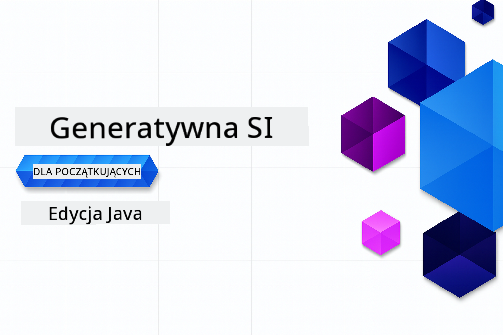

<!--
CO_OP_TRANSLATOR_METADATA:
{
  "original_hash": "d684972689e288a83779255116bb42c3",
  "translation_date": "2025-07-27T08:46:19+00:00",
  "source_file": "README.md",
  "language_code": "pl"
}
-->
# Generatywna AI dla Początkujących - Edycja Java

**Czas trwania**: Cały warsztat można ukończyć online bez konieczności lokalnej konfiguracji. Jeśli chcesz uruchomić przykłady, konfiguracja środowiska zajmuje 2 minuty, a eksploracja przykładów wymaga od 1 do 3 godzin, w zależności od głębokości analizy.

> **Szybki Start** 

1. Sforkuj to repozytorium na swoje konto GitHub
2. Kliknij **Code** → zakładka **Codespaces** → **...** → **New with options...**
3. Użyj ustawień domyślnych – zostanie wybrany kontener deweloperski stworzony dla tego kursu
4. Kliknij **Create codespace**
5. Poczekaj około 2 minut, aż środowisko będzie gotowe
6. Przejdź bezpośrednio do [Tworzenia swojego tokena GitHub Models](./02-SetupDevEnvironment/README.md#step-2-create-a-github-personal-access-token)

## Obsługa wielu języków

### Obsługiwane za pomocą GitHub Action (Automatyczne i zawsze aktualne)

[Francuski](../fr/README.md) | [Hiszpański](../es/README.md) | [Niemiecki](../de/README.md) | [Rosyjski](../ru/README.md) | [Arabski](../ar/README.md) | [Perski (Farsi)](../fa/README.md) | [Urdu](../ur/README.md) | [Chiński (uproszczony)](../zh/README.md) | [Chiński (tradycyjny, Makau)](../mo/README.md) | [Chiński (tradycyjny, Hongkong)](../hk/README.md) | [Chiński (tradycyjny, Tajwan)](../tw/README.md) | [Japoński](../ja/README.md) | [Koreański](../ko/README.md) | [Hindi](../hi/README.md) | [Bengalski](../bn/README.md) | [Marathi](../mr/README.md) | [Nepalski](../ne/README.md) | [Pendżabski (Gurmukhi)](../pa/README.md) | [Portugalski (Portugalia)](../pt/README.md) | [Portugalski (Brazylia)](../br/README.md) | [Włoski](../it/README.md) | [Polski](./README.md) | [Turecki](../tr/README.md) | [Grecki](../el/README.md) | [Tajski](../th/README.md) | [Szwedzki](../sv/README.md) | [Duński](../da/README.md) | [Norweski](../no/README.md) | [Fiński](../fi/README.md) | [Holenderski](../nl/README.md) | [Hebrajski](../he/README.md) | [Wietnamski](../vi/README.md) | [Indonezyjski](../id/README.md) | [Malajski](../ms/README.md) | [Tagalog (Filipiński)](../tl/README.md) | [Suahili](../sw/README.md) | [Węgierski](../hu/README.md) | [Czeski](../cs/README.md) | [Słowacki](../sk/README.md) | [Rumuński](../ro/README.md) | [Bułgarski](../bg/README.md) | [Serbski (cyrylica)](../sr/README.md) | [Chorwacki](../hr/README.md) | [Słoweński](../sl/README.md) | [Ukraiński](../uk/README.md) | [Birmański (Myanmar)](../my/README.md)

## Struktura kursu i ścieżka nauki

### **Rozdział 1: Wprowadzenie do Generatywnej AI**
- **Podstawowe pojęcia**: Zrozumienie dużych modeli językowych, tokenów, osadzeń i możliwości AI
- **Ekosystem AI w Javie**: Przegląd Spring AI i OpenAI SDK
- **Protokół kontekstu modelu**: Wprowadzenie do MCP i jego roli w komunikacji agentów AI
- **Praktyczne zastosowania**: Scenariusze z życia wzięte, w tym chatboty i generowanie treści
- **[→ Rozpocznij Rozdział 1](./01-IntroToGenAI/README.md)**

### **Rozdział 2: Konfiguracja środowiska deweloperskiego**
- **Konfiguracja wielu dostawców**: Ustawienia integracji GitHub Models, Azure OpenAI i OpenAI Java SDK
- **Spring Boot + Spring AI**: Najlepsze praktyki w tworzeniu aplikacji AI dla przedsiębiorstw
- **GitHub Models**: Darmowy dostęp do modeli AI do prototypowania i nauki (bez potrzeby karty kredytowej)
- **Narzędzia deweloperskie**: Konfiguracja kontenerów Dockera, VS Code i GitHub Codespaces
- **[→ Rozpocznij Rozdział 2](./02-SetupDevEnvironment/README.md)**

### **Rozdział 3: Podstawowe techniki Generatywnej AI**
- **Inżynieria promptów**: Techniki uzyskiwania optymalnych odpowiedzi od modeli AI
- **Osadzenia i operacje na wektorach**: Implementacja wyszukiwania semantycznego i dopasowywania podobieństw
- **Generowanie wspomagane wyszukiwaniem (RAG)**: Łączenie AI z własnymi źródłami danych
- **Wywoływanie funkcji**: Rozszerzanie możliwości AI za pomocą niestandardowych narzędzi i wtyczek
- **[→ Rozpocznij Rozdział 3](./03-CoreGenerativeAITechniques/README.md)**

### **Rozdział 4: Praktyczne zastosowania i projekty**
- **Generator historii o zwierzętach** (`petstory/`): Tworzenie kreatywnych treści za pomocą GitHub Models
- **Lokalna demonstracja Foundry** (`foundrylocal/`): Integracja lokalnych modeli AI z OpenAI Java SDK
- **Usługa kalkulatora MCP** (`mcp/calculator/`): Podstawowa implementacja protokołu kontekstu modelu z Spring AI
- **[→ Rozpocznij Rozdział 4](./04-PracticalSamples/README.md)**

### **Rozdział 5: Odpowiedzialny rozwój AI**
- **Bezpieczeństwo GitHub Models**: Testowanie wbudowanego filtrowania treści i mechanizmów bezpieczeństwa
- **Demonstracja odpowiedzialnego AI**: Praktyczny przykład pokazujący działanie filtrów bezpieczeństwa AI
- **Najlepsze praktyki**: Kluczowe wytyczne dotyczące etycznego rozwoju i wdrażania AI
- **[→ Rozpocznij Rozdział 5](./05-ResponsibleGenAI/README.md)**

## Dodatkowe zasoby 

- [AI Agents For Beginners](https://github.com/microsoft/ai-agents-for-beginners)
- [Generatywna AI dla Początkujących z użyciem .NET](https://github.com/microsoft/Generative-AI-for-beginners-dotnet)
- [Generatywna AI dla Początkujących z użyciem JavaScript](https://github.com/microsoft/generative-ai-with-javascript)
- [Generatywna AI dla Początkujących](https://github.com/microsoft/generative-ai-for-beginners)
- [ML dla Początkujących](https://aka.ms/ml-beginners)
- [Data Science dla Początkujących](https://aka.ms/datascience-beginners)
- [AI dla Początkujących](https://aka.ms/ai-beginners)
- [Cyberbezpieczeństwo dla Początkujących](https://github.com/microsoft/Security-101)
- [Web Dev dla Początkujących](https://aka.ms/webdev-beginners)
- [IoT dla Początkujących](https://aka.ms/iot-beginners)
- [XR Development dla Początkujących](https://github.com/microsoft/xr-development-for-beginners)
- [Opanowanie GitHub Copilot dla programowania w parach z AI](https://aka.ms/GitHubCopilotAI)
- [Opanowanie GitHub Copilot dla programistów C#/.NET](https://github.com/microsoft/mastering-github-copilot-for-dotnet-csharp-developers)
- [Wybierz swoją własną przygodę z Copilotem](https://github.com/microsoft/CopilotAdventures)
- [Aplikacja czatu RAG z usługami Azure AI](https://github.com/Azure-Samples/azure-search-openai-demo-java)

**Zastrzeżenie**:  
Ten dokument został przetłumaczony za pomocą usługi tłumaczeniowej AI [Co-op Translator](https://github.com/Azure/co-op-translator). Chociaż dokładamy wszelkich starań, aby zapewnić precyzję, prosimy pamiętać, że automatyczne tłumaczenia mogą zawierać błędy lub nieścisłości. Oryginalny dokument w jego rodzimym języku powinien być uznawany za autorytatywne źródło. W przypadku informacji o kluczowym znaczeniu zaleca się skorzystanie z profesjonalnego tłumaczenia przez człowieka. Nie ponosimy odpowiedzialności za jakiekolwiek nieporozumienia lub błędne interpretacje wynikające z użycia tego tłumaczenia.