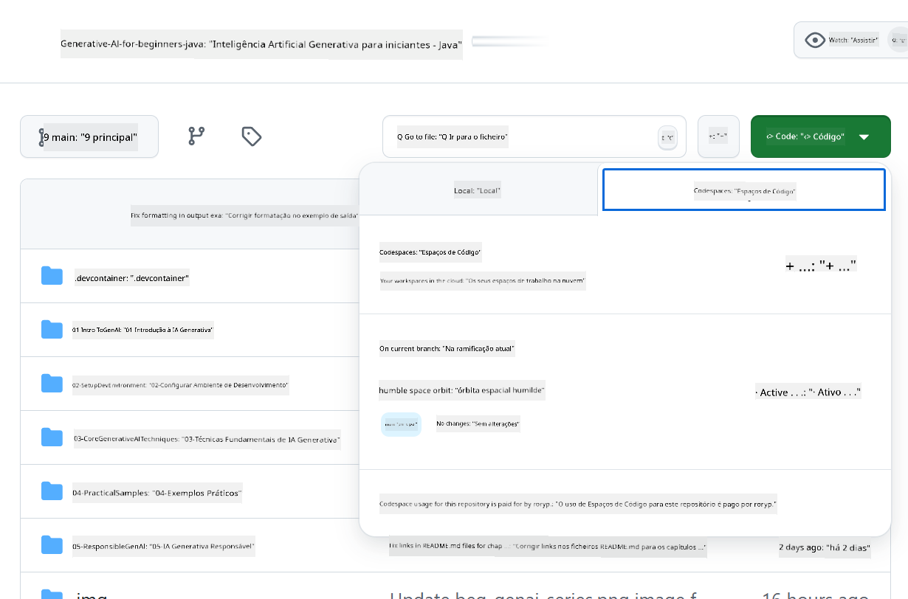

<!--
CO_OP_TRANSLATOR_METADATA:
{
  "original_hash": "bfdb4b4eadbee3a59ef742439f58326a",
  "translation_date": "2025-07-27T13:05:34+00:00",
  "source_file": "02-SetupDevEnvironment/getting-started-azure-openai.md",
  "language_code": "pt"
}
-->
# Configurar o Ambiente de Desenvolvimento para Azure OpenAI

> **Início Rápido**: Este guia é para configuração do Azure OpenAI. Para começar imediatamente com modelos gratuitos, utilize [Modelos GitHub com Codespaces](./README.md#quick-start-cloud).

Este guia irá ajudá-lo a configurar os modelos do Azure AI Foundry para as suas aplicações Java AI neste curso.

## Índice

- [Visão Geral da Configuração Rápida](../../../02-SetupDevEnvironment)
- [Passo 1: Criar Recursos do Azure AI Foundry](../../../02-SetupDevEnvironment)
  - [Criar um Hub e um Projeto](../../../02-SetupDevEnvironment)
  - [Implementar o Modelo GPT-4o-mini](../../../02-SetupDevEnvironment)
- [Passo 2: Criar o Seu Codespace](../../../02-SetupDevEnvironment)
- [Passo 3: Configurar o Seu Ambiente](../../../02-SetupDevEnvironment)
- [Passo 4: Testar a Sua Configuração](../../../02-SetupDevEnvironment)
- [O Que Vem a Seguir?](../../../02-SetupDevEnvironment)
- [Recursos](../../../02-SetupDevEnvironment)
- [Recursos Adicionais](../../../02-SetupDevEnvironment)

## Visão Geral da Configuração Rápida

1. Criar recursos do Azure AI Foundry (Hub, Projeto, Modelo)
2. Criar um Codespace com um container de desenvolvimento Java
3. Configurar o ficheiro .env com as credenciais do Azure OpenAI
4. Testar a sua configuração com o projeto de exemplo

## Passo 1: Criar Recursos do Azure AI Foundry

### Criar um Hub e um Projeto

1. Aceda ao [Portal do Azure AI Foundry](https://ai.azure.com/) e inicie sessão.
2. Clique em **+ Criar** → **Novo hub** (ou navegue até **Gestão** → **Todos os hubs** → **+ Novo hub**).
3. Configure o seu hub:
   - **Nome do hub**: por exemplo, "MeuHubAI"
   - **Subscrição**: Selecione a sua subscrição do Azure
   - **Grupo de recursos**: Crie um novo ou selecione um existente
   - **Localização**: Escolha a mais próxima de si
   - **Conta de armazenamento**: Utilize a predefinida ou configure uma personalizada
   - **Key vault**: Utilize a predefinida ou configure uma personalizada
   - Clique em **Seguinte** → **Rever + criar** → **Criar**
4. Após a criação, clique em **+ Novo projeto** (ou **Criar projeto** na visão geral do hub).
   - **Nome do projeto**: por exemplo, "GenAIJava"
   - Clique em **Criar**

### Implementar o Modelo GPT-4o-mini

1. No seu projeto, vá até **Catálogo de modelos** e procure por **gpt-4o-mini**.
   - *Alternativa: Vá até **Implementações** → **+ Criar implementação***
2. Clique em **Implementar** no cartão do modelo gpt-4o-mini.
3. Configure a implementação:
   - **Nome da implementação**: "gpt-4o-mini"
   - **Versão do modelo**: Utilize a mais recente
   - **Tipo de implementação**: Standard
4. Clique em **Implementar**
5. Após a implementação, vá até ao separador **Implementações** e copie os seguintes valores:
   - **Nome da implementação** (por exemplo, "gpt-4o-mini")
   - **URI de destino** (por exemplo, `https://seu-nome-do-hub.openai.azure.com/`)  
      > **Importante**: Copie apenas o URL base (por exemplo, `https://meuhub.openai.azure.com/`) e não o caminho completo do endpoint.
   - **Chave** (na secção de Chaves e Endpoint)

> **Ainda com dificuldades?** Consulte a [Documentação Oficial do Azure AI Foundry](https://learn.microsoft.com/azure/ai-foundry/how-to/create-projects?tabs=ai-foundry&pivots=hub-project)

## Passo 2: Criar o Seu Codespace

1. Faça um fork deste repositório para a sua conta GitHub.
   > **Nota**: Se quiser editar a configuração básica, consulte a [Configuração do Container de Desenvolvimento](../../../.devcontainer/devcontainer.json).
2. No seu repositório com fork, clique em **Code** → separador **Codespaces**.
3. Clique em **...** → **Novo com opções...**  

4. Selecione **Configuração do container de desenvolvimento**: 
   - **Ambiente de Desenvolvimento Java para IA Generativa**
5. Clique em **Criar codespace**.

## Passo 3: Configurar o Seu Ambiente

Quando o seu Codespace estiver pronto, configure as credenciais do Azure OpenAI:

1. **Navegue até ao projeto de exemplo a partir da raiz do repositório:**
   ```bash
   cd 02-SetupDevEnvironment/examples/basic-chat-azure
   ```

2. **Crie o seu ficheiro .env:**
   ```bash
   cp .env.example .env
   ```

3. **Edite o ficheiro .env com as suas credenciais do Azure OpenAI:**
   ```bash
   # Your Azure OpenAI API key (from Azure AI Foundry portal)
   AZURE_AI_KEY=your-actual-api-key-here
   
   # Your Azure OpenAI endpoint URL (e.g., https://myhub.openai.azure.com/)
   AZURE_AI_ENDPOINT=https://your-hub-name.openai.azure.com/
   ```

   > **Nota de Segurança**: 
   > - Nunca faça commit do seu ficheiro `.env` no controlo de versões
   > - O ficheiro `.env` já está incluído no `.gitignore`
   > - Mantenha as suas chaves API seguras e rode-as regularmente

## Passo 4: Testar a Sua Configuração

Execute a aplicação de exemplo para testar a sua ligação ao Azure OpenAI:

```bash
mvn clean spring-boot:run
```

Deverá ver uma resposta do modelo GPT-4o-mini!

> **Utilizadores do VS Code**: Também pode pressionar `F5` no VS Code para executar a aplicação. A configuração de lançamento já está preparada para carregar automaticamente o seu ficheiro `.env`.

> **Exemplo completo**: Consulte o [Exemplo Completo do Azure OpenAI](./examples/basic-chat-azure/README.md) para instruções detalhadas e resolução de problemas.

## O Que Vem a Seguir?

**Configuração Concluída!** Agora tem:
- Azure OpenAI com gpt-4o-mini implementado
- Configuração do ficheiro .env local
- Ambiente de desenvolvimento Java pronto

**Continue para** [Capítulo 3: Técnicas Fundamentais de IA Generativa](../03-CoreGenerativeAITechniques/README.md) para começar a criar aplicações de IA!

## Recursos

- [Documentação do Azure AI Foundry](https://learn.microsoft.com/azure/ai-services/)
- [Documentação do Spring AI Azure OpenAI](https://docs.spring.io/spring-ai/reference/api/clients/azure-openai-chat.html)
- [SDK Java do Azure OpenAI](https://learn.microsoft.com/java/api/overview/azure/ai-openai-readme)

## Recursos Adicionais

- [Descarregar VS Code](https://code.visualstudio.com/Download)
- [Obter Docker Desktop](https://www.docker.com/products/docker-desktop)
- [Configuração do Container de Desenvolvimento](../../../.devcontainer/devcontainer.json)

**Aviso Legal**:  
Este documento foi traduzido utilizando o serviço de tradução por IA [Co-op Translator](https://github.com/Azure/co-op-translator). Embora nos esforcemos para garantir a precisão, é importante notar que traduções automáticas podem conter erros ou imprecisões. O documento original na sua língua nativa deve ser considerado a fonte autoritária. Para informações críticas, recomenda-se a tradução profissional realizada por humanos. Não nos responsabilizamos por quaisquer mal-entendidos ou interpretações incorretas decorrentes da utilização desta tradução.