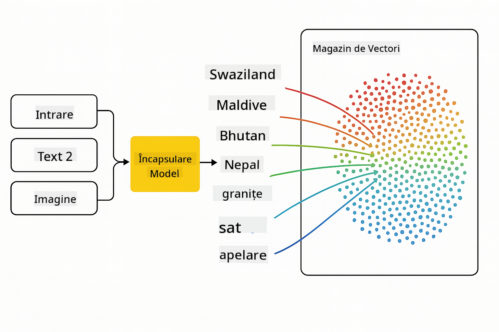
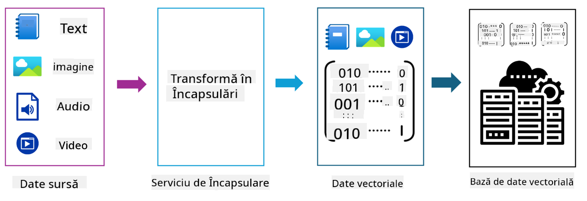
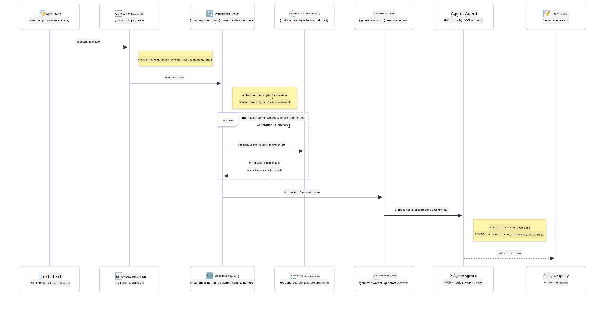

<!--
CO_OP_TRANSLATOR_METADATA:
{
  "original_hash": "75bfb080ca725e8a9aa9c80cae25fba1",
  "translation_date": "2025-07-29T10:09:48+00:00",
  "source_file": "01-IntroToGenAI/README.md",
  "language_code": "ro"
}
-->
# Introducere în AI Generativ - Ediția Java

## Ce vei învăța

- **Fundamentele AI generativ** inclusiv LLM-uri, ingineria prompturilor, tokeni, embedding-uri și baze de date vectoriale
- **Compararea instrumentelor de dezvoltare AI pentru Java** inclusiv Azure OpenAI SDK, Spring AI și OpenAI Java SDK
- **Descoperirea Protocolului de Context al Modelului** și rolul său în comunicarea agenților AI

## Cuprins

- [Introducere](../../../01-IntroToGenAI)
- [O recapitulare rapidă a conceptelor AI generativ](../../../01-IntroToGenAI)
- [Revizuirea ingineriei prompturilor](../../../01-IntroToGenAI)
- [Tokeni, embedding-uri și agenți](../../../01-IntroToGenAI)
- [Instrumente și biblioteci de dezvoltare AI pentru Java](../../../01-IntroToGenAI)
  - [OpenAI Java SDK](../../../01-IntroToGenAI)
  - [Spring AI](../../../01-IntroToGenAI)
  - [Azure OpenAI Java SDK](../../../01-IntroToGenAI)
- [Rezumat](../../../01-IntroToGenAI)
- [Pași următori](../../../01-IntroToGenAI)

## Introducere

Bine ai venit la primul capitol din AI Generativ pentru Începători - Ediția Java! Această lecție fundamentală te introduce în conceptele de bază ale AI generativ și cum să lucrezi cu ele folosind Java. Vei învăța despre elementele esențiale ale aplicațiilor AI, inclusiv Modele de Limbaj de Dimensiuni Mari (LLM-uri), tokeni, embedding-uri și agenți AI. De asemenea, vom explora principalele instrumente Java pe care le vei folosi pe parcursul acestui curs.

### O recapitulare rapidă a conceptelor AI generativ

AI generativ este un tip de inteligență artificială care creează conținut nou, cum ar fi text, imagini sau cod, pe baza tiparelor și relațiilor învățate din date. Modelele AI generative pot genera răspunsuri asemănătoare celor umane, pot înțelege contextul și, uneori, pot crea conținut care pare uman.

Pe măsură ce dezvolți aplicații AI în Java, vei lucra cu **modele AI generative** pentru a crea conținut. Unele dintre capabilitățile modelelor AI generative includ:

- **Generare de text**: Crearea de text asemănător celui uman pentru chatboți, conținut și completarea textului.
- **Generare și analiză de imagini**: Producerea de imagini realiste, îmbunătățirea fotografiilor și detectarea obiectelor.
- **Generare de cod**: Scrierea de fragmente de cod sau scripturi.

Există tipuri specifice de modele optimizate pentru diferite sarcini. De exemplu, atât **Modelele de Limbaj de Dimensiuni Mici (SLM-uri)**, cât și **Modelele de Limbaj de Dimensiuni Mari (LLM-uri)** pot gestiona generarea de text, LLM-urile oferind de obicei performanțe mai bune pentru sarcini complexe. Pentru sarcini legate de imagini, ai folosi modele specializate de viziune sau modele multi-modale.

Desigur, răspunsurile acestor modele nu sunt perfecte tot timpul. Probabil ai auzit despre modele care "halucinează" sau generează informații incorecte într-un mod autoritar. Dar poți ajuta modelul să genereze răspunsuri mai bune oferindu-i instrucțiuni clare și context. Aici intervine **ingineria prompturilor**.

#### Revizuirea ingineriei prompturilor

Ingineria prompturilor este practica de a proiecta intrări eficiente pentru a ghida modelele AI către rezultatele dorite. Aceasta implică:

- **Claritate**: Crearea de instrucțiuni clare și neambigue.
- **Context**: Furnizarea informațiilor de fundal necesare.
- **Constrângeri**: Specificarea oricăror limitări sau formate.

Câteva bune practici pentru ingineria prompturilor includ proiectarea prompturilor, instrucțiuni clare, descompunerea sarcinilor, învățarea one-shot și few-shot, și ajustarea prompturilor. Testarea diferitelor prompturi este esențială pentru a găsi ce funcționează cel mai bine pentru cazul tău specific.

Când dezvolți aplicații, vei lucra cu diferite tipuri de prompturi:
- **Prompturi de sistem**: Setează regulile de bază și contextul pentru comportamentul modelului
- **Prompturi de utilizator**: Datele de intrare de la utilizatorii aplicației tale
- **Prompturi de asistent**: Răspunsurile modelului bazate pe prompturile de sistem și utilizator

> **Află mai multe**: Află mai multe despre ingineria prompturilor în [capitolul Prompt Engineering din cursul GenAI pentru Începători](https://github.com/microsoft/generative-ai-for-beginners/tree/main/04-prompt-engineering-fundamentals)

#### Tokeni, embedding-uri și agenți

Când lucrezi cu modele AI generative, vei întâlni termeni precum **tokeni**, **embedding-uri**, **agenți** și **Protocolul de Context al Modelului (MCP)**. Iată o prezentare detaliată a acestor concepte:

- **Tokeni**: Tokenii sunt cea mai mică unitate de text într-un model. Pot fi cuvinte, caractere sau subcuvinte. Tokenii sunt folosiți pentru a reprezenta datele textuale într-un format pe care modelul îl poate înțelege. De exemplu, propoziția "The quick brown fox jumped over the lazy dog" ar putea fi tokenizată ca ["The", " quick", " brown", " fox", " jumped", " over", " the", " lazy", " dog"] sau ["The", " qu", "ick", " br", "own", " fox", " jump", "ed", " over", " the", " la", "zy", " dog"] în funcție de strategia de tokenizare.

Tokenizarea este procesul de împărțire a textului în aceste unități mai mici. Acest lucru este crucial deoarece modelele operează pe tokeni, nu pe text brut. Numărul de tokeni dintr-un prompt afectează lungimea și calitatea răspunsului modelului, deoarece modelele au limite de tokeni pentru fereastra lor de context (de exemplu, 128K tokeni pentru contextul total al GPT-4o, incluzând atât intrarea, cât și ieșirea).

  În Java, poți folosi biblioteci precum OpenAI SDK pentru a gestiona automat tokenizarea atunci când trimiți cereri către modele AI.

- **Embedding-uri**: Embedding-urile sunt reprezentări vectoriale ale tokenilor care capturează semnificația semantică. Sunt reprezentări numerice (de obicei matrice de numere în virgulă mobilă) care permit modelelor să înțeleagă relațiile dintre cuvinte și să genereze răspunsuri relevante contextual. Cuvintele similare au embedding-uri similare, permițând modelului să înțeleagă concepte precum sinonimele și relațiile semantice.

  În Java, poți genera embedding-uri folosind OpenAI SDK sau alte biblioteci care suportă generarea de embedding-uri. Aceste embedding-uri sunt esențiale pentru sarcini precum căutarea semantică, unde vrei să găsești conținut similar pe baza semnificației, nu a potrivirilor exacte de text.

- **Baze de date vectoriale**: Bazele de date vectoriale sunt sisteme de stocare specializate optimizate pentru embedding-uri. Ele permit căutarea eficientă a similarităților și sunt cruciale pentru modelele de Generare Augmentată prin Recuperare (RAG), unde trebuie să găsești informații relevante din seturi mari de date pe baza similarității semantice, nu a potrivirilor exacte.

> **Notă**: În acest curs, nu vom acoperi bazele de date vectoriale, dar considerăm că merită menționate deoarece sunt utilizate frecvent în aplicațiile din lumea reală.

- **Agenți & MCP**: Componente AI care interacționează autonom cu modele, instrumente și sisteme externe. Protocolul de Context al Modelului (MCP) oferă o modalitate standardizată pentru agenți de a accesa în siguranță surse de date externe și instrumente. Află mai multe în cursul nostru [MCP pentru Începători](https://github.com/microsoft/mcp-for-beginners).

În aplicațiile AI Java, vei folosi tokeni pentru procesarea textului, embedding-uri pentru căutarea semantică și RAG, baze de date vectoriale pentru recuperarea datelor și agenți cu MCP pentru construirea de sisteme inteligente care utilizează instrumente.

### Instrumente și biblioteci de dezvoltare AI pentru Java

Java oferă instrumente excelente pentru dezvoltarea AI. Există trei biblioteci principale pe care le vom explora pe parcursul acestui curs - OpenAI Java SDK, Azure OpenAI SDK și Spring AI.

Iată un tabel de referință rapid care arată ce SDK este utilizat în exemplele fiecărui capitol:

| Capitol | Exemplu | SDK |
|---------|---------|-----|
| 02-SetupDevEnvironment | github-models | OpenAI Java SDK |
| 02-SetupDevEnvironment | basic-chat-azure | Spring AI Azure OpenAI |
| 03-CoreGenerativeAITechniques | examples | Azure OpenAI SDK |
| 04-PracticalSamples | petstory | OpenAI Java SDK |
| 04-PracticalSamples | foundrylocal | OpenAI Java SDK |
| 04-PracticalSamples | calculator | Spring AI MCP SDK + LangChain4j |

**Linkuri către documentația SDK:**
- [Azure OpenAI Java SDK](https://github.com/Azure/azure-sdk-for-java/tree/azure-ai-openai_1.0.0-beta.16/sdk/openai/azure-ai-openai)
- [Spring AI](https://docs.spring.io/spring-ai/reference/)
- [OpenAI Java SDK](https://github.com/openai/openai-java)
- [LangChain4j](https://docs.langchain4j.dev/)

#### OpenAI Java SDK

SDK-ul OpenAI este biblioteca oficială Java pentru API-ul OpenAI. Oferă o interfață simplă și consistentă pentru interacțiunea cu modelele OpenAI, facilitând integrarea capabilităților AI în aplicațiile Java. Exemplul GitHub Models din Capitolul 2, aplicația Pet Story din Capitolul 4 și exemplul Foundry Local demonstrează abordarea SDK-ului OpenAI.

#### Spring AI

Spring AI este un cadru cuprinzător care aduce capabilități AI aplicațiilor Spring, oferind un strat de abstractizare consistent între diferiți furnizori AI. Se integrează perfect cu ecosistemul Spring, fiind alegerea ideală pentru aplicațiile Java de tip enterprise care necesită capabilități AI.

Punctul forte al Spring AI constă în integrarea sa fără cusur cu ecosistemul Spring, facilitând construirea de aplicații AI gata de producție cu tipare familiare Spring, cum ar fi injecția de dependențe, gestionarea configurației și cadrele de testare. Vei folosi Spring AI în Capitolul 2 și 4 pentru a construi aplicații care utilizează atât OpenAI, cât și bibliotecile Spring AI pentru Protocolul de Context al Modelului (MCP).

##### Protocolul de Context al Modelului (MCP)

[Protocolul de Context al Modelului (MCP)](https://modelcontextprotocol.io/) este un standard emergent care permite aplicațiilor AI să interacționeze în siguranță cu surse de date externe și instrumente. MCP oferă o modalitate standardizată pentru modelele AI de a accesa informații contextuale și de a executa acțiuni în aplicațiile tale.

În Capitolul 4, vei construi un serviciu simplu de calculator MCP care demonstrează fundamentele Protocolului de Context al Modelului cu Spring AI, arătând cum să creezi integrări de instrumente de bază și arhitecturi de servicii.

#### Azure OpenAI Java SDK

Biblioteca client Azure OpenAI pentru Java este o adaptare a API-urilor REST OpenAI care oferă o interfață idiomatică și integrare cu restul ecosistemului Azure SDK. În Capitolul 3, vei construi aplicații folosind Azure OpenAI SDK, inclusiv aplicații de chat, apeluri de funcții și modele RAG (Generare Augmentată prin Recuperare).

> Notă: Azure OpenAI SDK este în urmă față de OpenAI Java SDK în ceea ce privește funcționalitățile, așa că pentru proiectele viitoare, ia în considerare utilizarea OpenAI Java SDK.

## Rezumat

Acestea sunt fundamentele! Acum înțelegi:

- Conceptele de bază din spatele AI generativ - de la LLM-uri și ingineria prompturilor la tokeni, embedding-uri și baze de date vectoriale
- Opțiunile tale de instrumente pentru dezvoltarea AI în Java: Azure OpenAI SDK, Spring AI și OpenAI Java SDK
- Ce este Protocolul de Context al Modelului și cum permite agenților AI să lucreze cu instrumente externe

## Pași următori

[Capitolul 2: Configurarea Mediului de Dezvoltare](../02-SetupDevEnvironment/README.md)

**Declinarea responsabilității**:  
Acest document a fost tradus folosind serviciul de traducere AI [Co-op Translator](https://github.com/Azure/co-op-translator). Deși depunem eforturi pentru acuratețe, vă rugăm să rețineți că traducerile automate pot conține erori sau inexactități. Documentul original în limba sa nativă ar trebui considerat sursa autoritară. Pentru informații critice, se recomandă traducerea profesională realizată de un specialist. Nu ne asumăm răspunderea pentru eventualele neînțelegeri sau interpretări greșite care pot apărea din utilizarea acestei traduceri.