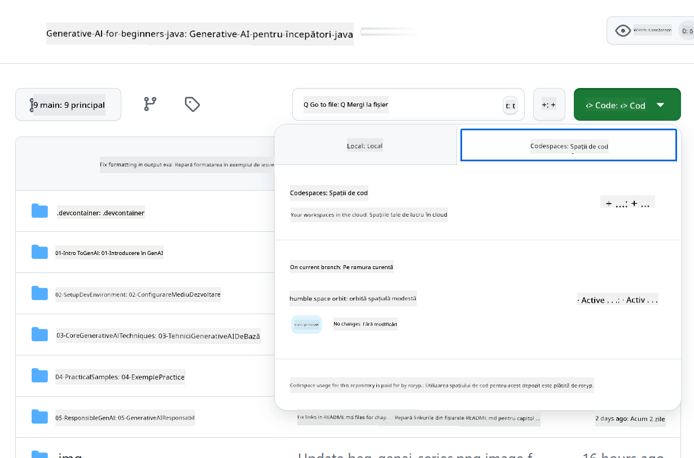

<!--
CO_OP_TRANSLATOR_METADATA:
{
  "original_hash": "bfdb4b4eadbee3a59ef742439f58326a",
  "translation_date": "2025-07-27T13:25:57+00:00",
  "source_file": "02-SetupDevEnvironment/getting-started-azure-openai.md",
  "language_code": "ro"
}
-->
# Configurarea Mediului de Dezvoltare pentru Azure OpenAI

> **Start Rapid**: Acest ghid este pentru configurarea Azure OpenAI. Pentru un început imediat cu modele gratuite, folosiți [Modele GitHub cu Codespaces](./README.md#quick-start-cloud).

Acest ghid vă va ajuta să configurați modelele Azure AI Foundry pentru aplicațiile Java AI din acest curs.

## Cuprins

- [Prezentare Generală a Configurării Rapide](../../../02-SetupDevEnvironment)
- [Pasul 1: Crearea Resurselor Azure AI Foundry](../../../02-SetupDevEnvironment)
  - [Crearea unui Hub și Proiect](../../../02-SetupDevEnvironment)
  - [Deplasarea Modelului GPT-4o-mini](../../../02-SetupDevEnvironment)
- [Pasul 2: Crearea Codespace-ului](../../../02-SetupDevEnvironment)
- [Pasul 3: Configurarea Mediului](../../../02-SetupDevEnvironment)
- [Pasul 4: Testarea Configurării](../../../02-SetupDevEnvironment)
- [Ce Urmează?](../../../02-SetupDevEnvironment)
- [Resurse](../../../02-SetupDevEnvironment)
- [Resurse Suplimentare](../../../02-SetupDevEnvironment)

## Prezentare Generală a Configurării Rapide

1. Creați resurse Azure AI Foundry (Hub, Proiect, Model)
2. Creați un Codespace cu container de dezvoltare Java
3. Configurați fișierul `.env` cu acreditivele Azure OpenAI
4. Testați configurarea cu proiectul exemplu

## Pasul 1: Crearea Resurselor Azure AI Foundry

### Crearea unui Hub și Proiect

1. Accesați [Portalul Azure AI Foundry](https://ai.azure.com/) și autentificați-vă
2. Faceți clic pe **+ Create** → **New hub** (sau navigați la **Management** → **All hubs** → **+ New hub**)
3. Configurați hub-ul:
   - **Hub name**: de exemplu, "MyAIHub"
   - **Subscription**: Selectați abonamentul Azure
   - **Resource group**: Creați unul nou sau selectați unul existent
   - **Location**: Alegeți locația cea mai apropiată
   - **Storage account**: Folosiți implicit sau configurați personalizat
   - **Key vault**: Folosiți implicit sau configurați personalizat
   - Faceți clic pe **Next** → **Review + create** → **Create**
4. După crearea hub-ului, faceți clic pe **+ New project** (sau **Create project** din pagina de prezentare a hub-ului)
   - **Project name**: de exemplu, "GenAIJava"
   - Faceți clic pe **Create**

### Deplasarea Modelului GPT-4o-mini

1. În proiectul dvs., accesați **Model catalog** și căutați **gpt-4o-mini**
   - *Alternativ: Accesați **Deployments** → **+ Create deployment***
2. Faceți clic pe **Deploy** pe cardul modelului gpt-4o-mini
3. Configurați implementarea:
   - **Deployment name**: "gpt-4o-mini"
   - **Model version**: Folosiți cea mai recentă versiune
   - **Deployment type**: Standard
4. Faceți clic pe **Deploy**
5. După implementare, accesați fila **Deployments** și copiați aceste valori:
   - **Deployment name** (de exemplu, "gpt-4o-mini")
   - **Target URI** (de exemplu, `https://your-hub-name.openai.azure.com/`) 
      > **Important**: Copiați doar URL-ul de bază (de exemplu, `https://myhub.openai.azure.com/`) nu calea completă a endpoint-ului.
   - **Key** (din secțiunea Keys and Endpoint)

> **Încă aveți probleme?** Vizitați documentația oficială [Azure AI Foundry Documentation](https://learn.microsoft.com/azure/ai-foundry/how-to/create-projects?tabs=ai-foundry&pivots=hub-project)

## Pasul 2: Crearea Codespace-ului

1. Faceți fork acestui depozit în contul dvs. GitHub
   > **Notă**: Dacă doriți să editați configurația de bază, consultați [Configurarea Containerului de Dezvoltare](../../../.devcontainer/devcontainer.json)
2. În depozitul fork-uit, faceți clic pe **Code** → fila **Codespaces**
3. Faceți clic pe **...** → **New with options...**

4. Selectați **Dev container configuration**: 
   - **Generative AI Java Development Environment**
5. Faceți clic pe **Create codespace**

## Pasul 3: Configurarea Mediului

După ce Codespace-ul este gata, configurați acreditivele Azure OpenAI:

1. **Navigați la proiectul exemplu din rădăcina depozitului:**
   ```bash
   cd 02-SetupDevEnvironment/examples/basic-chat-azure
   ```

2. **Creați fișierul `.env`:**
   ```bash
   cp .env.example .env
   ```

3. **Editați fișierul `.env` cu acreditivele Azure OpenAI:**
   ```bash
   # Your Azure OpenAI API key (from Azure AI Foundry portal)
   AZURE_AI_KEY=your-actual-api-key-here
   
   # Your Azure OpenAI endpoint URL (e.g., https://myhub.openai.azure.com/)
   AZURE_AI_ENDPOINT=https://your-hub-name.openai.azure.com/
   ```

   > **Notă de Securitate**: 
   > - Nu comiteți niciodată fișierul `.env` în controlul versiunilor
   > - Fișierul `.env` este deja inclus în `.gitignore`
   > - Păstrați cheile API în siguranță și rotiți-le regulat

## Pasul 4: Testarea Configurării

Rulați aplicația exemplu pentru a testa conexiunea Azure OpenAI:

```bash
mvn clean spring-boot:run
```

Ar trebui să vedeți un răspuns de la modelul GPT-4o-mini!

> **Utilizatori VS Code**: Puteți apăsa `F5` în VS Code pentru a rula aplicația. Configurația de lansare este deja setată să încarce automat fișierul `.env`.

> **Exemplu complet**: Consultați [Exemplul End-to-End Azure OpenAI](./examples/basic-chat-azure/README.md) pentru instrucțiuni detaliate și depanare.

## Ce Urmează?

**Configurare Finalizată!** Acum aveți:
- Azure OpenAI cu gpt-4o-mini implementat
- Configurare locală `.env`
- Mediu de dezvoltare Java pregătit

**Continuați cu** [Capitolul 3: Tehnici de Bază Generative AI](../03-CoreGenerativeAITechniques/README.md) pentru a începe să construiți aplicații AI!

## Resurse

- [Documentația Azure AI Foundry](https://learn.microsoft.com/azure/ai-services/)
- [Documentația Spring AI Azure OpenAI](https://docs.spring.io/spring-ai/reference/api/clients/azure-openai-chat.html)
- [SDK Java Azure OpenAI](https://learn.microsoft.com/java/api/overview/azure/ai-openai-readme)

## Resurse Suplimentare

- [Descărcați VS Code](https://code.visualstudio.com/Download)
- [Obțineți Docker Desktop](https://www.docker.com/products/docker-desktop)
- [Configurarea Containerului de Dezvoltare](../../../.devcontainer/devcontainer.json)

**Declinare de responsabilitate**:  
Acest document a fost tradus folosind serviciul de traducere AI [Co-op Translator](https://github.com/Azure/co-op-translator). Deși ne străduim să asigurăm acuratețea, vă rugăm să fiți conștienți că traducerile automate pot conține erori sau inexactități. Documentul original în limba sa natală ar trebui considerat sursa autoritară. Pentru informații critice, se recomandă traducerea profesională realizată de un specialist uman. Nu ne asumăm responsabilitatea pentru eventualele neînțelegeri sau interpretări greșite care pot apărea din utilizarea acestei traduceri.