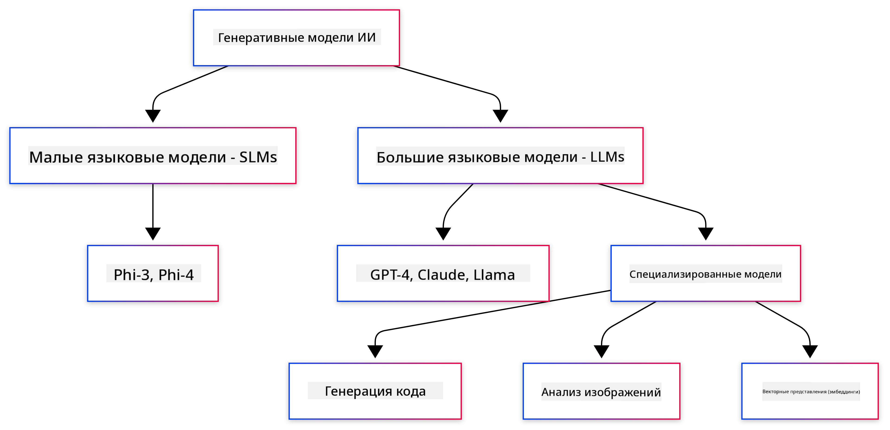
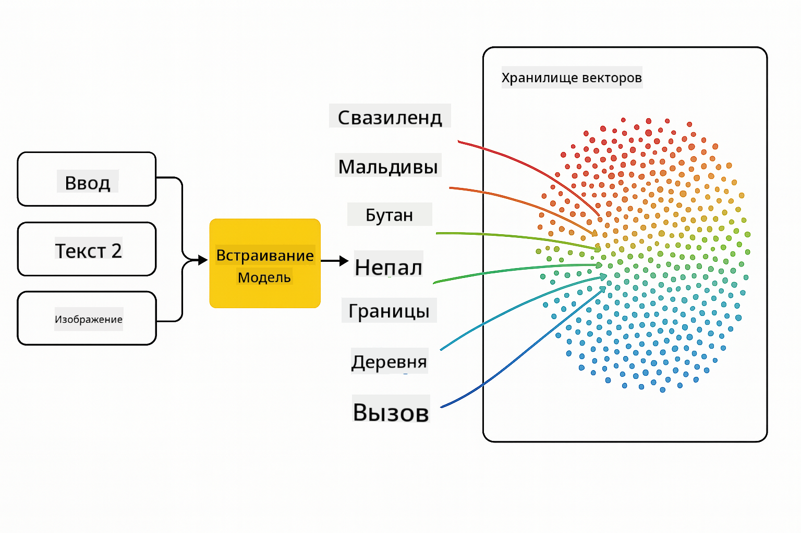
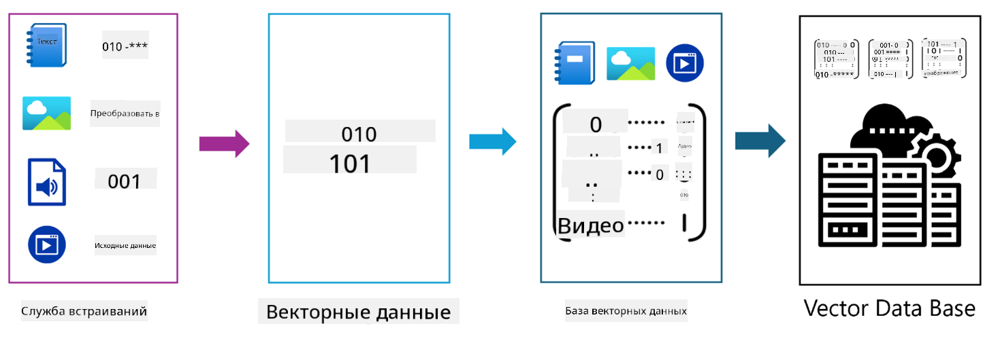

<!--
CO_OP_TRANSLATOR_METADATA:
{
  "original_hash": "6d8b4a0d774dc2a1e97c95859a6d6e4b",
  "translation_date": "2025-07-21T18:37:39+00:00",
  "source_file": "01-IntroToGenAI/README.md",
  "language_code": "ru"
}
-->
# Введение в генеративный ИИ - версия для Java

## Чему вы научитесь

- **Основы генеративного ИИ**, включая LLM, инженерия подсказок, токены, эмбеддинги и векторные базы данных
- **Сравнение инструментов разработки ИИ для Java**, включая Azure OpenAI SDK, Spring AI и OpenAI Java SDK
- **Изучение протокола Model Context Protocol** и его роли в коммуникации агентов ИИ

## Содержание

- [Введение](../../../01-IntroToGenAI)
- [Краткое освежение концепций генеративного ИИ](../../../01-IntroToGenAI)
- [Обзор инженерии подсказок](../../../01-IntroToGenAI)
- [Токены, эмбеддинги и агенты](../../../01-IntroToGenAI)
- [Инструменты и библиотеки для разработки ИИ на Java](../../../01-IntroToGenAI)
  - [OpenAI Java SDK](../../../01-IntroToGenAI)
  - [Spring AI](../../../01-IntroToGenAI)
  - [Azure OpenAI Java SDK](../../../01-IntroToGenAI)
- [Резюме](../../../01-IntroToGenAI)
- [Следующие шаги](../../../01-IntroToGenAI)

## Введение

Добро пожаловать в первую главу курса "Генеративный ИИ для начинающих - версия для Java"! Этот базовый урок познакомит вас с ключевыми концепциями генеративного ИИ и покажет, как работать с ними, используя Java. Вы узнаете о фундаментальных строительных блоках приложений ИИ, включая большие языковые модели (LLM), токены, эмбеддинги и агентов ИИ. Мы также рассмотрим основные инструменты для Java, которые вы будете использовать в этом курсе.

### Краткое освежение концепций генеративного ИИ

Генеративный ИИ — это тип искусственного интеллекта, который создает новый контент, такой как текст, изображения или код, основываясь на шаблонах и взаимосвязях, изученных из данных. Модели генеративного ИИ могут генерировать ответы, похожие на человеческие, понимать контекст и иногда даже создавать контент, который кажется человеческим.

Разрабатывая приложения ИИ на Java, вы будете работать с **моделями генеративного ИИ** для создания контента. Некоторые возможности моделей генеративного ИИ включают:

- **Генерация текста**: Создание текста, похожего на человеческий, для чат-ботов, контента и завершения текста.
- **Генерация и анализ изображений**: Создание реалистичных изображений, улучшение фотографий и обнаружение объектов.
- **Генерация кода**: Написание фрагментов кода или скриптов.

Существуют определенные типы моделей, оптимизированные для различных задач. Например, как **малые языковые модели (SLM)**, так и **большие языковые модели (LLM)** могут справляться с генерацией текста, причем LLM обычно обеспечивают лучшую производительность для сложных задач. Для задач, связанных с изображениями, используются специализированные модели для обработки изображений или мультимодальные модели.

Конечно, ответы этих моделей не всегда идеальны. Вы, вероятно, слышали о том, что модели могут "галлюцинировать" или генерировать некорректную информацию с уверенностью. Однако вы можете помочь модели создавать более качественные ответы, предоставляя ей четкие инструкции и контекст. Здесь на помощь приходит **инженерия подсказок**.

#### Обзор инженерии подсказок

Инженерия подсказок — это практика проектирования эффективных входных данных, чтобы направить модели ИИ к желаемым результатам. Она включает:

- **Ясность**: Формулировка четких и недвусмысленных инструкций.
- **Контекст**: Предоставление необходимой фоновой информации.
- **Ограничения**: Указание любых ограничений или форматов.

Некоторые лучшие практики инженерии подсказок включают проектирование подсказок, четкие инструкции, разбиение задач, обучение на одном или нескольких примерах и настройку подсказок. Тестирование различных подсказок важно для поиска наиболее эффективного подхода для вашего конкретного случая.

При разработке приложений вы будете работать с различными типами подсказок:
- **Системные подсказки**: Устанавливают базовые правила и контекст для поведения модели.
- **Пользовательские подсказки**: Входные данные от пользователей вашего приложения.
- **Подсказки помощника**: Ответы модели, основанные на системных и пользовательских подсказках.

> **Узнать больше**: Узнайте больше о инженерии подсказок в [главе "Основы инженерии подсказок" курса GenAI для начинающих](https://github.com/microsoft/generative-ai-for-beginners/tree/main/04-prompt-engineering-fundamentals)

#### Токены, эмбеддинги и агенты

Работая с моделями генеративного ИИ, вы столкнетесь с такими терминами, как **токены**, **эмбеддинги**, **агенты** и **Model Context Protocol (MCP)**. Вот подробный обзор этих концепций:

- **Токены**: Токены — это наименьшие единицы текста в модели. Это могут быть слова, символы или подслова. Токены используются для представления текстовых данных в формате, который модель может понять. Например, предложение "The quick brown fox jumped over the lazy dog" может быть токенизировано как ["The", " quick", " brown", " fox", " jumped", " over", " the", " lazy", " dog"] или ["The", " qu", "ick", " br", "own", " fox", " jump", "ed", " over", " the", " la", "zy", " dog"] в зависимости от стратегии токенизации.

Токенизация — это процесс разбиения текста на эти меньшие единицы. Это важно, потому что модели работают с токенами, а не с необработанным текстом. Количество токенов в подсказке влияет на длину и качество ответа модели, так как у моделей есть ограничения на количество токенов в контекстном окне (например, 128K токенов для общего контекста GPT-4o, включая входные и выходные данные).

  В Java вы можете использовать библиотеки, такие как OpenAI SDK, для автоматической обработки токенизации при отправке запросов к моделям ИИ.

- **Эмбеддинги**: Эмбеддинги — это векторные представления токенов, которые захватывают семантическое значение. Это числовые представления (обычно массивы чисел с плавающей точкой), которые позволяют моделям понимать взаимосвязи между словами и генерировать контекстуально релевантные ответы. Похожие слова имеют похожие эмбеддинги, что позволяет модели понимать такие концепции, как синонимы и семантические связи.

  В Java вы можете генерировать эмбеддинги, используя OpenAI SDK или другие библиотеки, поддерживающие генерацию эмбеддингов. Эти эмбеддинги важны для задач, таких как семантический поиск, где вы хотите найти похожий контент на основе значения, а не точного совпадения текста.

- **Векторные базы данных**: Векторные базы данных — это специализированные системы хранения, оптимизированные для эмбеддингов. Они обеспечивают эффективный поиск по сходству и являются ключевыми для паттернов Retrieval-Augmented Generation (RAG), где необходимо находить релевантную информацию из больших наборов данных на основе семантического сходства, а не точных совпадений.

> **Примечание**: В этом курсе мы не будем подробно рассматривать векторные базы данных, но считаем, что они заслуживают упоминания, так как часто используются в реальных приложениях.

- **Агенты и MCP**: Компоненты ИИ, которые автономно взаимодействуют с моделями, инструментами и внешними системами. Протокол Model Context Protocol (MCP) предоставляет стандартизированный способ для агентов безопасно получать доступ к внешним источникам данных и инструментам. Узнайте больше в нашем курсе [MCP для начинающих](https://github.com/microsoft/mcp-for-beginners).

В приложениях ИИ на Java вы будете использовать токены для обработки текста, эмбеддинги для семантического поиска и RAG, векторные базы данных для извлечения данных и агентов с MCP для создания интеллектуальных систем, использующих инструменты.

### Инструменты и библиотеки для разработки ИИ на Java

Java предлагает отличные инструменты для разработки ИИ. В этом курсе мы рассмотрим три основные библиотеки — OpenAI Java SDK, Azure OpenAI SDK и Spring AI.

Вот краткая таблица, показывающая, какая библиотека используется в примерах каждой главы:

| Глава | Пример | SDK |
|-------|--------|-----|
| 02-SetupDevEnvironment | src/github-models/ | OpenAI Java SDK |
| 02-SetupDevEnvironment | src/basic-chat-azure/ | Spring AI Azure OpenAI |
| 03-CoreGenerativeAITechniques | examples/ | Azure OpenAI SDK |
| 04-PracticalSamples | petstory/ | OpenAI Java SDK |
| 04-PracticalSamples | foundrylocal/ | OpenAI Java SDK |
| 04-PracticalSamples | mcp/calculator/ | Spring AI MCP SDK + LangChain4j |

**Ссылки на документацию SDK:**
- [Azure OpenAI Java SDK](https://github.com/Azure/azure-sdk-for-java/tree/azure-ai-openai_1.0.0-beta.16/sdk/openai/azure-ai-openai)
- [Spring AI](https://docs.spring.io/spring-ai/reference/)
- [OpenAI Java SDK](https://github.com/openai/openai-java)
- [LangChain4j](https://docs.langchain4j.dev/)

#### OpenAI Java SDK

OpenAI SDK — это официальная библиотека Java для API OpenAI. Она предоставляет простой и последовательный интерфейс для взаимодействия с моделями OpenAI, что упрощает интеграцию возможностей ИИ в приложения на Java. Примеры GitHub Models из главы 2, приложение Pet Story и пример Foundry Local из главы 4 демонстрируют подход OpenAI SDK.

#### Spring AI

Spring AI — это комплексный фреймворк, который добавляет возможности ИИ в приложения Spring, предоставляя единый уровень абстракции для различных поставщиков ИИ. Он интегрируется с экосистемой Spring, что делает его идеальным выбором для корпоративных приложений Java, нуждающихся в возможностях ИИ.

Сила Spring AI заключается в его бесшовной интеграции с экосистемой Spring, что упрощает создание готовых к производству приложений ИИ с использованием знакомых шаблонов Spring, таких как внедрение зависимостей, управление конфигурацией и тестовые фреймворки. Вы будете использовать Spring AI в главах 2 и 4 для создания приложений, использующих библиотеки OpenAI и Model Context Protocol (MCP) Spring AI.

##### Model Context Protocol (MCP)

[Model Context Protocol (MCP)](https://modelcontextprotocol.io/) — это новый стандарт, который позволяет приложениям ИИ безопасно взаимодействовать с внешними источниками данных и инструментами. MCP предоставляет стандартизированный способ для моделей ИИ получать доступ к контекстной информации и выполнять действия в ваших приложениях.

В главе 4 вы создадите простой сервис калькулятора MCP, который демонстрирует основы протокола Model Context Protocol с Spring AI, показывая, как создавать базовые интеграции инструментов и архитектуры сервисов.

#### Azure OpenAI Java SDK

Клиентская библиотека Azure OpenAI для Java — это адаптация REST API OpenAI, которая предоставляет идиоматический интерфейс и интеграцию с остальной экосистемой Azure SDK. В главе 3 вы создадите приложения, используя Azure OpenAI SDK, включая чат-приложения, вызов функций и паттерны RAG (Retrieval-Augmented Generation).

> Примечание: Azure OpenAI SDK отстает от OpenAI Java SDK по функциональности, поэтому для будущих проектов рассмотрите возможность использования OpenAI Java SDK.

## Резюме

**Поздравляем!** Вы успешно:

- **Изучили основы генеративного ИИ**, включая LLM, инженерия подсказок, токены, эмбеддинги и векторные базы данных
- **Сравнили инструменты разработки ИИ для Java**, включая Azure OpenAI SDK, Spring AI и OpenAI Java SDK
- **Открыли для себя протокол Model Context Protocol** и его роль в коммуникации агентов ИИ

## Следующие шаги

[Глава 2: Настройка среды разработки](../02-SetupDevEnvironment/README.md)

**Отказ от ответственности**:  
Этот документ был переведен с использованием сервиса автоматического перевода [Co-op Translator](https://github.com/Azure/co-op-translator). Хотя мы стремимся к точности, пожалуйста, учитывайте, что автоматические переводы могут содержать ошибки или неточности. Оригинальный документ на его родном языке следует считать авторитетным источником. Для получения критически важной информации рекомендуется профессиональный перевод человеком. Мы не несем ответственности за любые недоразумения или неправильные интерпретации, возникшие в результате использования данного перевода.