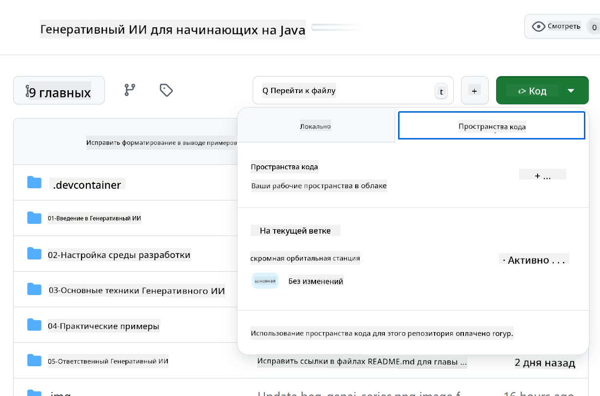

<!--
CO_OP_TRANSLATOR_METADATA:
{
  "original_hash": "bfdb4b4eadbee3a59ef742439f58326a",
  "translation_date": "2025-07-27T12:51:01+00:00",
  "source_file": "02-SetupDevEnvironment/getting-started-azure-openai.md",
  "language_code": "ru"
}
-->
# Настройка среды разработки для Azure OpenAI

> **Быстрый старт**: Это руководство предназначено для настройки Azure OpenAI. Для быстрого начала с бесплатными моделями используйте [GitHub Models with Codespaces](./README.md#quick-start-cloud).

Это руководство поможет вам настроить модели Azure AI Foundry для ваших Java AI приложений в рамках этого курса.

## Содержание

- [Обзор быстрой настройки](../../../02-SetupDevEnvironment)
- [Шаг 1: Создание ресурсов Azure AI Foundry](../../../02-SetupDevEnvironment)
  - [Создание хаба и проекта](../../../02-SetupDevEnvironment)
  - [Развертывание модели GPT-4o-mini](../../../02-SetupDevEnvironment)
- [Шаг 2: Создание Codespace](../../../02-SetupDevEnvironment)
- [Шаг 3: Настройка среды](../../../02-SetupDevEnvironment)
- [Шаг 4: Тестирование настройки](../../../02-SetupDevEnvironment)
- [Что дальше?](../../../02-SetupDevEnvironment)
- [Ресурсы](../../../02-SetupDevEnvironment)
- [Дополнительные ресурсы](../../../02-SetupDevEnvironment)

## Обзор быстрой настройки

1. Создайте ресурсы Azure AI Foundry (хаб, проект, модель)
2. Создайте Codespace с контейнером для разработки на Java
3. Настройте файл .env с учетными данными Azure OpenAI
4. Протестируйте настройку с помощью примерного проекта

## Шаг 1: Создание ресурсов Azure AI Foundry

### Создание хаба и проекта

1. Перейдите на [портал Azure AI Foundry](https://ai.azure.com/) и войдите в систему
2. Нажмите **+ Create** → **New hub** (или перейдите в **Management** → **All hubs** → **+ New hub**)
3. Настройте ваш хаб:
   - **Hub name**: например, "MyAIHub"
   - **Subscription**: выберите вашу подписку Azure
   - **Resource group**: создайте новую или выберите существующую
   - **Location**: выберите ближайший к вам регион
   - **Storage account**: используйте стандартный или настройте свой
   - **Key vault**: используйте стандартный или настройте свой
   - Нажмите **Next** → **Review + create** → **Create**
4. После создания нажмите **+ New project** (или **Create project** на странице обзора хаба)
   - **Project name**: например, "GenAIJava"
   - Нажмите **Create**

### Развертывание модели GPT-4o-mini

1. В вашем проекте перейдите в **Model catalog** и найдите **gpt-4o-mini**
   - *Альтернатива: Перейдите в **Deployments** → **+ Create deployment***
2. Нажмите **Deploy** на карточке модели gpt-4o-mini
3. Настройте развертывание:
   - **Deployment name**: "gpt-4o-mini"
   - **Model version**: используйте последнюю версию
   - **Deployment type**: Standard
4. Нажмите **Deploy**
5. После развертывания перейдите на вкладку **Deployments** и скопируйте следующие значения:
   - **Deployment name** (например, "gpt-4o-mini")
   - **Target URI** (например, `https://your-hub-name.openai.azure.com/`)  
      > **Важно**: Скопируйте только базовый URL (например, `https://myhub.openai.azure.com/`), а не полный путь к конечной точке.
   - **Key** (из раздела Keys and Endpoint)

> **Все еще есть вопросы?** Посетите официальную [документацию Azure AI Foundry](https://learn.microsoft.com/azure/ai-foundry/how-to/create-projects?tabs=ai-foundry&pivots=hub-project)

## Шаг 2: Создание Codespace

1. Форкните этот репозиторий в свой аккаунт GitHub
   > **Примечание**: Если вы хотите изменить базовую конфигурацию, ознакомьтесь с [Dev Container Configuration](../../../.devcontainer/devcontainer.json)
2. В вашем форкнутом репозитории нажмите **Code** → вкладка **Codespaces**
3. Нажмите **...** → **New with options...**

4. Выберите **Dev container configuration**: 
   - **Generative AI Java Development Environment**
5. Нажмите **Create codespace**

## Шаг 3: Настройка среды

После создания Codespace настройте учетные данные Azure OpenAI:

1. **Перейдите в примерный проект из корня репозитория:**
   ```bash
   cd 02-SetupDevEnvironment/examples/basic-chat-azure
   ```

2. **Создайте файл .env:**
   ```bash
   cp .env.example .env
   ```

3. **Отредактируйте файл .env, добавив учетные данные Azure OpenAI:**
   ```bash
   # Your Azure OpenAI API key (from Azure AI Foundry portal)
   AZURE_AI_KEY=your-actual-api-key-here
   
   # Your Azure OpenAI endpoint URL (e.g., https://myhub.openai.azure.com/)
   AZURE_AI_ENDPOINT=https://your-hub-name.openai.azure.com/
   ```

   > **Примечание по безопасности**: 
   > - Никогда не добавляйте файл `.env` в систему контроля версий
   > - Файл `.env` уже включен в `.gitignore`
   > - Храните свои API-ключи в безопасности и регулярно их обновляйте

## Шаг 4: Тестирование настройки

Запустите примерное приложение, чтобы проверить подключение к Azure OpenAI:

```bash
mvn clean spring-boot:run
```

Вы должны увидеть ответ от модели GPT-4o-mini!

> **Пользователи VS Code**: Вы также можете нажать `F5` в VS Code, чтобы запустить приложение. Конфигурация запуска уже настроена для автоматической загрузки вашего файла `.env`.

> **Полный пример**: Ознакомьтесь с [End-to-End Azure OpenAI Example](./examples/basic-chat-azure/README.md) для подробных инструкций и устранения неполадок.

## Что дальше?

**Настройка завершена!** Теперь у вас есть:
- Azure OpenAI с развернутой моделью gpt-4o-mini
- Локальная конфигурация файла .env
- Готовая среда разработки на Java

**Продолжайте к** [Главе 3: Основные техники генеративного ИИ](../03-CoreGenerativeAITechniques/README.md), чтобы начать создавать AI-приложения!

## Ресурсы

- [Документация Azure AI Foundry](https://learn.microsoft.com/azure/ai-services/)
- [Документация Spring AI Azure OpenAI](https://docs.spring.io/spring-ai/reference/api/clients/azure-openai-chat.html)
- [Java SDK для Azure OpenAI](https://learn.microsoft.com/java/api/overview/azure/ai-openai-readme)

## Дополнительные ресурсы

- [Скачать VS Code](https://code.visualstudio.com/Download)
- [Скачать Docker Desktop](https://www.docker.com/products/docker-desktop)
- [Конфигурация Dev Container](../../../.devcontainer/devcontainer.json)

**Отказ от ответственности**:  
Этот документ был переведен с помощью сервиса автоматического перевода [Co-op Translator](https://github.com/Azure/co-op-translator). Хотя мы стремимся к точности, пожалуйста, учитывайте, что автоматические переводы могут содержать ошибки или неточности. Оригинальный документ на его родном языке следует считать авторитетным источником. Для получения критически важной информации рекомендуется профессиональный перевод человеком. Мы не несем ответственности за любые недоразумения или неправильные интерпретации, возникающие в результате использования данного перевода.