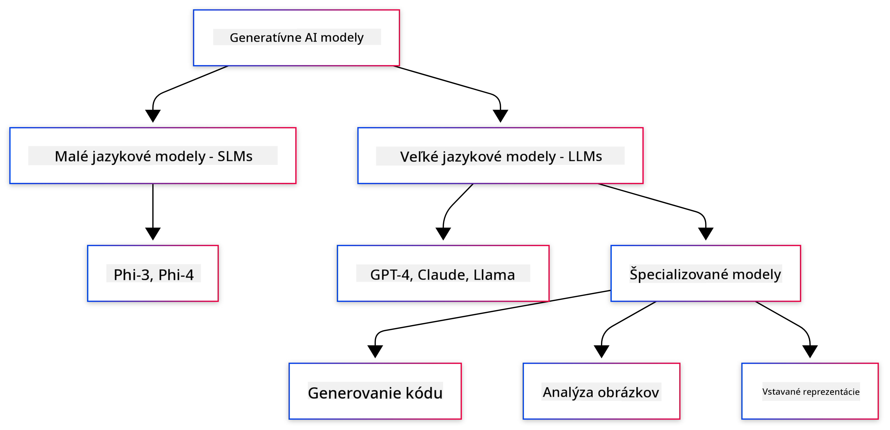
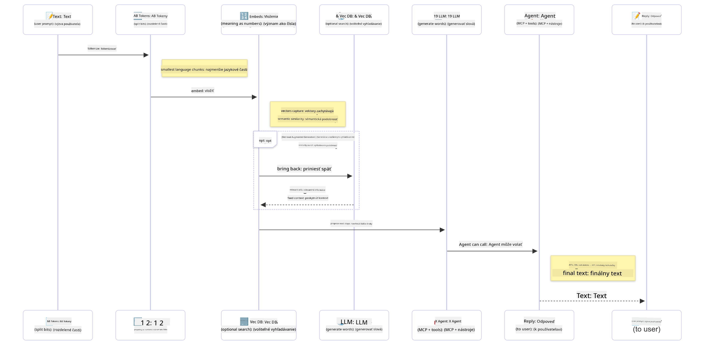

<!--
CO_OP_TRANSLATOR_METADATA:
{
  "original_hash": "006866db93a268a8769bb55f2e324291",
  "translation_date": "2025-07-28T11:09:30+00:00",
  "source_file": "01-IntroToGenAI/README.md",
  "language_code": "sk"
}
-->
# Úvod do Generatívnej AI - Java edícia

## Čo sa naučíte

- **Základy generatívnej AI**, vrátane LLM, návrhu promptov, tokenov, embeddingov a vektorových databáz
- **Porovnanie nástrojov na vývoj AI v Jave**, ako sú Azure OpenAI SDK, Spring AI a OpenAI Java SDK
- **Objavte Model Context Protocol** a jeho úlohu v komunikácii AI agentov

## Obsah

- [Úvod](../../../01-IntroToGenAI)
- [Rýchle zopakovanie konceptov generatívnej AI](../../../01-IntroToGenAI)
- [Prehľad návrhu promptov](../../../01-IntroToGenAI)
- [Tokeny, embeddingy a agenti](../../../01-IntroToGenAI)
- [Nástroje a knižnice pre vývoj AI v Jave](../../../01-IntroToGenAI)
  - [OpenAI Java SDK](../../../01-IntroToGenAI)
  - [Spring AI](../../../01-IntroToGenAI)
  - [Azure OpenAI Java SDK](../../../01-IntroToGenAI)
- [Zhrnutie](../../../01-IntroToGenAI)
- [Ďalšie kroky](../../../01-IntroToGenAI)

## Úvod

Vitajte v prvej kapitole Generatívnej AI pre začiatočníkov - Java edícia! Táto úvodná lekcia vás oboznámi so základnými konceptmi generatívnej AI a s tým, ako s nimi pracovať v Jave. Naučíte sa o základných stavebných prvkoch AI aplikácií, vrátane veľkých jazykových modelov (LLM), tokenov, embeddingov a AI agentov. Preskúmame aj hlavné nástroje pre Javu, ktoré budete používať počas tohto kurzu.

### Rýchle zopakovanie konceptov generatívnej AI

Generatívna AI je typ umelej inteligencie, ktorá vytvára nový obsah, ako sú texty, obrázky alebo kód, na základe vzorov a vzťahov naučených z dát. Modely generatívnej AI dokážu generovať odpovede podobné ľudským, chápať kontext a niekedy dokonca vytvárať obsah, ktorý pôsobí ako ľudský.

Pri vývoji vašich Java AI aplikácií budete pracovať s **generatívnymi AI modelmi** na tvorbu obsahu. Niektoré schopnosti generatívnych AI modelov zahŕňajú:

- **Generovanie textu**: Tvorba textov podobných ľudským pre chatboty, obsah a dopĺňanie textu.
- **Generovanie a analýza obrázkov**: Vytváranie realistických obrázkov, vylepšovanie fotografií a detekcia objektov.
- **Generovanie kódu**: Písanie útržkov kódu alebo skriptov.

Existujú špecifické typy modelov optimalizované pre rôzne úlohy. Napríklad, **malé jazykové modely (SLM)** a **veľké jazykové modely (LLM)** dokážu spracovať generovanie textu, pričom LLM zvyčajne ponúkajú lepší výkon pri zložitejších úlohách. Pre úlohy súvisiace s obrázkami by ste použili špecializované vizuálne modely alebo multimodálne modely.

Samozrejme, odpovede týchto modelov nie sú vždy dokonalé. Pravdepodobne ste už počuli o tom, že modely „halucinujú“ alebo generujú nesprávne informácie autoritatívnym spôsobom. Môžete však modelu pomôcť generovať lepšie odpovede tým, že mu poskytnete jasné inštrukcie a kontext. Tu prichádza na rad **návrh promptov**.

#### Prehľad návrhu promptov

Návrh promptov je prax navrhovania efektívnych vstupov na usmernenie AI modelov k požadovaným výstupom. Zahŕňa:

- **Jasnosť**: Zabezpečenie, že inštrukcie sú jasné a jednoznačné.
- **Kontext**: Poskytnutie potrebných informácií na pozadí.
- **Obmedzenia**: Špecifikovanie akýchkoľvek limitov alebo formátov.

Niektoré osvedčené postupy pre návrh promptov zahŕňajú návrh promptov, jasné inštrukcie, rozdelenie úloh, učenie na jednom alebo niekoľkých príkladoch a ladenie promptov. Testovanie rôznych promptov je nevyhnutné na zistenie, čo najlepšie funguje pre váš konkrétny prípad použitia.

Pri vývoji aplikácií budete pracovať s rôznymi typmi promptov:
- **Systémové prompty**: Nastavujú základné pravidlá a kontext pre správanie modelu.
- **Používateľské prompty**: Vstupné dáta od používateľov vašej aplikácie.
- **Asistenčné prompty**: Odpovede modelu na základe systémových a používateľských promptov.

> **Viac sa dozviete**: Viac o návrhu promptov sa dozviete v [kapitole o návrhu promptov kurzu GenAI pre začiatočníkov](https://github.com/microsoft/generative-ai-for-beginners/tree/main/04-prompt-engineering-fundamentals)

#### Tokeny, embeddingy a agenti

Pri práci s generatívnymi AI modelmi sa stretnete s pojmami ako **tokeny**, **embeddingy**, **agenti** a **Model Context Protocol (MCP)**. Tu je podrobný prehľad týchto konceptov:

- **Tokeny**: Tokeny sú najmenšie jednotky textu v modeli. Môžu to byť slová, znaky alebo podslová. Tokeny sa používajú na reprezentáciu textových dát vo formáte, ktorému model rozumie. Napríklad veta „The quick brown fox jumped over the lazy dog“ môže byť tokenizovaná ako ["The", " quick", " brown", " fox", " jumped", " over", " the", " lazy", " dog"] alebo ["The", " qu", "ick", " br", "own", " fox", " jump", "ed", " over", " the", " la", "zy", " dog"] v závislosti od stratégie tokenizácie.

Tokenizácia je proces rozdelenia textu na tieto menšie jednotky. Je to kľúčové, pretože modely pracujú s tokenmi namiesto surového textu. Počet tokenov v promte ovplyvňuje dĺžku a kvalitu odpovede modelu, pretože modely majú limity na počet tokenov vo svojom kontextovom okne (napr. 128K tokenov pre celkový kontext GPT-4o, vrátane vstupu a výstupu).

  V Jave môžete použiť knižnice ako OpenAI SDK na automatické spracovanie tokenizácie pri odosielaní požiadaviek na AI modely.

- **Embeddingy**: Embeddingy sú vektorové reprezentácie tokenov, ktoré zachytávajú sémantický význam. Sú to číselné reprezentácie (zvyčajne polia čísel s pohyblivou desatinnou čiarkou), ktoré umožňujú modelom chápať vzťahy medzi slovami a generovať kontextovo relevantné odpovede. Podobné slová majú podobné embeddingy, čo umožňuje modelu chápať koncepty ako synonymá a sémantické vzťahy.

  V Jave môžete generovať embeddingy pomocou OpenAI SDK alebo iných knižníc, ktoré podporujú generovanie embeddingov. Tieto embeddingy sú nevyhnutné pre úlohy ako sémantické vyhľadávanie, kde chcete nájsť podobný obsah na základe významu, a nie presných textových zhôd.

- **Vektorové databázy**: Vektorové databázy sú špecializované úložné systémy optimalizované pre embeddingy. Umožňujú efektívne vyhľadávanie podobností a sú kľúčové pre vzory Retrieval-Augmented Generation (RAG), kde potrebujete nájsť relevantné informácie z veľkých datasetov na základe sémantickej podobnosti, a nie presných zhôd.

> **Poznámka**: V tomto kurze sa nebudeme venovať vektorovým databázam, ale považujeme ich za dôležité spomenúť, pretože sa bežne používajú v reálnych aplikáciách.

- **Agenti a MCP**: AI komponenty, ktoré autonómne interagujú s modelmi, nástrojmi a externými systémami. Model Context Protocol (MCP) poskytuje štandardizovaný spôsob, ako môžu agenti bezpečne pristupovať k externým zdrojom dát a nástrojom. Viac sa dozviete v našom kurze [MCP pre začiatočníkov](https://github.com/microsoft/mcp-for-beginners).

V Java AI aplikáciách budete používať tokeny na spracovanie textu, embeddingy na sémantické vyhľadávanie a RAG, vektorové databázy na získavanie dát a agentov s MCP na budovanie inteligentných systémov využívajúcich nástroje.

### Nástroje a knižnice pre vývoj AI v Jave

Java ponúka vynikajúce nástroje na vývoj AI. Počas tohto kurzu preskúmame tri hlavné knižnice - OpenAI Java SDK, Azure OpenAI SDK a Spring AI.

Tu je rýchla referenčná tabuľka ukazujúca, ktorý SDK sa používa v príkladoch jednotlivých kapitol:

| Kapitola | Príklad | SDK |
|----------|---------|-----|
| 02-SetupDevEnvironment | github-models | OpenAI Java SDK |
| 02-SetupDevEnvironment | basic-chat-azure | Spring AI Azure OpenAI |
| 03-CoreGenerativeAITechniques | examples | Azure OpenAI SDK |
| 04-PracticalSamples | petstory | OpenAI Java SDK |
| 04-PracticalSamples | foundrylocal | OpenAI Java SDK |
| 04-PracticalSamples | calculator | Spring AI MCP SDK + LangChain4j |

**Odkazy na dokumentáciu SDK:**
- [Azure OpenAI Java SDK](https://github.com/Azure/azure-sdk-for-java/tree/azure-ai-openai_1.0.0-beta.16/sdk/openai/azure-ai-openai)
- [Spring AI](https://docs.spring.io/spring-ai/reference/)
- [OpenAI Java SDK](https://github.com/openai/openai-java)
- [LangChain4j](https://docs.langchain4j.dev/)

#### OpenAI Java SDK

OpenAI SDK je oficiálna Java knižnica pre OpenAI API. Poskytuje jednoduché a konzistentné rozhranie na interakciu s modelmi OpenAI, čo uľahčuje integráciu AI schopností do Java aplikácií. Príklady GitHub Models v kapitole 2, aplikácia Pet Story v kapitole 4 a príklad Foundry Local demonštrujú prístup OpenAI SDK.

#### Spring AI

Spring AI je komplexný rámec, ktorý prináša AI schopnosti do Spring aplikácií, poskytujúc konzistentnú abstrakčnú vrstvu naprieč rôznymi AI poskytovateľmi. Bezproblémovo sa integruje s ekosystémom Spring, čo z neho robí ideálnu voľbu pre podnikové Java aplikácie, ktoré potrebujú AI schopnosti.

Silnou stránkou Spring AI je jeho bezproblémová integrácia s ekosystémom Spring, čo uľahčuje budovanie produkčne pripravených AI aplikácií s použitím známych Spring vzorov, ako sú injekcia závislostí, správa konfigurácie a testovacie rámce. Spring AI budete používať v kapitolách 2 a 4 na budovanie aplikácií, ktoré využívajú OpenAI aj knižnice Model Context Protocol (MCP) Spring AI.

##### Model Context Protocol (MCP)

[Model Context Protocol (MCP)](https://modelcontextprotocol.io/) je vznikajúci štandard, ktorý umožňuje AI aplikáciám bezpečne interagovať s externými zdrojmi dát a nástrojmi. MCP poskytuje štandardizovaný spôsob, ako môžu AI modely pristupovať ku kontextovým informáciám a vykonávať akcie vo vašich aplikáciách.

V kapitole 4 vytvoríte jednoduchú MCP kalkulačkovú službu, ktorá demonštruje základy Model Context Protocol so Spring AI, ukazujúc, ako vytvárať základné integrácie nástrojov a architektúry služieb.

#### Azure OpenAI Java SDK

Klientská knižnica Azure OpenAI pre Javu je adaptáciou REST API OpenAI, ktorá poskytuje idiomatické rozhranie a integráciu so zvyškom ekosystému Azure SDK. V kapitole 3 budete budovať aplikácie pomocou Azure OpenAI SDK, vrátane chatovacích aplikácií, volania funkcií a vzorov RAG (Retrieval-Augmented Generation).

> Poznámka: Azure OpenAI SDK zaostáva za OpenAI Java SDK, pokiaľ ide o funkcie, takže pre budúce projekty zvážte použitie OpenAI Java SDK.

## Zhrnutie

**Gratulujeme!** Úspešne ste:

- **Naučili sa základy generatívnej AI**, vrátane LLM, návrhu promptov, tokenov, embeddingov a vektorových databáz
- **Porovnali nástroje na vývoj AI v Jave**, ako sú Azure OpenAI SDK, Spring AI a OpenAI Java SDK
- **Objavili Model Context Protocol** a jeho úlohu v komunikácii AI agentov

## Ďalšie kroky

[2. kapitola: Nastavenie vývojového prostredia](../02-SetupDevEnvironment/README.md)

**Zrieknutie sa zodpovednosti**:  
Tento dokument bol preložený pomocou služby AI prekladu [Co-op Translator](https://github.com/Azure/co-op-translator). Hoci sa snažíme o presnosť, prosím, berte na vedomie, že automatizované preklady môžu obsahovať chyby alebo nepresnosti. Pôvodný dokument v jeho rodnom jazyku by mal byť považovaný za autoritatívny zdroj. Pre kritické informácie sa odporúča profesionálny ľudský preklad. Nenesieme zodpovednosť za akékoľvek nedorozumenia alebo nesprávne interpretácie vyplývajúce z použitia tohto prekladu.