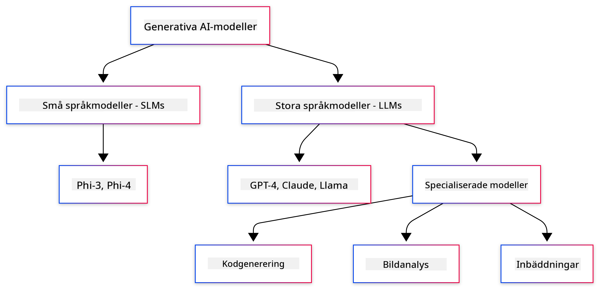
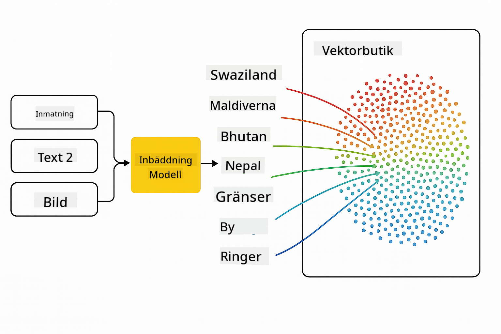
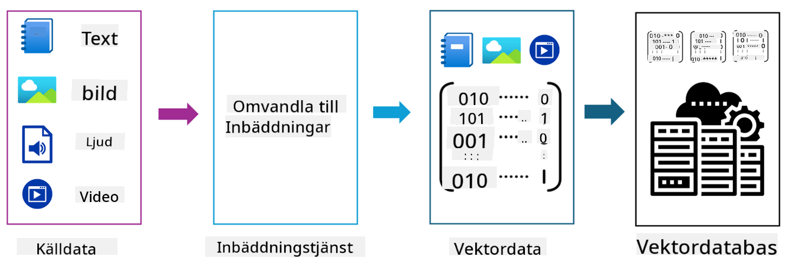
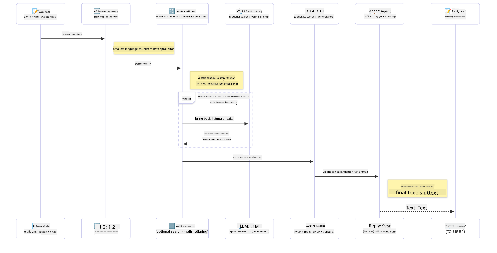

<!--
CO_OP_TRANSLATOR_METADATA:
{
  "original_hash": "75bfb080ca725e8a9aa9c80cae25fba1",
  "translation_date": "2025-07-29T09:24:13+00:00",
  "source_file": "01-IntroToGenAI/README.md",
  "language_code": "sv"
}
-->
# Introduktion till Generativ AI - Java Edition

## Vad du kommer att lära dig

- **Grundläggande om generativ AI**, inklusive LLMs, prompt engineering, tokens, embeddings och vektordatabaser
- **Jämförelse av Java AI-utvecklingsverktyg**, inklusive Azure OpenAI SDK, Spring AI och OpenAI Java SDK
- **Upptäck Model Context Protocol** och dess roll i AI-agenters kommunikation

## Innehållsförteckning

- [Introduktion](../../../01-IntroToGenAI)
- [En snabb översikt över begrepp inom generativ AI](../../../01-IntroToGenAI)
- [Genomgång av prompt engineering](../../../01-IntroToGenAI)
- [Tokens, embeddings och agenter](../../../01-IntroToGenAI)
- [AI-utvecklingsverktyg och bibliotek för Java](../../../01-IntroToGenAI)
  - [OpenAI Java SDK](../../../01-IntroToGenAI)
  - [Spring AI](../../../01-IntroToGenAI)
  - [Azure OpenAI Java SDK](../../../01-IntroToGenAI)
- [Sammanfattning](../../../01-IntroToGenAI)
- [Nästa steg](../../../01-IntroToGenAI)

## Introduktion

Välkommen till det första kapitlet i Generativ AI för nybörjare - Java Edition! Denna grundläggande lektion introducerar dig till kärnkoncepten inom generativ AI och hur du kan arbeta med dem med hjälp av Java. Du kommer att lära dig om de grundläggande byggstenarna för AI-applikationer, inklusive Large Language Models (LLMs), tokens, embeddings och AI-agenter. Vi kommer också att utforska de primära Java-verktygen som du kommer att använda under kursen.

### En snabb översikt över begrepp inom generativ AI

Generativ AI är en typ av artificiell intelligens som skapar nytt innehåll, såsom text, bilder eller kod, baserat på mönster och relationer som den har lärt sig från data. Generativa AI-modeller kan generera mänskliga liknande svar, förstå kontext och ibland till och med skapa innehåll som verkar mänskligt.

När du utvecklar dina Java AI-applikationer kommer du att arbeta med **generativa AI-modeller** för att skapa innehåll. Några av de funktioner som generativa AI-modeller erbjuder inkluderar:

- **Textgenerering**: Skapa mänskligt liknande text för chatbots, innehåll och textkomplettering.
- **Bildgenerering och analys**: Producera realistiska bilder, förbättra foton och identifiera objekt.
- **Kodgenerering**: Skriva kodsnuttar eller skript.

Det finns specifika typer av modeller som är optimerade för olika uppgifter. Till exempel kan både **Small Language Models (SLMs)** och **Large Language Models (LLMs)** hantera textgenerering, där LLMs vanligtvis erbjuder bättre prestanda för komplexa uppgifter. För bildrelaterade uppgifter använder du specialiserade visionsmodeller eller multimodala modeller.

Naturligtvis är svaren från dessa modeller inte alltid perfekta. Du har förmodligen hört talas om att modeller "hallucinerar" eller genererar felaktig information på ett övertygande sätt. Men du kan hjälpa modellen att generera bättre svar genom att ge tydliga instruktioner och kontext. Här kommer **prompt engineering** in i bilden.

#### Genomgång av prompt engineering

Prompt engineering är praktiken att designa effektiva indata för att styra AI-modeller mot önskade resultat. Det innefattar:

- **Tydlighet**: Göra instruktionerna klara och entydiga.
- **Kontext**: Ge nödvändig bakgrundsinformation.
- **Begränsningar**: Specificera eventuella begränsningar eller format.

Några bästa praxis för prompt engineering inkluderar promptdesign, tydliga instruktioner, uppdelning av uppgifter, one-shot och few-shot learning samt prompt tuning. Att testa olika prompts är avgörande för att hitta vad som fungerar bäst för ditt specifika användningsområde.

När du utvecklar applikationer kommer du att arbeta med olika typer av prompts:
- **Systemprompts**: Sätter grundregler och kontext för modellens beteende
- **Användarprompts**: Indata från dina applikationsanvändare
- **Assistentprompts**: Modellens svar baserat på system- och användarprompts

> **Läs mer**: Läs mer om prompt engineering i [Prompt Engineering-kapitlet i GenAI för nybörjare-kursen](https://github.com/microsoft/generative-ai-for-beginners/tree/main/04-prompt-engineering-fundamentals)

#### Tokens, embeddings och agenter

När du arbetar med generativa AI-modeller kommer du att stöta på termer som **tokens**, **embeddings**, **agenter** och **Model Context Protocol (MCP)**. Här är en detaljerad översikt över dessa begrepp:

- **Tokens**: Tokens är den minsta enheten av text i en modell. De kan vara ord, tecken eller delord. Tokens används för att representera textdata i ett format som modellen kan förstå. Till exempel kan meningen "The quick brown fox jumped over the lazy dog" tokeniseras som ["The", " quick", " brown", " fox", " jumped", " over", " the", " lazy", " dog"] eller ["The", " qu", "ick", " br", "own", " fox", " jump", "ed", " over", " the", " la", "zy", " dog"] beroende på tokeniseringsstrategin.

Tokenisering är processen att bryta ner text i dessa mindre enheter. Detta är avgörande eftersom modeller arbetar med tokens snarare än rå text. Antalet tokens i en prompt påverkar modellens svarslängd och kvalitet, eftersom modeller har tokenbegränsningar för sitt kontextfönster (t.ex. 128K tokens för GPT-4o:s totala kontext, inklusive både indata och utdata).

  I Java kan du använda bibliotek som OpenAI SDK för att hantera tokenisering automatiskt när du skickar förfrågningar till AI-modeller.

- **Embeddings**: Embeddings är vektorrepresentationer av tokens som fångar semantisk betydelse. De är numeriska representationer (vanligtvis arrayer av flyttal) som gör det möjligt för modeller att förstå relationer mellan ord och generera kontextuellt relevanta svar. Liknande ord har liknande embeddings, vilket gör att modellen kan förstå begrepp som synonymer och semantiska relationer.

  I Java kan du generera embeddings med OpenAI SDK eller andra bibliotek som stödjer embeddinggenerering. Dessa embeddings är viktiga för uppgifter som semantisk sökning, där du vill hitta liknande innehåll baserat på betydelse snarare än exakta textmatchningar.

- **Vektordatabaser**: Vektordatabaser är specialiserade lagringssystem optimerade för embeddings. De möjliggör effektiv likhetssökning och är avgörande för Retrieval-Augmented Generation (RAG)-mönster där du behöver hitta relevant information från stora datamängder baserat på semantisk likhet snarare än exakta matchningar.

> **Notera**: I denna kurs kommer vi inte att täcka vektordatabaser, men de är värda att nämna eftersom de ofta används i verkliga applikationer.

- **Agenter & MCP**: AI-komponenter som autonomt interagerar med modeller, verktyg och externa system. Model Context Protocol (MCP) tillhandahåller ett standardiserat sätt för agenter att säkert få tillgång till externa datakällor och verktyg. Läs mer i vår [MCP för nybörjare](https://github.com/microsoft/mcp-for-beginners)-kurs.

I Java AI-applikationer kommer du att använda tokens för textbearbetning, embeddings för semantisk sökning och RAG, vektordatabaser för datahämtning och agenter med MCP för att bygga intelligenta system som använder verktyg.

### AI-utvecklingsverktyg och bibliotek för Java

Java erbjuder utmärkta verktyg för AI-utveckling. Det finns tre huvudsakliga bibliotek som vi kommer att utforska under kursen - OpenAI Java SDK, Azure OpenAI SDK och Spring AI.

Här är en snabb referenstabell som visar vilket SDK som används i varje kapitels exempel:

| Kapitel | Exempel | SDK |
|---------|--------|-----|
| 02-SetupDevEnvironment | github-models | OpenAI Java SDK |
| 02-SetupDevEnvironment | basic-chat-azure | Spring AI Azure OpenAI |
| 03-CoreGenerativeAITechniques | examples | Azure OpenAI SDK |
| 04-PracticalSamples | petstory | OpenAI Java SDK |
| 04-PracticalSamples | foundrylocal | OpenAI Java SDK |
| 04-PracticalSamples | calculator | Spring AI MCP SDK + LangChain4j |

**SDK-dokumentationslänkar:**
- [Azure OpenAI Java SDK](https://github.com/Azure/azure-sdk-for-java/tree/azure-ai-openai_1.0.0-beta.16/sdk/openai/azure-ai-openai)
- [Spring AI](https://docs.spring.io/spring-ai/reference/)
- [OpenAI Java SDK](https://github.com/openai/openai-java)
- [LangChain4j](https://docs.langchain4j.dev/)

#### OpenAI Java SDK

OpenAI SDK är det officiella Java-biblioteket för OpenAI API. Det erbjuder ett enkelt och konsekvent gränssnitt för att interagera med OpenAIs modeller, vilket gör det enkelt att integrera AI-funktioner i Java-applikationer. Kapitel 2:s GitHub Models-exempel, Kapitel 4:s Pet Story-applikation och Foundry Local-exempel demonstrerar OpenAI SDK-metoden.

#### Spring AI

Spring AI är ett omfattande ramverk som tillför AI-funktioner till Spring-applikationer och erbjuder ett konsekvent abstraktionslager över olika AI-leverantörer. Det integreras sömlöst med Spring-ekosystemet, vilket gör det till det idealiska valet för företags-Java-applikationer som behöver AI-funktioner.

Spring AIs styrka ligger i dess sömlösa integration med Spring-ekosystemet, vilket gör det enkelt att bygga produktionsklara AI-applikationer med välbekanta Spring-mönster som beroendeinjektion, konfigurationshantering och testningsramverk. Du kommer att använda Spring AI i Kapitel 2 och 4 för att bygga applikationer som utnyttjar både OpenAI och Model Context Protocol (MCP) Spring AI-bibliotek.

##### Model Context Protocol (MCP)

[Model Context Protocol (MCP)](https://modelcontextprotocol.io/) är en framväxande standard som gör det möjligt för AI-applikationer att interagera säkert med externa datakällor och verktyg. MCP tillhandahåller ett standardiserat sätt för AI-modeller att få tillgång till kontextuell information och utföra åtgärder i dina applikationer.

I Kapitel 4 kommer du att bygga en enkel MCP-kalkylatorservice som demonstrerar grunderna i Model Context Protocol med Spring AI, och visar hur man skapar grundläggande verktygsintegrationer och servicearkitekturer.

#### Azure OpenAI Java SDK

Azure OpenAI-klientbiblioteket för Java är en anpassning av OpenAIs REST-API:er som erbjuder ett idiomatiskt gränssnitt och integration med resten av Azure SDK-ekosystemet. I Kapitel 3 kommer du att bygga applikationer med Azure OpenAI SDK, inklusive chattapplikationer, funktionsanrop och RAG (Retrieval-Augmented Generation)-mönster.

> Notera: Azure OpenAI SDK ligger efter OpenAI Java SDK när det gäller funktioner, så för framtida projekt kan det vara värt att överväga att använda OpenAI Java SDK.

## Sammanfattning

Det var grunderna! Du förstår nu:

- Kärnkoncepten bakom generativ AI - från LLMs och prompt engineering till tokens, embeddings och vektordatabaser
- Dina verktygsalternativ för Java AI-utveckling: Azure OpenAI SDK, Spring AI och OpenAI Java SDK
- Vad Model Context Protocol är och hur det gör det möjligt för AI-agenter att arbeta med externa verktyg

## Nästa steg

[Kapitel 2: Ställa in utvecklingsmiljön](../02-SetupDevEnvironment/README.md)

**Ansvarsfriskrivning**:  
Detta dokument har översatts med hjälp av AI-översättningstjänsten [Co-op Translator](https://github.com/Azure/co-op-translator). Även om vi strävar efter noggrannhet, vänligen notera att automatiska översättningar kan innehålla fel eller felaktigheter. Det ursprungliga dokumentet på dess originalspråk bör betraktas som den auktoritativa källan. För kritisk information rekommenderas professionell mänsklig översättning. Vi ansvarar inte för eventuella missförstånd eller feltolkningar som uppstår vid användning av denna översättning.