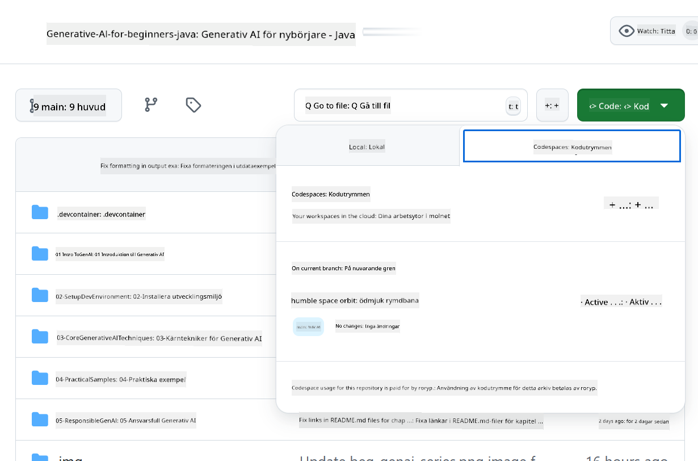

<!--
CO_OP_TRANSLATOR_METADATA:
{
  "original_hash": "bfdb4b4eadbee3a59ef742439f58326a",
  "translation_date": "2025-07-27T13:12:22+00:00",
  "source_file": "02-SetupDevEnvironment/getting-started-azure-openai.md",
  "language_code": "sv"
}
-->
# Ställa in utvecklingsmiljön för Azure OpenAI

> **Snabbstart**: Den här guiden är för att konfigurera Azure OpenAI. För att komma igång direkt med gratis modeller, använd [GitHub Models with Codespaces](./README.md#quick-start-cloud).

Den här guiden hjälper dig att konfigurera Azure AI Foundry-modeller för dina Java AI-appar i den här kursen.

## Innehållsförteckning

- [Snabb översikt över installationen](../../../02-SetupDevEnvironment)
- [Steg 1: Skapa Azure AI Foundry-resurser](../../../02-SetupDevEnvironment)
  - [Skapa en hubb och ett projekt](../../../02-SetupDevEnvironment)
  - [Distribuera GPT-4o-mini-modellen](../../../02-SetupDevEnvironment)
- [Steg 2: Skapa din Codespace](../../../02-SetupDevEnvironment)
- [Steg 3: Konfigurera din miljö](../../../02-SetupDevEnvironment)
- [Steg 4: Testa din installation](../../../02-SetupDevEnvironment)
- [Vad händer härnäst?](../../../02-SetupDevEnvironment)
- [Resurser](../../../02-SetupDevEnvironment)
- [Ytterligare resurser](../../../02-SetupDevEnvironment)

## Snabb översikt över installationen

1. Skapa Azure AI Foundry-resurser (Hubb, Projekt, Modell)
2. Skapa en Codespace med en Java-utvecklingscontainer
3. Konfigurera din .env-fil med Azure OpenAI-uppgifter
4. Testa din installation med exempelprojektet

## Steg 1: Skapa Azure AI Foundry-resurser

### Skapa en hubb och ett projekt

1. Gå till [Azure AI Foundry Portal](https://ai.azure.com/) och logga in
2. Klicka på **+ Create** → **New hub** (eller navigera till **Management** → **All hubs** → **+ New hub**)
3. Konfigurera din hubb:
   - **Hub name**: t.ex. "MyAIHub"
   - **Subscription**: Välj ditt Azure-abonnemang
   - **Resource group**: Skapa en ny eller välj en befintlig
   - **Location**: Välj den plats som är närmast dig
   - **Storage account**: Använd standard eller konfigurera anpassat
   - **Key vault**: Använd standard eller konfigurera anpassat
   - Klicka på **Next** → **Review + create** → **Create**
4. När hubben är skapad, klicka på **+ New project** (eller **Create project** från hubbens översikt)
   - **Project name**: t.ex. "GenAIJava"
   - Klicka på **Create**

### Distribuera GPT-4o-mini-modellen

1. I ditt projekt, gå till **Model catalog** och sök efter **gpt-4o-mini**
   - *Alternativ: Gå till **Deployments** → **+ Create deployment***
2. Klicka på **Deploy** på gpt-4o-mini-modellens kort
3. Konfigurera distributionen:
   - **Deployment name**: "gpt-4o-mini"
   - **Model version**: Använd den senaste
   - **Deployment type**: Standard
4. Klicka på **Deploy**
5. När distributionen är klar, gå till fliken **Deployments** och kopiera följande värden:
   - **Deployment name** (t.ex. "gpt-4o-mini")
   - **Target URI** (t.ex. `https://your-hub-name.openai.azure.com/`) 
      > **Viktigt**: Kopiera endast bas-URL:en (t.ex. `https://myhub.openai.azure.com/`) och inte hela slutpunktsvägen.
   - **Key** (från avsnittet Keys and Endpoint)

> **Har du fortfarande problem?** Besök den officiella [Azure AI Foundry-dokumentationen](https://learn.microsoft.com/azure/ai-foundry/how-to/create-projects?tabs=ai-foundry&pivots=hub-project)

## Steg 2: Skapa din Codespace

1. Forka detta repository till ditt GitHub-konto
   > **Notera**: Om du vill redigera grundkonfigurationen, titta på [Dev Container Configuration](../../../.devcontainer/devcontainer.json)
2. I din forkade repo, klicka på **Code** → fliken **Codespaces**
3. Klicka på **...** → **New with options...**

4. Välj **Dev container configuration**: 
   - **Generative AI Java Development Environment**
5. Klicka på **Create codespace**

## Steg 3: Konfigurera din miljö

När din Codespace är redo, ställ in dina Azure OpenAI-uppgifter:

1. **Navigera till exempelprojektet från repository-roten:**
   ```bash
   cd 02-SetupDevEnvironment/examples/basic-chat-azure
   ```

2. **Skapa din .env-fil:**
   ```bash
   cp .env.example .env
   ```

3. **Redigera .env-filen med dina Azure OpenAI-uppgifter:**
   ```bash
   # Your Azure OpenAI API key (from Azure AI Foundry portal)
   AZURE_AI_KEY=your-actual-api-key-here
   
   # Your Azure OpenAI endpoint URL (e.g., https://myhub.openai.azure.com/)
   AZURE_AI_ENDPOINT=https://your-hub-name.openai.azure.com/
   ```

   > **Säkerhetsnotering**: 
   > - Lämna aldrig in din `.env`-fil till versionskontroll
   > - `.env`-filen är redan inkluderad i `.gitignore`
   > - Håll dina API-nycklar säkra och rotera dem regelbundet

## Steg 4: Testa din installation

Kör exempelapplikationen för att testa din Azure OpenAI-anslutning:

```bash
mvn clean spring-boot:run
```

Du bör se ett svar från GPT-4o-mini-modellen!

> **VS Code-användare**: Du kan också trycka på `F5` i VS Code för att köra applikationen. Startkonfigurationen är redan inställd för att automatiskt ladda din `.env`-fil.

> **Fullständigt exempel**: Se [End-to-End Azure OpenAI Example](./examples/basic-chat-azure/README.md) för detaljerade instruktioner och felsökning.

## Vad händer härnäst?

**Installationen är klar!** Du har nu:
- Azure OpenAI med gpt-4o-mini distribuerad
- Lokal .env-filkonfiguration
- Java-utvecklingsmiljö redo

**Fortsätt till** [Kapitel 3: Grundläggande tekniker för generativ AI](../03-CoreGenerativeAITechniques/README.md) för att börja bygga AI-applikationer!

## Resurser

- [Azure AI Foundry-dokumentation](https://learn.microsoft.com/azure/ai-services/)
- [Spring AI Azure OpenAI-dokumentation](https://docs.spring.io/spring-ai/reference/api/clients/azure-openai-chat.html)
- [Azure OpenAI Java SDK](https://learn.microsoft.com/java/api/overview/azure/ai-openai-readme)

## Ytterligare resurser

- [Ladda ner VS Code](https://code.visualstudio.com/Download)
- [Skaffa Docker Desktop](https://www.docker.com/products/docker-desktop)
- [Dev Container Configuration](../../../.devcontainer/devcontainer.json)

**Ansvarsfriskrivning**:  
Detta dokument har översatts med hjälp av AI-översättningstjänsten [Co-op Translator](https://github.com/Azure/co-op-translator). Även om vi strävar efter noggrannhet, bör det noteras att automatiserade översättningar kan innehålla fel eller felaktigheter. Det ursprungliga dokumentet på dess originalspråk bör betraktas som den auktoritativa källan. För kritisk information rekommenderas professionell mänsklig översättning. Vi tar inget ansvar för eventuella missförstånd eller feltolkningar som uppstår vid användning av denna översättning.