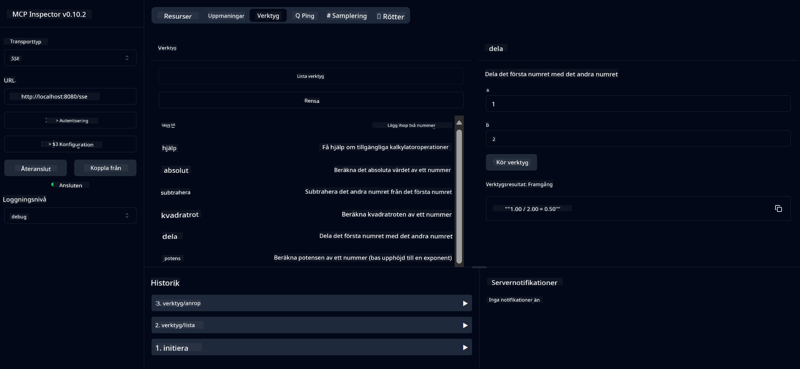

<!--
CO_OP_TRANSLATOR_METADATA:
{
  "original_hash": "5bd7a347d6ed1d706443f9129dd29dd9",
  "translation_date": "2025-07-25T09:36:05+00:00",
  "source_file": "04-PracticalSamples/mcp/calculator/README.md",
  "language_code": "sv"
}
-->
# Grundläggande Kalkylator MCP-tjänst

>**Note**: Detta kapitel inkluderar en [**Tutorial**](./TUTORIAL.md) som guidar dig genom exemplen.

Välkommen till din första praktiska upplevelse med **Model Context Protocol (MCP)**! I de tidigare kapitlen har du lärt dig grunderna i generativ AI och satt upp din utvecklingsmiljö. Nu är det dags att bygga något praktiskt.

Denna kalkylatortjänst visar hur AI-modeller säkert kan interagera med externa verktyg med hjälp av MCP. Istället för att förlita sig på AI-modellens ibland opålitliga matematiska förmågor, kommer vi att visa hur man bygger ett robust system där AI kan anropa specialiserade tjänster för exakta beräkningar.

## Innehållsförteckning

- [Vad du kommer att lära dig](../../../../../04-PracticalSamples/mcp/calculator)
- [Förkunskaper](../../../../../04-PracticalSamples/mcp/calculator)
- [Nyckelkoncept](../../../../../04-PracticalSamples/mcp/calculator)
- [Snabbstart](../../../../../04-PracticalSamples/mcp/calculator)
- [Tillgängliga kalkylatoroperationer](../../../../../04-PracticalSamples/mcp/calculator)
- [Testklienter](../../../../../04-PracticalSamples/mcp/calculator)
  - [1. Direkt MCP-klient (SDKClient)](../../../../../04-PracticalSamples/mcp/calculator)
  - [2. AI-driven klient (LangChain4jClient)](../../../../../04-PracticalSamples/mcp/calculator)
- [MCP Inspector (Webbgränssnitt)](../../../../../04-PracticalSamples/mcp/calculator)
  - [Steg-för-steg-instruktioner](../../../../../04-PracticalSamples/mcp/calculator)

## Vad du kommer att lära dig

Genom att arbeta med detta exempel kommer du att förstå:
- Hur man skapar MCP-kompatibla tjänster med Spring Boot
- Skillnaden mellan direkt protokollkommunikation och AI-driven interaktion
- Hur AI-modeller avgör när och hur externa verktyg ska användas
- Bästa praxis för att bygga AI-applikationer med verktygsintegration

Perfekt för nybörjare som vill lära sig MCP-koncept och är redo att bygga sin första AI-verktygsintegration!

## Förkunskaper

- Java 21+
- Maven 3.6+
- **GitHub Token**: Krävs för den AI-drivna klienten. Om du inte har ställt in detta ännu, se [Kapitel 2: Ställa in din utvecklingsmiljö](../../../02-SetupDevEnvironment/README.md) för instruktioner.

## Nyckelkoncept

**Model Context Protocol (MCP)** är ett standardiserat sätt för AI-applikationer att säkert ansluta till externa verktyg. Tänk på det som en "bro" som låter AI-modeller använda externa tjänster som vår kalkylator. Istället för att AI-modellen försöker göra matematik själv (vilket kan vara opålitligt), kan den anropa vår kalkylatortjänst för att få exakta resultat. MCP säkerställer att denna kommunikation sker säkert och konsekvent.

**Server-Sent Events (SSE)** möjliggör realtidskommunikation mellan servern och klienterna. Till skillnad från traditionella HTTP-förfrågningar där du frågar och väntar på ett svar, tillåter SSE att servern kontinuerligt skickar uppdateringar till klienten. Detta är perfekt för AI-applikationer där svar kan strömmas eller ta tid att bearbeta.

**AI-verktyg och funktionsanrop** gör det möjligt för AI-modeller att automatiskt välja och använda externa funktioner (som kalkylatoroperationer) baserat på användarförfrågningar. När du frågar "Vad är 15 + 27?", förstår AI-modellen att du vill addera, anropar automatiskt vårt `add`-verktyg med rätt parametrar (15, 27) och returnerar resultatet i naturligt språk. AI fungerar som en intelligent koordinator som vet när och hur varje verktyg ska användas.

## Snabbstart

### 1. Navigera till kalkylatorapplikationens katalog
```bash
cd Generative-AI-for-beginners-java/04-PracticalSamples/mcp/calculator
```

### 2. Bygg och kör
```bash
mvn clean install -DskipTests
java -jar target/calculator-server-0.0.1-SNAPSHOT.jar
```

### 2. Testa med klienter
- **SDKClient**: Direkt MCP-protokollinteraktion
- **LangChain4jClient**: AI-driven interaktion med naturligt språk (kräver GitHub-token)

## Tillgängliga kalkylatoroperationer

- `add(a, b)`, `subtract(a, b)`, `multiply(a, b)`, `divide(a, b)`
- `power(base, exponent)`, `squareRoot(number)`, `absolute(number)`
- `modulus(a, b)`, `help()`

## Testklienter

### 1. Direkt MCP-klient (SDKClient)
Testar rå MCP-protokollkommunikation. Kör med:
```bash
mvn test-compile exec:java -Dexec.mainClass="com.microsoft.mcp.sample.client.SDKClient" -Dexec.classpathScope=test
```

### 2. AI-driven klient (LangChain4jClient)
Demonstrerar interaktion med naturligt språk med GitHub-modeller. Kräver GitHub-token (se [Förkunskaper](../../../../../04-PracticalSamples/mcp/calculator)).

**Kör:**
```bash
mvn test-compile exec:java -Dexec.mainClass="com.microsoft.mcp.sample.client.LangChain4jClient" -Dexec.classpathScope=test
```

## MCP Inspector (Webbgränssnitt)

MCP Inspector tillhandahåller ett visuellt webbgränssnitt för att testa din MCP-tjänst utan att skriva kod. Perfekt för nybörjare som vill förstå hur MCP fungerar!

### Steg-för-steg-instruktioner:

1. **Starta kalkylatorservern** (om den inte redan körs):
   ```bash
   java -jar target/calculator-server-0.0.1-SNAPSHOT.jar
   ```

2. **Installera och kör MCP Inspector** i ett nytt terminalfönster:
   ```bash
   npx @modelcontextprotocol/inspector
   ```

3. **Öppna webbgränssnittet**:
   - Leta efter ett meddelande som "Inspector running at http://localhost:6274"
   - Öppna den URL:en i din webbläsare

4. **Anslut till din kalkylatortjänst**:
   - I webbgränssnittet, ställ in transporttypen till "SSE"
   - Ställ in URL:en till: `http://localhost:8080/sse`
   - Klicka på knappen "Connect"

5. **Utforska tillgängliga verktyg**:
   - Klicka på "List Tools" för att se alla kalkylatoroperationer
   - Du kommer att se funktioner som `add`, `subtract`, `multiply`, etc.

6. **Testa en kalkylatoroperation**:
   - Välj ett verktyg (t.ex. "add")
   - Ange parametrar (t.ex. `a: 15`, `b: 27`)
   - Klicka på "Run Tool"
   - Se resultatet som returneras av din MCP-tjänst!

Detta visuella tillvägagångssätt hjälper dig att förstå exakt hur MCP-kommunikation fungerar innan du bygger dina egna klienter.



---
**Referens:** [MCP Server Boot Starter Docs](https://docs.spring.io/spring-ai/reference/api/mcp/mcp-server-boot-starter-docs.html)

**Ansvarsfriskrivning**:  
Detta dokument har översatts med hjälp av AI-översättningstjänsten [Co-op Translator](https://github.com/Azure/co-op-translator). Även om vi strävar efter noggrannhet, bör det noteras att automatiserade översättningar kan innehålla fel eller felaktigheter. Det ursprungliga dokumentet på dess originalspråk bör betraktas som den auktoritativa källan. För kritisk information rekommenderas professionell mänsklig översättning. Vi ansvarar inte för eventuella missförstånd eller feltolkningar som uppstår vid användning av denna översättning.