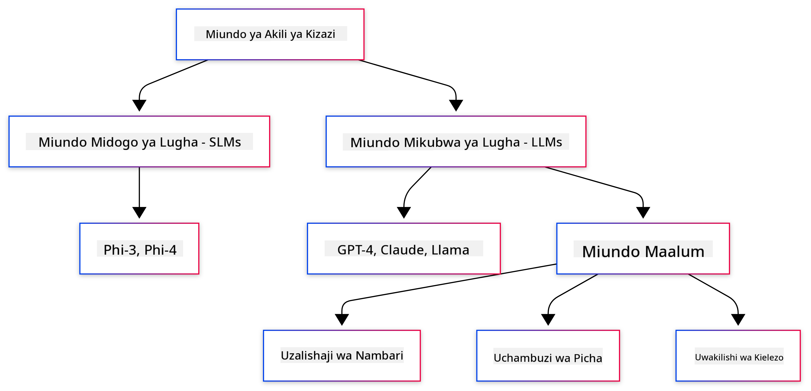
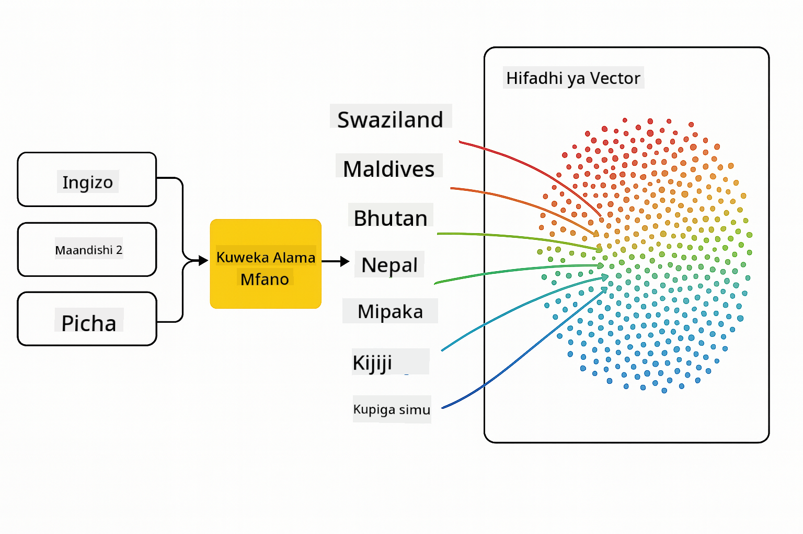
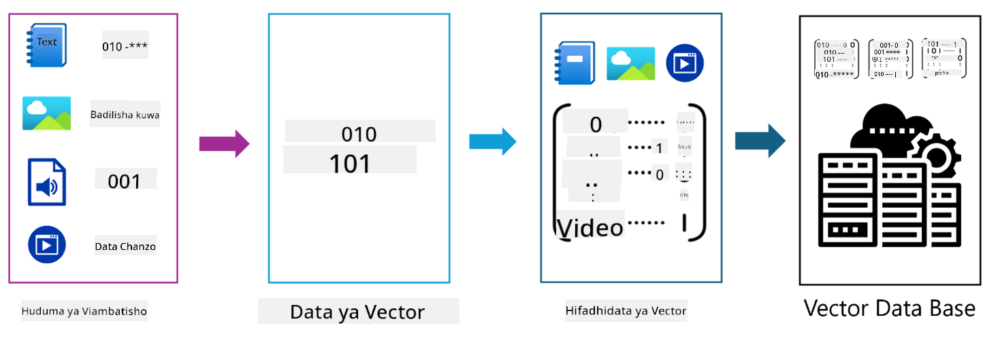
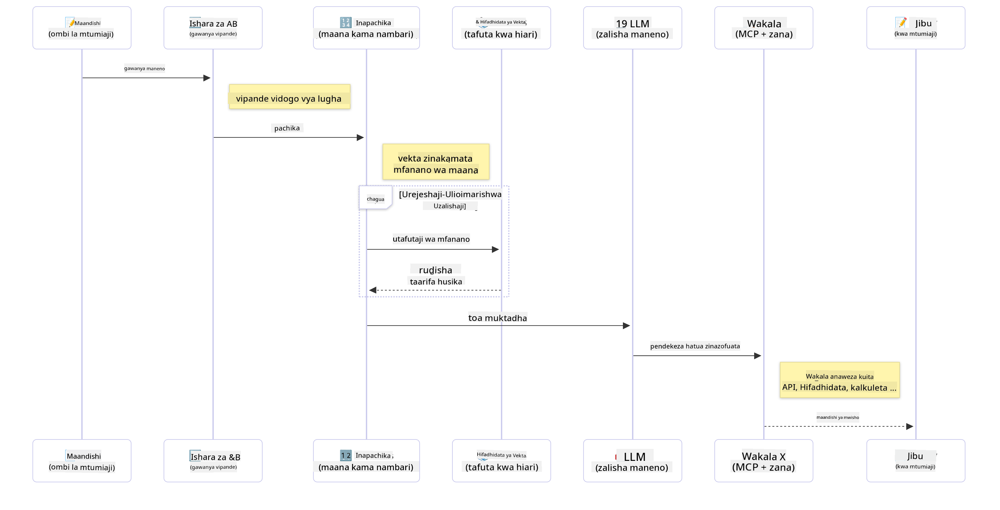

<!--
CO_OP_TRANSLATOR_METADATA:
{
  "original_hash": "6d8b4a0d774dc2a1e97c95859a6d6e4b",
  "translation_date": "2025-07-21T21:44:08+00:00",
  "source_file": "01-IntroToGenAI/README.md",
  "language_code": "sw"
}
-->
# Utangulizi wa AI Inayozalisha - Toleo la Java

## Kile Utakachojifunza

- **Misingi ya AI Inayozalisha** ikijumuisha LLMs, uhandisi wa maelekezo, tokeni, embeddings, na hifadhidata za vekta
- **Linganisho la zana za maendeleo ya AI kwa Java** ikijumuisha Azure OpenAI SDK, Spring AI, na OpenAI Java SDK
- **Gundua Itifaki ya Muktadha wa Modeli** na jukumu lake katika mawasiliano ya mawakala wa AI

## Jedwali la Maudhui

- [Utangulizi](../../../01-IntroToGenAI)
- [Kumbukumbu ya haraka kuhusu dhana za AI Inayozalisha](../../../01-IntroToGenAI)
- [Mapitio ya uhandisi wa maelekezo](../../../01-IntroToGenAI)
- [Tokeni, embeddings, na mawakala](../../../01-IntroToGenAI)
- [Zana za Maendeleo ya AI na Maktaba kwa Java](../../../01-IntroToGenAI)
  - [OpenAI Java SDK](../../../01-IntroToGenAI)
  - [Spring AI](../../../01-IntroToGenAI)
  - [Azure OpenAI Java SDK](../../../01-IntroToGenAI)
- [Muhtasari](../../../01-IntroToGenAI)
- [Hatua Zifuatazo](../../../01-IntroToGenAI)

## Utangulizi

Karibu kwenye sura ya kwanza ya AI Inayozalisha kwa Kompyuta - Toleo la Java! Somo hili la msingi linakutambulisha kwenye dhana kuu za AI inayozalisha na jinsi ya kuzitumia kwa Java. Utajifunza kuhusu vipengele muhimu vya programu za AI, ikijumuisha Modeli Kubwa za Lugha (LLMs), tokeni, embeddings, na mawakala wa AI. Pia tutachunguza zana kuu za Java utakazotumia katika kozi hii.

### Kumbukumbu ya haraka kuhusu dhana za AI Inayozalisha

AI Inayozalisha ni aina ya akili bandia inayounda maudhui mapya, kama vile maandishi, picha, au msimbo, kulingana na mifumo na uhusiano uliyojifunza kutoka kwa data. Modeli za AI Inayozalisha zinaweza kutoa majibu yanayofanana na ya binadamu, kuelewa muktadha, na wakati mwingine hata kuunda maudhui yanayoonekana kama ya binadamu.

Unapounda programu zako za AI kwa Java, utatumia **modeli za AI inayozalisha** kuunda maudhui. Baadhi ya uwezo wa modeli za AI inayozalisha ni pamoja na:

- **Uundaji wa Maandishi**: Kuandika maandishi yanayofanana na ya binadamu kwa chatbots, maudhui, na kukamilisha maandishi.
- **Uundaji na Uchambuzi wa Picha**: Kutengeneza picha halisi, kuboresha picha, na kugundua vitu.
- **Uundaji wa Msimbo**: Kuandika vipande vya msimbo au hati.

Kuna aina maalum za modeli ambazo zimeboreshwa kwa kazi tofauti. Kwa mfano, **Modeli Ndogo za Lugha (SLMs)** na **Modeli Kubwa za Lugha (LLMs)** zote zinaweza kushughulikia uundaji wa maandishi, huku LLMs zikitoa utendaji bora zaidi kwa kazi ngumu. Kwa kazi zinazohusiana na picha, ungetumia modeli za maono maalum au modeli za njia nyingi.

Bila shaka, majibu kutoka kwa modeli hizi si kamilifu kila wakati. Huenda umesikia kuhusu modeli "zinazohalalisha" au kutoa taarifa zisizo sahihi kwa njia ya kujiamini. Lakini unaweza kusaidia kuongoza modeli kutoa majibu bora kwa kuzipatia maelekezo na muktadha wazi. Hapa ndipo **uhandisi wa maelekezo** unapoingia.

#### Mapitio ya uhandisi wa maelekezo

Uhandisi wa maelekezo ni mazoezi ya kubuni pembejeo bora ili kuongoza modeli za AI kuelekea matokeo yanayotarajiwa. Inahusisha:

- **Uwazi**: Kufanya maelekezo yawe wazi na yasiyo na utata.
- **Muktadha**: Kutoa taarifa za msingi zinazohitajika.
- **Vizuizi**: Kueleza mapungufu au miundo yoyote.

Baadhi ya mbinu bora za uhandisi wa maelekezo ni pamoja na kubuni maelekezo, maelekezo wazi, kuvunja kazi, kujifunza kwa mfano mmoja na michache, na kurekebisha maelekezo. Kujaribu maelekezo tofauti ni muhimu ili kupata kile kinachofanya kazi vizuri kwa matumizi yako maalum.

Unapounda programu, utatumia aina tofauti za maelekezo:
- **Maelekezo ya mfumo**: Kuweka sheria za msingi na muktadha wa tabia ya modeli
- **Maelekezo ya mtumiaji**: Data ya pembejeo kutoka kwa watumiaji wa programu yako
- **Maelekezo ya msaidizi**: Majibu ya modeli kulingana na maelekezo ya mfumo na mtumiaji

> **Jifunze zaidi**: Jifunze zaidi kuhusu uhandisi wa maelekezo katika [Sura ya Uhandisi wa Maelekezo ya kozi ya GenAI kwa Kompyuta](https://github.com/microsoft/generative-ai-for-beginners/tree/main/04-prompt-engineering-fundamentals)

#### Tokeni, embeddings, na mawakala

Unapofanya kazi na modeli za AI inayozalisha, utapata maneno kama **tokeni**, **embeddings**, **mawakala**, na **Itifaki ya Muktadha wa Modeli (MCP)**. Hapa kuna muhtasari wa kina wa dhana hizi:

- **Tokeni**: Tokeni ni kipande kidogo zaidi cha maandishi katika modeli. Zinaweza kuwa maneno, herufi, au sehemu za maneno. Tokeni hutumika kuwakilisha data ya maandishi kwa muundo ambao modeli inaweza kuelewa. Kwa mfano, sentensi "The quick brown fox jumped over the lazy dog" inaweza kugawanywa kama ["The", " quick", " brown", " fox", " jumped", " over", " the", " lazy", " dog"] au ["The", " qu", "ick", " br", "own", " fox", " jump", "ed", " over", " the", " la", "zy", " dog"] kulingana na mkakati wa kugawanya.

Kugawanya ni mchakato wa kugawanya maandishi kuwa vipande vidogo hivi. Hii ni muhimu kwa sababu modeli hufanya kazi na tokeni badala ya maandishi ghafi. Idadi ya tokeni katika maelekezo huathiri urefu na ubora wa majibu ya modeli, kwani modeli zina mipaka ya tokeni kwa dirisha lake la muktadha (mfano, tokeni 128K kwa muktadha wa jumla wa GPT-4o, ikijumuisha pembejeo na matokeo).

  Katika Java, unaweza kutumia maktaba kama OpenAI SDK kushughulikia kugawanya kiotomatiki unapowasilisha maombi kwa modeli za AI.

- **Embeddings**: Embeddings ni uwakilishi wa vekta wa tokeni unaoelezea maana ya kisemantiki. Ni uwakilishi wa nambari (kawaida safu za nambari za kuelea) zinazowezesha modeli kuelewa uhusiano kati ya maneno na kutoa majibu yanayofaa kwa muktadha. Maneno yanayofanana yana embeddings zinazofanana, na hivyo kuwezesha modeli kuelewa dhana kama visawe na uhusiano wa kisemantiki.

  Katika Java, unaweza kuunda embeddings kwa kutumia OpenAI SDK au maktaba nyingine zinazounga mkono uundaji wa embeddings. Embeddings hizi ni muhimu kwa kazi kama utafutaji wa kisemantiki, ambapo unataka kupata maudhui yanayofanana kulingana na maana badala ya mechi halisi za maandishi.

- **Hifadhidata za vekta**: Hifadhidata za vekta ni mifumo maalum ya kuhifadhi iliyoboreshwa kwa embeddings. Zinasaidia utafutaji wa kufanana kwa ufanisi na ni muhimu kwa mifumo ya RAG (Uundaji wa Maudhui Ulioimarishwa na Urejeshaji) ambapo unahitaji kupata taarifa muhimu kutoka kwa seti kubwa za data kulingana na kufanana kwa kisemantiki badala ya mechi halisi.

> **Kumbuka**: Katika kozi hii, hatutashughulikia hifadhidata za vekta lakini tunadhani ni muhimu kuzitaja kwani zinatumika sana katika programu za ulimwengu halisi.

- **Mawakala & MCP**: Vipengele vya AI vinavyoshirikiana kiotomatiki na modeli, zana, na mifumo ya nje. Itifaki ya Muktadha wa Modeli (MCP) hutoa njia sanifu kwa mawakala kufikia vyanzo vya data vya nje na zana kwa usalama. Jifunze zaidi katika kozi yetu ya [MCP kwa Kompyuta](https://github.com/microsoft/mcp-for-beginners).

Katika programu za AI za Java, utatumia tokeni kwa usindikaji wa maandishi, embeddings kwa utafutaji wa kisemantiki na RAG, hifadhidata za vekta kwa urejeshaji wa data, na mawakala na MCP kwa kujenga mifumo ya akili inayotumia zana.

### Zana za Maendeleo ya AI na Maktaba kwa Java

Java inatoa zana bora kwa maendeleo ya AI. Kuna maktaba kuu tatu ambazo tutachunguza katika kozi hii - OpenAI Java SDK, Azure OpenAI SDK, na Spring AI.

Hapa kuna jedwali la kumbukumbu la haraka linaloonyesha SDK inayotumika katika mifano ya kila sura:

| Sura | Mfano | SDK |
|---------|--------|-----|
| 02-SetupDevEnvironment | src/github-models/ | OpenAI Java SDK |
| 02-SetupDevEnvironment | src/basic-chat-azure/ | Spring AI Azure OpenAI |
| 03-CoreGenerativeAITechniques | examples/ | Azure OpenAI SDK |
| 04-PracticalSamples | petstory/ | OpenAI Java SDK |
| 04-PracticalSamples | foundrylocal/ | OpenAI Java SDK |
| 04-PracticalSamples | mcp/calculator/ | Spring AI MCP SDK + LangChain4j |

**Viungo vya Nyaraka za SDK:**
- [Azure OpenAI Java SDK](https://github.com/Azure/azure-sdk-for-java/tree/azure-ai-openai_1.0.0-beta.16/sdk/openai/azure-ai-openai)
- [Spring AI](https://docs.spring.io/spring-ai/reference/)
- [OpenAI Java SDK](https://github.com/openai/openai-java)
- [LangChain4j](https://docs.langchain4j.dev/)

#### OpenAI Java SDK

OpenAI SDK ni maktaba rasmi ya Java kwa API ya OpenAI. Inatoa kiolesura rahisi na thabiti cha kuingiliana na modeli za OpenAI, na kuifanya iwe rahisi kuunganisha uwezo wa AI katika programu za Java. Mfano wa GitHub Models wa Sura ya 2, programu ya Pet Story ya Sura ya 4, na mfano wa Foundry Local unaonyesha mbinu ya OpenAI SDK.

#### Spring AI

Spring AI ni mfumo wa kina unaoleta uwezo wa AI kwa programu za Spring, na kutoa safu ya unyumbufu thabiti kwa watoa huduma tofauti wa AI. Inajumuika bila mshono na mfumo wa Spring, na kuifanya kuwa chaguo bora kwa programu za Java za biashara zinazohitaji uwezo wa AI.

Nguvu ya Spring AI iko katika ujumuishaji wake bila mshono na mfumo wa Spring, na kuifanya iwe rahisi kujenga programu za AI tayari kwa uzalishaji kwa kutumia mifumo ya kawaida ya Spring kama sindano ya utegemezi, usimamizi wa usanidi, na mifumo ya majaribio. Utatumia Spring AI katika Sura ya 2 na 4 kujenga programu zinazotumia maktaba za OpenAI na Model Context Protocol (MCP) za Spring AI.

##### Itifaki ya Muktadha wa Modeli (MCP)

[Itifaki ya Muktadha wa Modeli (MCP)](https://modelcontextprotocol.io/) ni kiwango kinachojitokeza kinachowezesha programu za AI kuingiliana kwa usalama na vyanzo vya data vya nje na zana. MCP hutoa njia sanifu kwa modeli za AI kufikia taarifa za muktadha na kutekeleza vitendo katika programu zako.

Katika Sura ya 4, utajenga huduma rahisi ya kalkuleta ya MCP inayodhihirisha misingi ya Itifaki ya Muktadha wa Modeli kwa Spring AI, ikionyesha jinsi ya kuunda ujumuishaji wa zana za msingi na usanifu wa huduma.

#### Azure OpenAI Java SDK

Maktaba ya mteja ya Azure OpenAI kwa Java ni marekebisho ya API za REST za OpenAI zinazotoa kiolesura cha kawaida na ujumuishaji na ekosistimu ya SDK ya Azure. Katika Sura ya 3, utajenga programu kwa kutumia Azure OpenAI SDK, ikijumuisha programu za mazungumzo, kupiga kazi, na mifumo ya RAG (Uundaji wa Maudhui Ulioimarishwa na Urejeshaji).

> Kumbuka: Azure OpenAI SDK iko nyuma ya OpenAI Java SDK kwa suala la vipengele, kwa hivyo kwa miradi ya baadaye, fikiria kutumia OpenAI Java SDK.

## Muhtasari

**Hongera!** Umefanikiwa:

- **Kujifunza kuhusu misingi ya AI inayozalisha** ikijumuisha LLMs, uhandisi wa maelekezo, tokeni, embeddings, na hifadhidata za vekta
- **Kulinganisha zana za maendeleo ya AI kwa Java** ikijumuisha Azure OpenAI SDK, Spring AI, na OpenAI Java SDK
- **Kugundua Itifaki ya Muktadha wa Modeli** na jukumu lake katika mawasiliano ya mawakala wa AI

## Hatua Zifuatazo

[Sura ya 2: Kuweka Mazingira ya Maendeleo](../02-SetupDevEnvironment/README.md)

**Kanusho**:  
Hati hii imetafsiriwa kwa kutumia huduma ya kutafsiri ya AI [Co-op Translator](https://github.com/Azure/co-op-translator). Ingawa tunajitahidi kuhakikisha usahihi, tafadhali fahamu kuwa tafsiri za kiotomatiki zinaweza kuwa na makosa au kutokuwa sahihi. Hati ya asili katika lugha yake ya awali inapaswa kuzingatiwa kama chanzo cha mamlaka. Kwa taarifa muhimu, tafsiri ya kitaalamu ya binadamu inapendekezwa. Hatutawajibika kwa kutoelewana au tafsiri zisizo sahihi zinazotokana na matumizi ya tafsiri hii.