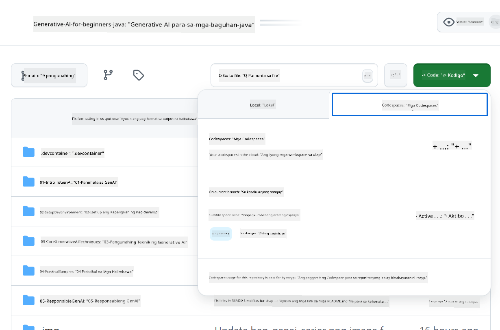

<!--
CO_OP_TRANSLATOR_METADATA:
{
  "original_hash": "bfdb4b4eadbee3a59ef742439f58326a",
  "translation_date": "2025-07-27T13:20:59+00:00",
  "source_file": "02-SetupDevEnvironment/getting-started-azure-openai.md",
  "language_code": "tl"
}
-->
# Pagtatakda ng Development Environment para sa Azure OpenAI

> **Quick Start**: Ang gabay na ito ay para sa Azure OpenAI setup. Para sa mabilisang pagsisimula gamit ang mga libreng modelo, gamitin ang [GitHub Models with Codespaces](./README.md#quick-start-cloud).

Ang gabay na ito ay tutulong sa iyo na i-set up ang mga modelo ng Azure AI Foundry para sa iyong mga Java AI app sa kursong ito.

## Talaan ng Nilalaman

- [Pangkalahatang-ideya ng Mabilisang Setup](../../../02-SetupDevEnvironment)
- [Hakbang 1: Gumawa ng Azure AI Foundry Resources](../../../02-SetupDevEnvironment)
  - [Gumawa ng Hub at Project](../../../02-SetupDevEnvironment)
  - [I-deploy ang GPT-4o-mini Model](../../../02-SetupDevEnvironment)
- [Hakbang 2: Gumawa ng Iyong Codespace](../../../02-SetupDevEnvironment)
- [Hakbang 3: I-configure ang Iyong Environment](../../../02-SetupDevEnvironment)
- [Hakbang 4: Subukan ang Iyong Setup](../../../02-SetupDevEnvironment)
- [Ano ang Susunod?](../../../02-SetupDevEnvironment)
- [Mga Resources](../../../02-SetupDevEnvironment)
- [Karagdagang Resources](../../../02-SetupDevEnvironment)

## Pangkalahatang-ideya ng Mabilisang Setup

1. Gumawa ng Azure AI Foundry resources (Hub, Project, Model)
2. Gumawa ng Codespace gamit ang Java development container
3. I-configure ang iyong .env file gamit ang Azure OpenAI credentials
4. Subukan ang iyong setup gamit ang example project

## Hakbang 1: Gumawa ng Azure AI Foundry Resources

### Gumawa ng Hub at Project

1. Pumunta sa [Azure AI Foundry Portal](https://ai.azure.com/) at mag-sign in
2. I-click ang **+ Create** → **New hub** (o mag-navigate sa **Management** → **All hubs** → **+ New hub**)
3. I-configure ang iyong hub:
   - **Hub name**: Halimbawa, "MyAIHub"
   - **Subscription**: Piliin ang iyong Azure subscription
   - **Resource group**: Gumawa ng bago o piliin ang umiiral
   - **Location**: Piliin ang pinakamalapit sa iyo
   - **Storage account**: Gamitin ang default o mag-configure ng custom
   - **Key vault**: Gamitin ang default o mag-configure ng custom
   - I-click ang **Next** → **Review + create** → **Create**
4. Kapag nagawa na, i-click ang **+ New project** (o **Create project** mula sa hub overview)
   - **Project name**: Halimbawa, "GenAIJava"
   - I-click ang **Create**

### I-deploy ang GPT-4o-mini Model

1. Sa iyong project, pumunta sa **Model catalog** at hanapin ang **gpt-4o-mini**
   - *Alternatibo: Pumunta sa **Deployments** → **+ Create deployment***
2. I-click ang **Deploy** sa gpt-4o-mini model card
3. I-configure ang deployment:
   - **Deployment name**: "gpt-4o-mini"
   - **Model version**: Gamitin ang pinakabago
   - **Deployment type**: Standard
4. I-click ang **Deploy**
5. Kapag na-deploy na, pumunta sa **Deployments** tab at kopyahin ang mga sumusunod:
   - **Deployment name** (Halimbawa, "gpt-4o-mini")
   - **Target URI** (Halimbawa, `https://your-hub-name.openai.azure.com/`) 
      > **Mahalaga**: Kopyahin lamang ang base URL (Halimbawa, `https://myhub.openai.azure.com/`) hindi ang buong endpoint path.
   - **Key** (mula sa Keys and Endpoint section)

> **May problema pa rin?** Bisitahin ang opisyal na [Azure AI Foundry Documentation](https://learn.microsoft.com/azure/ai-foundry/how-to/create-projects?tabs=ai-foundry&pivots=hub-project)

## Hakbang 2: Gumawa ng Iyong Codespace

1. I-fork ang repository na ito sa iyong GitHub account
   > **Tandaan**: Kung nais mong i-edit ang basic config, tingnan ang [Dev Container Configuration](../../../.devcontainer/devcontainer.json)
2. Sa iyong forked repo, i-click ang **Code** → **Codespaces** tab
3. I-click ang **...** → **New with options...**

4. Piliin ang **Dev container configuration**: 
   - **Generative AI Java Development Environment**
5. I-click ang **Create codespace**

## Hakbang 3: I-configure ang Iyong Environment

Kapag handa na ang iyong Codespace, i-set up ang iyong Azure OpenAI credentials:

1. **Mag-navigate sa example project mula sa repository root:**
   ```bash
   cd 02-SetupDevEnvironment/examples/basic-chat-azure
   ```

2. **Gumawa ng iyong .env file:**
   ```bash
   cp .env.example .env
   ```

3. **I-edit ang .env file gamit ang iyong Azure OpenAI credentials:**
   ```bash
   # Your Azure OpenAI API key (from Azure AI Foundry portal)
   AZURE_AI_KEY=your-actual-api-key-here
   
   # Your Azure OpenAI endpoint URL (e.g., https://myhub.openai.azure.com/)
   AZURE_AI_ENDPOINT=https://your-hub-name.openai.azure.com/
   ```

   > **Tandaan sa Seguridad**: 
   > - Huwag kailanman i-commit ang iyong `.env` file sa version control
   > - Ang `.env` file ay kasama na sa `.gitignore`
   > - Panatilihing ligtas ang iyong API keys at i-rotate ang mga ito nang regular

## Hakbang 4: Subukan ang Iyong Setup

Patakbuhin ang example application upang subukan ang iyong Azure OpenAI connection:

```bash
mvn clean spring-boot:run
```

Makikita mo ang response mula sa GPT-4o-mini model!

> **VS Code Users**: Maaari mo ring pindutin ang `F5` sa VS Code upang patakbuhin ang application. Ang launch configuration ay naka-set up na upang awtomatikong i-load ang iyong `.env` file.

> **Buong halimbawa**: Tingnan ang [End-to-End Azure OpenAI Example](./examples/basic-chat-azure/README.md) para sa detalyadong mga tagubilin at troubleshooting.

## Ano ang Susunod?

**Setup Kumpleto!** Ngayon ay mayroon ka nang:
- Azure OpenAI na may gpt-4o-mini na naka-deploy
- Lokal na .env file configuration
- Java development environment na handa

**Magpatuloy sa** [Chapter 3: Core Generative AI Techniques](../03-CoreGenerativeAITechniques/README.md) upang simulan ang paggawa ng AI applications!

## Mga Resources

- [Azure AI Foundry Documentation](https://learn.microsoft.com/azure/ai-services/)
- [Spring AI Azure OpenAI Documentation](https://docs.spring.io/spring-ai/reference/api/clients/azure-openai-chat.html)
- [Azure OpenAI Java SDK](https://learn.microsoft.com/java/api/overview/azure/ai-openai-readme)

## Karagdagang Resources

- [I-download ang VS Code](https://code.visualstudio.com/Download)
- [Kunin ang Docker Desktop](https://www.docker.com/products/docker-desktop)
- [Dev Container Configuration](../../../.devcontainer/devcontainer.json)

**Paunawa**:  
Ang dokumentong ito ay isinalin gamit ang AI translation service na [Co-op Translator](https://github.com/Azure/co-op-translator). Bagama't sinisikap naming maging tumpak, pakitandaan na ang mga awtomatikong pagsasalin ay maaaring maglaman ng mga pagkakamali o hindi pagkakatugma. Ang orihinal na dokumento sa orihinal nitong wika ang dapat ituring na opisyal na sanggunian. Para sa mahalagang impormasyon, inirerekomenda ang propesyonal na pagsasalin ng tao. Hindi kami mananagot sa anumang hindi pagkakaunawaan o maling interpretasyon na dulot ng paggamit ng pagsasaling ito.