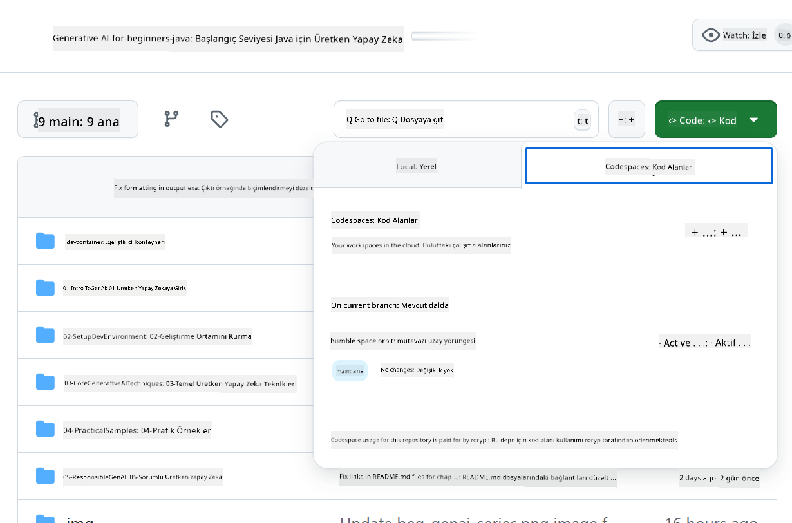

<!--
CO_OP_TRANSLATOR_METADATA:
{
  "original_hash": "bfdb4b4eadbee3a59ef742439f58326a",
  "translation_date": "2025-07-27T13:09:15+00:00",
  "source_file": "02-SetupDevEnvironment/getting-started-azure-openai.md",
  "language_code": "tr"
}
-->
# Azure OpenAI için Geliştirme Ortamını Kurma

> **Hızlı Başlangıç**: Bu kılavuz Azure OpenAI kurulumu içindir. Ücretsiz modellerle hemen başlamak için [GitHub Modelleri ve Codespaces](./README.md#quick-start-cloud) kullanabilirsiniz.

Bu kılavuz, bu kursta Java yapay zeka uygulamalarınız için Azure AI Foundry modellerini kurmanıza yardımcı olacaktır.

## İçindekiler

- [Hızlı Kurulum Genel Bakış](../../../02-SetupDevEnvironment)
- [Adım 1: Azure AI Foundry Kaynaklarını Oluşturun](../../../02-SetupDevEnvironment)
  - [Bir Hub ve Proje Oluşturun](../../../02-SetupDevEnvironment)
  - [GPT-4o-mini Modelini Dağıtın](../../../02-SetupDevEnvironment)
- [Adım 2: Codespace'inizi Oluşturun](../../../02-SetupDevEnvironment)
- [Adım 3: Ortamınızı Yapılandırın](../../../02-SetupDevEnvironment)
- [Adım 4: Kurulumunuzu Test Edin](../../../02-SetupDevEnvironment)
- [Sırada Ne Var?](../../../02-SetupDevEnvironment)
- [Kaynaklar](../../../02-SetupDevEnvironment)
- [Ek Kaynaklar](../../../02-SetupDevEnvironment)

## Hızlı Kurulum Genel Bakış

1. Azure AI Foundry kaynaklarını oluşturun (Hub, Proje, Model)
2. Java geliştirme konteyneri ile bir Codespace oluşturun
3. Azure OpenAI kimlik bilgileriyle `.env` dosyanızı yapılandırın
4. Örnek proje ile kurulumunuzu test edin

## Adım 1: Azure AI Foundry Kaynaklarını Oluşturun

### Bir Hub ve Proje Oluşturun

1. [Azure AI Foundry Portalı](https://ai.azure.com/) adresine gidin ve oturum açın
2. **+ Create** → **New hub** seçeneğine tıklayın (veya **Management** → **All hubs** → **+ New hub** yolunu izleyin)
3. Hub'ınızı yapılandırın:
   - **Hub adı**: Örneğin, "MyAIHub"
   - **Abonelik**: Azure aboneliğinizi seçin
   - **Kaynak grubu**: Yeni oluşturun veya mevcut birini seçin
   - **Konum**: Size en yakın olanı seçin
   - **Depolama hesabı**: Varsayılanı kullanın veya özel yapılandırın
   - **Anahtar kasası**: Varsayılanı kullanın veya özel yapılandırın
   - **Next** → **Review + create** → **Create** seçeneğine tıklayın
4. Oluşturulduktan sonra, **+ New project** seçeneğine tıklayın (veya hub genel bakışından **Create project** seçeneğini seçin)
   - **Proje adı**: Örneğin, "GenAIJava"
   - **Create** seçeneğine tıklayın

### GPT-4o-mini Modelini Dağıtın

1. Projenizde, **Model catalog** sekmesine gidin ve **gpt-4o-mini** modelini arayın
   - *Alternatif*: **Deployments** → **+ Create deployment** yolunu izleyin
2. gpt-4o-mini model kartında **Deploy** seçeneğine tıklayın
3. Dağıtımı yapılandırın:
   - **Dağıtım adı**: "gpt-4o-mini"
   - **Model sürümü**: En son sürümü kullanın
   - **Dağıtım türü**: Standart
4. **Deploy** seçeneğine tıklayın
5. Dağıtım tamamlandıktan sonra, **Deployments** sekmesine gidin ve şu değerleri kopyalayın:
   - **Dağıtım adı** (örneğin, "gpt-4o-mini")
   - **Hedef URI** (örneğin, `https://your-hub-name.openai.azure.com/`) 
      > **Önemli**: Yalnızca temel URL'yi kopyalayın (örneğin, `https://myhub.openai.azure.com/`), tam uç nokta yolunu değil.
   - **Anahtar** (Keys and Endpoint bölümünden)

> **Hâlâ sorun mu yaşıyorsunuz?** Resmi [Azure AI Foundry Belgeleri](https://learn.microsoft.com/azure/ai-foundry/how-to/create-projects?tabs=ai-foundry&pivots=hub-project) adresini ziyaret edin.

## Adım 2: Codespace'inizi Oluşturun

1. Bu depoyu GitHub hesabınıza fork edin
   > **Not**: Temel yapılandırmayı düzenlemek isterseniz [Geliştirme Konteyneri Yapılandırması](../../../.devcontainer/devcontainer.json) bölümüne göz atabilirsiniz.
2. Forkladığınız depoda, **Code** → **Codespaces** sekmesine tıklayın
3. **...** → **New with options...** seçeneğine tıklayın  

4. **Geliştirme konteyneri yapılandırmasını** seçin: 
   - **Generative AI Java Development Environment**
5. **Create codespace** seçeneğine tıklayın

## Adım 3: Ortamınızı Yapılandırın

Codespace'iniz hazır olduğunda, Azure OpenAI kimlik bilgilerinizi ayarlayın:

1. **Depo kökünden örnek projeye gidin:**
   ```bash
   cd 02-SetupDevEnvironment/examples/basic-chat-azure
   ```

2. **.env dosyanızı oluşturun:**
   ```bash
   cp .env.example .env
   ```

3. **.env dosyasını Azure OpenAI kimlik bilgilerinizle düzenleyin:**
   ```bash
   # Your Azure OpenAI API key (from Azure AI Foundry portal)
   AZURE_AI_KEY=your-actual-api-key-here
   
   # Your Azure OpenAI endpoint URL (e.g., https://myhub.openai.azure.com/)
   AZURE_AI_ENDPOINT=https://your-hub-name.openai.azure.com/
   ```

   > **Güvenlik Notu**: 
   > - `.env` dosyanızı asla sürüm kontrolüne göndermeyin
   > - `.env` dosyası zaten `.gitignore` içinde yer alıyor
   > - API anahtarlarınızı güvende tutun ve düzenli olarak yenileyin

## Adım 4: Kurulumunuzu Test Edin

Azure OpenAI bağlantınızı test etmek için örnek uygulamayı çalıştırın:

```bash
mvn clean spring-boot:run
```

GPT-4o-mini modelinden bir yanıt görmelisiniz!

> **VS Code Kullanıcıları**: Uygulamayı çalıştırmak için `F5` tuşuna da basabilirsiniz. Başlatma yapılandırması `.env` dosyanızı otomatik olarak yükleyecek şekilde ayarlanmıştır.

> **Tam örnek**: Ayrıntılı talimatlar ve sorun giderme için [Uçtan Uca Azure OpenAI Örneği](./examples/basic-chat-azure/README.md) bölümüne bakın.

## Sırada Ne Var?

**Kurulum Tamamlandı!** Artık şunlara sahipsiniz:
- gpt-4o-mini modeliyle Azure OpenAI dağıtımı
- Yerel `.env` dosyası yapılandırması
- Java geliştirme ortamı hazır

**Devam edin** [Bölüm 3: Temel Üretken Yapay Zeka Teknikleri](../03-CoreGenerativeAITechniques/README.md) ile yapay zeka uygulamaları oluşturmaya başlayın!

## Kaynaklar

- [Azure AI Foundry Belgeleri](https://learn.microsoft.com/azure/ai-services/)
- [Spring AI Azure OpenAI Belgeleri](https://docs.spring.io/spring-ai/reference/api/clients/azure-openai-chat.html)
- [Azure OpenAI Java SDK](https://learn.microsoft.com/java/api/overview/azure/ai-openai-readme)

## Ek Kaynaklar

- [VS Code'u İndirin](https://code.visualstudio.com/Download)
- [Docker Desktop Edinin](https://www.docker.com/products/docker-desktop)
- [Geliştirme Konteyneri Yapılandırması](../../../.devcontainer/devcontainer.json)

**Feragatname**:  
Bu belge, AI çeviri hizmeti [Co-op Translator](https://github.com/Azure/co-op-translator) kullanılarak çevrilmiştir. Doğruluk için çaba göstersek de, otomatik çevirilerin hata veya yanlışlık içerebileceğini lütfen unutmayın. Belgenin orijinal dilindeki hali, yetkili kaynak olarak kabul edilmelidir. Kritik bilgiler için profesyonel insan çevirisi önerilir. Bu çevirinin kullanımından kaynaklanan yanlış anlamalar veya yanlış yorumlamalar için sorumluluk kabul etmiyoruz.