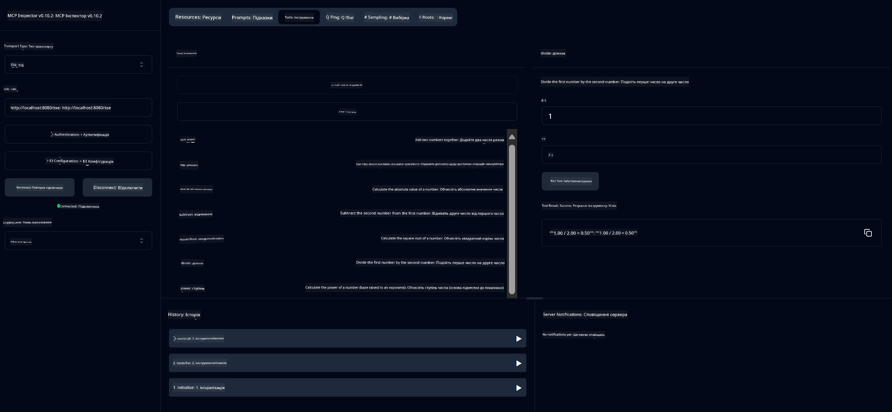

<!--
CO_OP_TRANSLATOR_METADATA:
{
  "original_hash": "7bf9a4a832911269a8bd0decb97ff36c",
  "translation_date": "2025-07-21T21:30:31+00:00",
  "source_file": "04-PracticalSamples/mcp/calculator/README.md",
  "language_code": "uk"
}
-->
# Основний сервіс калькулятора MCP

>**Примітка**: У цьому розділі є [**Підручник**](./TUTORIAL.md), який допоможе вам запустити готові приклади.

Ласкаво просимо до вашого першого практичного досвіду роботи з **Model Context Protocol (MCP)**! У попередніх розділах ви дізналися про основи генеративного штучного інтелекту та налаштували своє середовище розробки. Тепер настав час створити щось практичне.

Цей сервіс калькулятора демонструє, як моделі штучного інтелекту можуть безпечно взаємодіяти із зовнішніми інструментами за допомогою MCP. Замість того, щоб покладатися на іноді ненадійні математичні здібності моделі, ми покажемо, як створити надійну систему, де ШІ може викликати спеціалізовані сервіси для точних обчислень.

## Зміст

- [Чого ви навчитеся](../../../../../04-PracticalSamples/mcp/calculator)
- [Передумови](../../../../../04-PracticalSamples/mcp/calculator)
- [Ключові концепції](../../../../../04-PracticalSamples/mcp/calculator)
- [Швидкий старт](../../../../../04-PracticalSamples/mcp/calculator)
- [Доступні операції калькулятора](../../../../../04-PracticalSamples/mcp/calculator)
- [Клієнти для тестування](../../../../../04-PracticalSamples/mcp/calculator)
  - [1. Прямий MCP-клієнт (SDKClient)](../../../../../04-PracticalSamples/mcp/calculator)
  - [2. Клієнт на основі ШІ (LangChain4jClient)](../../../../../04-PracticalSamples/mcp/calculator)
- [MCP Inspector (веб-інтерфейс)](../../../../../04-PracticalSamples/mcp/calculator)
  - [Покрокова інструкція](../../../../../04-PracticalSamples/mcp/calculator)

## Чого ви навчитеся

Працюючи з цим прикладом, ви зрозумієте:
- Як створювати сервіси, сумісні з MCP, за допомогою Spring Boot
- Різницю між прямою комунікацією за протоколом і взаємодією на основі ШІ
- Як моделі ШІ вирішують, коли і як використовувати зовнішні інструменти
- Найкращі практики створення додатків ШІ з підтримкою інструментів

Цей приклад ідеально підходить для початківців, які вивчають концепції MCP і готові створити свою першу інтеграцію інструментів ШІ!

## Передумови

- Java 21+
- Maven 3.6+
- **GitHub Token**: Потрібен для клієнта на основі ШІ. Якщо ви ще не налаштували його, дивіться [Розділ 2: Налаштування середовища розробки](../../../02-SetupDevEnvironment/README.md) для інструкцій.

## Ключові концепції

**Model Context Protocol (MCP)** — це стандартизований спосіб для додатків ШІ безпечно підключатися до зовнішніх інструментів. Уявіть це як "міст", який дозволяє моделям ШІ використовувати зовнішні сервіси, такі як наш калькулятор. Замість того, щоб модель ШІ намагалася виконувати обчислення самостійно (що може бути ненадійним), вона може викликати наш сервіс калькулятора для отримання точних результатів. MCP забезпечує безпечну та послідовну комунікацію.

**Події, що надсилаються сервером (SSE)**, дозволяють здійснювати реальний час комунікації між сервером і клієнтами. На відміну від традиційних HTTP-запитів, де ви запитуєте і чекаєте відповіді, SSE дозволяє серверу постійно надсилати оновлення клієнту. Це ідеально підходить для додатків ШІ, де відповіді можуть передаватися потоково або потребувати часу для обробки.

**Інструменти ШІ та виклик функцій** дозволяють моделям ШІ автоматично вибирати та використовувати зовнішні функції (наприклад, операції калькулятора) на основі запитів користувача. Коли ви запитуєте "Скільки буде 15 + 27?", модель ШІ розуміє, що вам потрібне додавання, автоматично викликає наш інструмент `add` із правильними параметрами (15, 27) і повертає результат у природній мові. ШІ виступає як інтелектуальний координатор, який знає, коли і як використовувати кожен інструмент.

## Швидкий старт

### 1. Перейдіть до каталогу програми калькулятора
```bash
cd Generative-AI-for-beginners-java/04-PracticalSamples/mcp/calculator
```

### 2. Збірка та запуск
```bash
mvn clean install -DskipTests
java -jar target/calculator-server-0.0.1-SNAPSHOT.jar
```

### 3. Тестування з клієнтами
- **SDKClient**: Пряма взаємодія за протоколом MCP
- **LangChain4jClient**: Взаємодія природною мовою на основі ШІ (потрібен GitHub Token)

## Доступні операції калькулятора

- `add(a, b)`, `subtract(a, b)`, `multiply(a, b)`, `divide(a, b)`
- `power(base, exponent)`, `squareRoot(number)`, `absolute(number)`
- `modulus(a, b)`, `help()`

## Клієнти для тестування

### 1. Прямий MCP-клієнт (SDKClient)
Тестує сиру комунікацію за протоколом MCP. Запустіть:
```bash
mvn test-compile exec:java -Dexec.mainClass="com.microsoft.mcp.sample.client.SDKClient" -Dexec.classpathScope=test
```

### 2. Клієнт на основі ШІ (LangChain4jClient)
Демонструє взаємодію природною мовою з моделями GitHub. Потрібен GitHub Token (див. [Передумови](../../../../../04-PracticalSamples/mcp/calculator)).

**Запуск:**
```bash
mvn test-compile exec:java -Dexec.mainClass="com.microsoft.mcp.sample.client.LangChain4jClient" -Dexec.classpathScope=test
```

## MCP Inspector (веб-інтерфейс)

MCP Inspector надає візуальний веб-інтерфейс для тестування вашого сервісу MCP без написання коду. Ідеально підходить для початківців, щоб зрозуміти, як працює MCP!

### Покрокова інструкція:

1. **Запустіть сервер калькулятора** (якщо він ще не запущений):
   ```bash
   java -jar target/calculator-server-0.0.1-SNAPSHOT.jar
   ```

2. **Встановіть і запустіть MCP Inspector** у новому терміналі:
   ```bash
   npx @modelcontextprotocol/inspector
   ```

3. **Відкрийте веб-інтерфейс**:
   - Знайдіть повідомлення на кшталт "Inspector running at http://localhost:6274"
   - Відкрийте цю URL-адресу у вашому веб-браузері

4. **Підключіться до вашого сервісу калькулятора**:
   - У веб-інтерфейсі встановіть тип транспорту "SSE"
   - Вкажіть URL: `http://localhost:8080/sse`
   - Натисніть кнопку "Connect"

5. **Ознайомтеся з доступними інструментами**:
   - Натисніть "List Tools", щоб побачити всі операції калькулятора
   - Ви побачите функції, такі як `add`, `subtract`, `multiply` тощо.

6. **Протестуйте операцію калькулятора**:
   - Виберіть інструмент (наприклад, "add")
   - Введіть параметри (наприклад, `a: 15`, `b: 27`)
   - Натисніть "Run Tool"
   - Перегляньте результат, повернутий вашим сервісом MCP!

Цей візуальний підхід допоможе вам зрозуміти, як саме працює комунікація MCP, перш ніж створювати власних клієнтів.



---
**Довідка:** [Документація MCP Server Boot Starter](https://docs.spring.io/spring-ai/reference/api/mcp/mcp-server-boot-starter-docs.html)

**Відмова від відповідальності**:  
Цей документ було перекладено за допомогою сервісу автоматичного перекладу [Co-op Translator](https://github.com/Azure/co-op-translator). Хоча ми прагнемо до точності, зверніть увагу, що автоматичні переклади можуть містити помилки або неточності. Оригінальний документ мовою оригіналу слід вважати авторитетним джерелом. Для критично важливої інформації рекомендується професійний людський переклад. Ми не несемо відповідальності за будь-які непорозуміння або неправильні тлумачення, що виникли внаслідок використання цього перекладу.