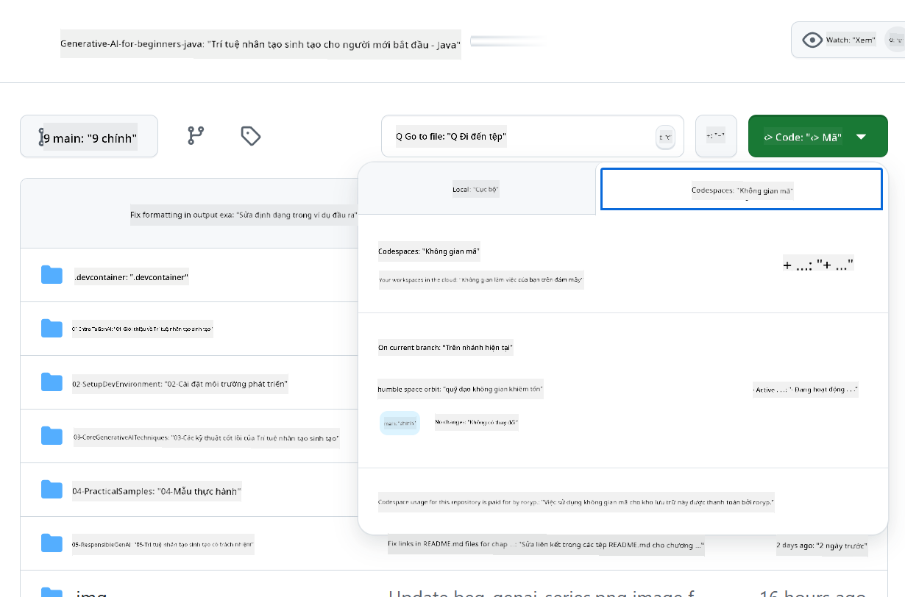

<!--
CO_OP_TRANSLATOR_METADATA:
{
  "original_hash": "e00bbea0f95c611aa3bec676d23e8b43",
  "translation_date": "2025-07-21T19:36:36+00:00",
  "source_file": "02-SetupDevEnvironment/getting-started-azure-openai.md",
  "language_code": "vi"
}
-->
# Thiết Lập Môi Trường Phát Triển cho Azure OpenAI

> **Bắt Đầu Nhanh**: Hướng dẫn này dành cho thiết lập Azure OpenAI. Để bắt đầu ngay với các mô hình miễn phí, hãy sử dụng [GitHub Models with Codespaces](./README.md#quick-start-cloud).

Hướng dẫn này sẽ giúp bạn thiết lập các mô hình Azure AI Foundry cho ứng dụng Java AI trong khóa học này.

## Mục Lục

- [Tổng Quan Thiết Lập Nhanh](../../../02-SetupDevEnvironment)
- [Bước 1: Tạo Tài Nguyên Azure AI Foundry](../../../02-SetupDevEnvironment)
  - [Tạo Hub và Dự Án](../../../02-SetupDevEnvironment)
  - [Triển Khai Mô Hình GPT-4o-mini](../../../02-SetupDevEnvironment)
- [Bước 2: Tạo Codespace](../../../02-SetupDevEnvironment)
- [Bước 3: Cấu Hình Môi Trường](../../../02-SetupDevEnvironment)
- [Bước 4: Kiểm Tra Thiết Lập](../../../02-SetupDevEnvironment)
- [Tiếp Theo Là Gì?](../../../02-SetupDevEnvironment)
- [Tài Nguyên](../../../02-SetupDevEnvironment)
- [Tài Nguyên Bổ Sung](../../../02-SetupDevEnvironment)

## Tổng Quan Thiết Lập Nhanh

1. Tạo tài nguyên Azure AI Foundry (Hub, Dự Án, Mô Hình)
2. Tạo Codespace với container phát triển Java
3. Cấu hình tệp .env với thông tin xác thực Azure OpenAI
4. Kiểm tra thiết lập với dự án mẫu

## Bước 1: Tạo Tài Nguyên Azure AI Foundry

### Tạo Hub và Dự Án

1. Truy cập [Azure AI Foundry Portal](https://ai.azure.com/) và đăng nhập
2. Nhấp vào **+ Create** → **New hub** (hoặc điều hướng đến **Management** → **All hubs** → **+ New hub**)
3. Cấu hình hub của bạn:
   - **Hub name**: ví dụ, "MyAIHub"
   - **Subscription**: Chọn gói Azure của bạn
   - **Resource group**: Tạo mới hoặc chọn nhóm hiện có
   - **Location**: Chọn vị trí gần bạn nhất
   - **Storage account**: Sử dụng mặc định hoặc cấu hình tùy chỉnh
   - **Key vault**: Sử dụng mặc định hoặc cấu hình tùy chỉnh
   - Nhấp **Next** → **Review + create** → **Create**
4. Sau khi tạo xong, nhấp vào **+ New project** (hoặc **Create project** từ trang tổng quan của hub)
   - **Project name**: ví dụ, "GenAIJava"
   - Nhấp **Create**

### Triển Khai Mô Hình GPT-4o-mini

1. Trong dự án của bạn, đi đến **Model catalog** và tìm kiếm **gpt-4o-mini**
   - *Lựa chọn thay thế: Đi đến **Deployments** → **+ Create deployment***
2. Nhấp **Deploy** trên thẻ mô hình gpt-4o-mini
3. Cấu hình triển khai:
   - **Deployment name**: "gpt-4o-mini"
   - **Model version**: Sử dụng phiên bản mới nhất
   - **Deployment type**: Standard
4. Nhấp **Deploy**
5. Sau khi triển khai, đi đến tab **Deployments** và sao chép các giá trị sau:
   - **Deployment name** (ví dụ, "gpt-4o-mini")
   - **Target URI** (ví dụ, `https://your-hub-name.openai.azure.com/`) 
      > **Quan Trọng**: Chỉ sao chép URL cơ bản (ví dụ, `https://myhub.openai.azure.com/`) không phải toàn bộ đường dẫn endpoint.
   - **Key** (từ phần Keys and Endpoint)

> **Vẫn gặp khó khăn?** Truy cập tài liệu chính thức [Azure AI Foundry Documentation](https://learn.microsoft.com/azure/ai-foundry/how-to/create-projects?tabs=ai-foundry&pivots=hub-project)

## Bước 2: Tạo Codespace

1. Fork repository này vào tài khoản GitHub của bạn
   > **Lưu ý**: Nếu bạn muốn chỉnh sửa cấu hình cơ bản, hãy xem [Dev Container Configuration](../../../.devcontainer/devcontainer.json)
2. Trong repo đã fork, nhấp vào **Code** → tab **Codespaces**
3. Nhấp **...** → **New with options...**

4. Chọn **Dev container configuration**: 
   - **Generative AI Java Development Environment**
5. Nhấp **Create codespace**

## Bước 3: Cấu Hình Môi Trường

Khi Codespace của bạn đã sẵn sàng, thiết lập thông tin xác thực Azure OpenAI:

1. **Đi đến dự án mẫu từ thư mục gốc của repository:**
   ```bash
   cd 02-SetupDevEnvironment/src/basic-chat-azure
   ```

2. **Tạo tệp .env:**
   ```bash
   cp .env.example .env
   ```

3. **Chỉnh sửa tệp .env với thông tin xác thực Azure OpenAI của bạn:**
   ```bash
   # Your Azure OpenAI API key (from Azure AI Foundry portal)
   AZURE_AI_KEY=your-actual-api-key-here
   
   # Your Azure OpenAI endpoint URL (e.g., https://myhub.openai.azure.com/)
   AZURE_AI_ENDPOINT=https://your-hub-name.openai.azure.com/
   ```

   > **Lưu Ý Bảo Mật**: 
   > - Không bao giờ commit tệp `.env` vào hệ thống kiểm soát phiên bản
   > - Tệp `.env` đã được thêm vào `.gitignore`
   > - Giữ an toàn cho các khóa API của bạn và thay đổi chúng thường xuyên

## Bước 4: Kiểm Tra Thiết Lập

Chạy ứng dụng mẫu để kiểm tra kết nối Azure OpenAI:

```bash
mvn clean spring-boot:run
```

Bạn sẽ thấy phản hồi từ mô hình GPT-4o-mini!

> **Người Dùng VS Code**: Bạn cũng có thể nhấn `F5` trong VS Code để chạy ứng dụng. Cấu hình khởi chạy đã được thiết lập sẵn để tự động tải tệp `.env` của bạn.

> **Ví dụ đầy đủ**: Xem [Ví dụ Azure OpenAI Từ Đầu Đến Cuối](./src/basic-chat-azure/README.md) để biết hướng dẫn chi tiết và cách khắc phục sự cố.

## Tiếp Theo Là Gì?

**Thiết Lập Hoàn Tất!** Bạn đã có:
- Azure OpenAI với gpt-4o-mini được triển khai
- Cấu hình tệp .env cục bộ
- Môi trường phát triển Java sẵn sàng

**Tiếp tục đến** [Chương 3: Kỹ Thuật AI Tạo Sinh Cốt Lõi](../03-CoreGenerativeAITechniques/README.md) để bắt đầu xây dựng các ứng dụng AI!

## Tài Nguyên

- [Tài Liệu Azure AI Foundry](https://learn.microsoft.com/azure/ai-services/)
- [Tài Liệu Spring AI Azure OpenAI](https://docs.spring.io/spring-ai/reference/api/clients/azure-openai-chat.html)
- [Azure OpenAI Java SDK](https://learn.microsoft.com/java/api/overview/azure/ai-openai-readme)

## Tài Nguyên Bổ Sung

- [Tải VS Code](https://code.visualstudio.com/Download)
- [Tải Docker Desktop](https://www.docker.com/products/docker-desktop)
- [Cấu Hình Dev Container](../../../.devcontainer/devcontainer.json)

**Tuyên bố miễn trừ trách nhiệm**:  
Tài liệu này đã được dịch bằng dịch vụ dịch thuật AI [Co-op Translator](https://github.com/Azure/co-op-translator). Mặc dù chúng tôi cố gắng đảm bảo độ chính xác, xin lưu ý rằng các bản dịch tự động có thể chứa lỗi hoặc không chính xác. Tài liệu gốc bằng ngôn ngữ bản địa nên được coi là nguồn thông tin chính thức. Đối với các thông tin quan trọng, khuyến nghị sử dụng dịch vụ dịch thuật chuyên nghiệp bởi con người. Chúng tôi không chịu trách nhiệm cho bất kỳ sự hiểu lầm hoặc diễn giải sai nào phát sinh từ việc sử dụng bản dịch này.