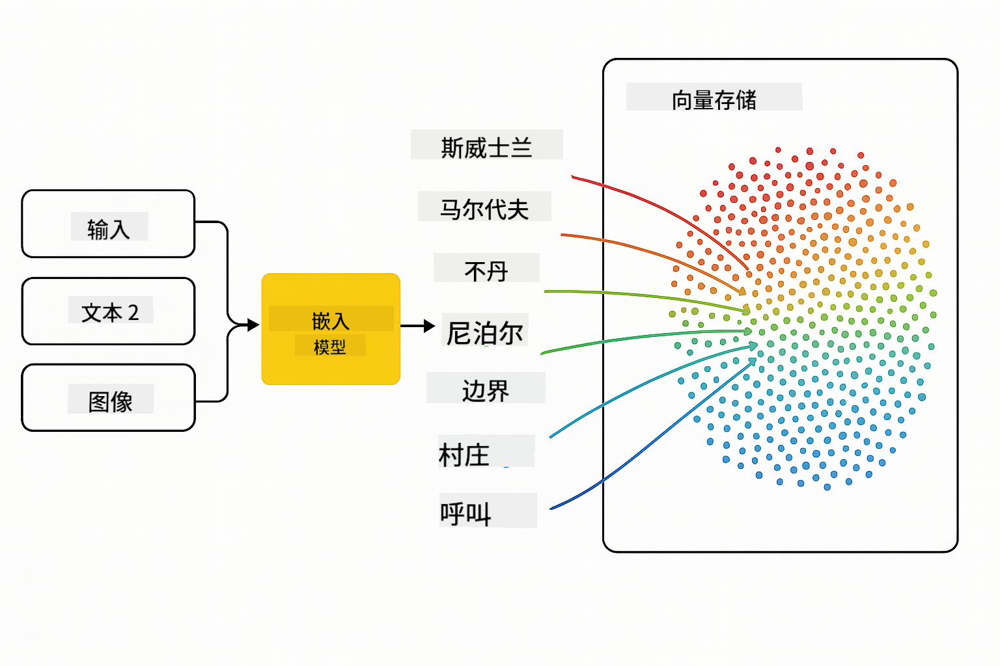
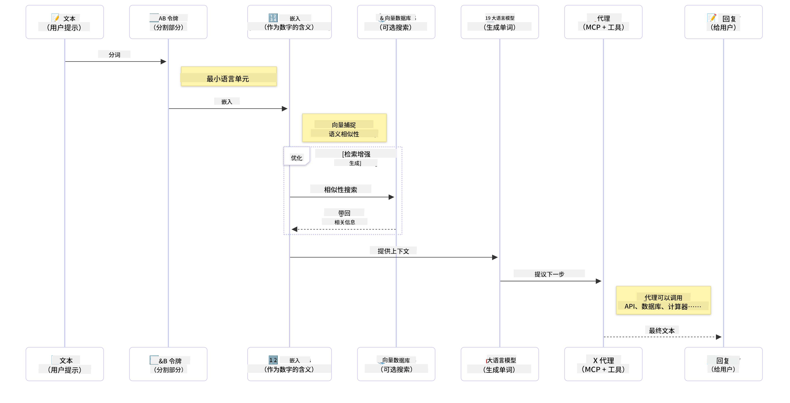

<!--
CO_OP_TRANSLATOR_METADATA:
{
  "original_hash": "75bfb080ca725e8a9aa9c80cae25fba1",
  "translation_date": "2025-07-29T08:19:31+00:00",
  "source_file": "01-IntroToGenAI/README.md",
  "language_code": "zh"
}
-->
# 生成式人工智能简介 - Java 版

## 你将学到什么

- **生成式人工智能基础知识**，包括大型语言模型（LLMs）、提示工程、tokens、嵌入和向量数据库
- **比较 Java 的 AI 开发工具**，包括 Azure OpenAI SDK、Spring AI 和 OpenAI Java SDK
- **了解模型上下文协议（Model Context Protocol）**及其在 AI 代理通信中的作用

## 目录

- [简介](../../../01-IntroToGenAI)
- [生成式人工智能概念快速回顾](../../../01-IntroToGenAI)
- [提示工程回顾](../../../01-IntroToGenAI)
- [Tokens、嵌入和代理](../../../01-IntroToGenAI)
- [Java 的 AI 开发工具和库](../../../01-IntroToGenAI)
  - [OpenAI Java SDK](../../../01-IntroToGenAI)
  - [Spring AI](../../../01-IntroToGenAI)
  - [Azure OpenAI Java SDK](../../../01-IntroToGenAI)
- [总结](../../../01-IntroToGenAI)
- [下一步](../../../01-IntroToGenAI)

## 简介

欢迎来到《生成式人工智能入门 - Java 版》的第一章！本章将为你介绍生成式人工智能的核心概念，以及如何使用 Java 与这些技术协作。你将学习 AI 应用程序的基本构建模块，包括大型语言模型（LLMs）、tokens、嵌入和 AI 代理。我们还将探索本课程中会用到的主要 Java 工具。

### 生成式人工智能概念快速回顾

生成式人工智能是一种能够根据从数据中学习到的模式和关系创建新内容（如文本、图像或代码）的人工智能技术。生成式 AI 模型可以生成类似人类的响应、理解上下文，有时甚至能创造出看似人类创作的内容。

在开发 Java AI 应用程序时，你将使用**生成式 AI 模型**来创建内容。这些模型的一些能力包括：

- **文本生成**：为聊天机器人、内容创作和文本补全生成类似人类的文本。
- **图像生成与分析**：生成逼真的图像、增强照片以及检测对象。
- **代码生成**：编写代码片段或脚本。

不同类型的模型针对不同任务进行了优化。例如，**小型语言模型（SLMs）**和**大型语言模型（LLMs）**都可以处理文本生成，但 LLMs 通常在处理复杂任务时表现更佳。而对于图像相关任务，你可能会使用专门的视觉模型或多模态模型。

当然，这些模型的响应并非总是完美的。你可能听说过模型会“幻觉”（hallucinate），即以权威的方式生成错误信息。但通过为模型提供清晰的指令和上下文，你可以帮助它生成更好的响应。这就是**提示工程**的用武之地。

#### 提示工程回顾

提示工程是设计有效输入以引导 AI 模型生成期望输出的实践。它包括以下几个方面：

- **清晰性**：确保指令清晰且无歧义。
- **上下文**：提供必要的背景信息。
- **约束条件**：指定任何限制或格式要求。

提示工程的一些最佳实践包括提示设计、清晰指令、任务分解、单样本学习和少样本学习，以及提示微调。测试不同的提示对于找到适合特定用例的最佳方法至关重要。

在开发应用程序时，你将使用不同类型的提示：
- **系统提示**：设置模型行为的基本规则和上下文
- **用户提示**：来自应用程序用户的输入数据
- **助手提示**：基于系统提示和用户提示生成的模型响应

> **了解更多**：在 [生成式 AI 入门课程的提示工程章节](https://github.com/microsoft/generative-ai-for-beginners/tree/main/04-prompt-engineering-fundamentals) 中了解更多提示工程内容。

#### Tokens、嵌入和代理

在使用生成式 AI 模型时，你会接触到一些术语，如**tokens**、**嵌入**、**代理**和**模型上下文协议（MCP）**。以下是这些概念的详细介绍：

- **Tokens**：Tokens 是模型中最小的文本单位，可以是单词、字符或子词。Tokens 用于将文本数据表示为模型可以理解的格式。例如，句子“The quick brown fox jumped over the lazy dog”可能被标记为 ["The", " quick", " brown", " fox", " jumped", " over", " the", " lazy", " dog"] 或 ["The", " qu", "ick", " br", "own", " fox", " jump", "ed", " over", " the", " la", "zy", " dog"]，具体取决于标记化策略。

标记化是将文本分解为这些更小单位的过程。这很重要，因为模型是基于 tokens 而非原始文本进行操作的。提示中的 token 数量会影响模型的响应长度和质量，因为模型对其上下文窗口（例如 GPT-4 的总上下文，包括输入和输出）有 token 限制。

  在 Java 中，你可以使用 OpenAI SDK 等库在向 AI 模型发送请求时自动处理标记化。

- **嵌入**：嵌入是捕捉语义意义的 tokens 的向量表示。它们是数值表示（通常是浮点数数组），使模型能够理解单词之间的关系并生成语境相关的响应。相似的单词具有相似的嵌入，这使得模型能够理解同义词和语义关系。

  在 Java 中，你可以使用 OpenAI SDK 或其他支持嵌入生成的库来生成嵌入。这些嵌入对于语义搜索等任务至关重要，在语义搜索中，你希望根据含义而非精确文本匹配找到相似内容。

- **向量数据库**：向量数据库是针对嵌入优化的专用存储系统。它们支持高效的相似性搜索，对于需要基于语义相似性而非精确匹配从大型数据集中查找相关信息的检索增强生成（RAG）模式至关重要。

> **注意**：本课程不会涵盖向量数据库，但它们在实际应用中非常常见，因此值得一提。

- **代理和 MCP**：代理是能够自主与模型、工具和外部系统交互的 AI 组件。模型上下文协议（MCP）为代理安全访问外部数据源和工具提供了标准化方式。更多内容请参考我们的 [MCP 入门课程](https://github.com/microsoft/mcp-for-beginners)。

在 Java AI 应用程序中，你将使用 tokens 进行文本处理，使用嵌入进行语义搜索和 RAG，使用向量数据库进行数据检索，并结合 MCP 使用代理构建智能工具系统。

### Java 的 AI 开发工具和库

Java 提供了出色的 AI 开发工具。本课程将探索三大主要库：OpenAI Java SDK、Azure OpenAI SDK 和 Spring AI。

以下是每章示例中使用的 SDK 的快速参考表：

| 章节 | 示例 | SDK |
|------|------|-----|
| 02-SetupDevEnvironment | github-models | OpenAI Java SDK |
| 02-SetupDevEnvironment | basic-chat-azure | Spring AI Azure OpenAI |
| 03-CoreGenerativeAITechniques | examples | Azure OpenAI SDK |
| 04-PracticalSamples | petstory | OpenAI Java SDK |
| 04-PracticalSamples | foundrylocal | OpenAI Java SDK |
| 04-PracticalSamples | calculator | Spring AI MCP SDK + LangChain4j |

**SDK 文档链接：**
- [Azure OpenAI Java SDK](https://github.com/Azure/azure-sdk-for-java/tree/azure-ai-openai_1.0.0-beta.16/sdk/openai/azure-ai-openai)
- [Spring AI](https://docs.spring.io/spring-ai/reference/)
- [OpenAI Java SDK](https://github.com/openai/openai-java)
- [LangChain4j](https://docs.langchain4j.dev/)

#### OpenAI Java SDK

OpenAI SDK 是 OpenAI API 的官方 Java 库。它提供了一个简单且一致的接口，用于与 OpenAI 的模型交互，使得将 AI 功能集成到 Java 应用程序中变得轻松。第 2 章的 GitHub Models 示例、第 4 章的 Pet Story 应用程序和 Foundry Local 示例展示了 OpenAI SDK 的使用方法。

#### Spring AI

Spring AI 是一个全面的框架，为 Spring 应用程序带来了 AI 功能，并在不同 AI 提供商之间提供了一致的抽象层。它与 Spring 生态系统无缝集成，是需要 AI 功能的企业级 Java 应用程序的理想选择。

Spring AI 的优势在于它与 Spring 生态系统的无缝集成，使得使用熟悉的 Spring 模式（如依赖注入、配置管理和测试框架）构建生产就绪的 AI 应用程序变得简单。在第 2 章和第 4 章中，你将使用 Spring AI 构建利用 OpenAI 和模型上下文协议（MCP）的应用程序。

##### 模型上下文协议（MCP）

[模型上下文协议（MCP）](https://modelcontextprotocol.io/) 是一项新兴标准，使 AI 应用程序能够安全地与外部数据源和工具交互。MCP 提供了一种标准化方式，使 AI 模型能够访问上下文信息并在应用程序中执行操作。

在第 4 章中，你将构建一个简单的 MCP 计算器服务，展示如何使用 Spring AI 实现模型上下文协议的基础知识，以及如何创建基本的工具集成和服务架构。

#### Azure OpenAI Java SDK

Azure OpenAI Java 客户端库是 OpenAI REST API 的一个适配版本，提供了符合 Java 习惯的接口，并与 Azure SDK 生态系统的其他部分集成。在第 3 章中，你将使用 Azure OpenAI SDK 构建应用程序，包括聊天应用程序、函数调用和 RAG（检索增强生成）模式。

> 注意：Azure OpenAI SDK 的功能落后于 OpenAI Java SDK，因此在未来的项目中，建议优先考虑使用 OpenAI Java SDK。

## 总结

本章内容到此结束！你现在已经了解了：

- 生成式人工智能的核心概念——从 LLMs 和提示工程到 tokens、嵌入和向量数据库
- Java AI 开发的工具选项：Azure OpenAI SDK、Spring AI 和 OpenAI Java SDK
- 什么是模型上下文协议，以及它如何使 AI 代理与外部工具协作

## 下一步

[第 2 章：设置开发环境](../02-SetupDevEnvironment/README.md)

**免责声明**：  
本文档使用AI翻译服务[Co-op Translator](https://github.com/Azure/co-op-translator)进行翻译。尽管我们努力确保准确性，但请注意，自动翻译可能包含错误或不准确之处。应以原始语言的文档作为权威来源。对于关键信息，建议使用专业人工翻译。对于因使用本翻译而引起的任何误解或误读，我们概不负责。