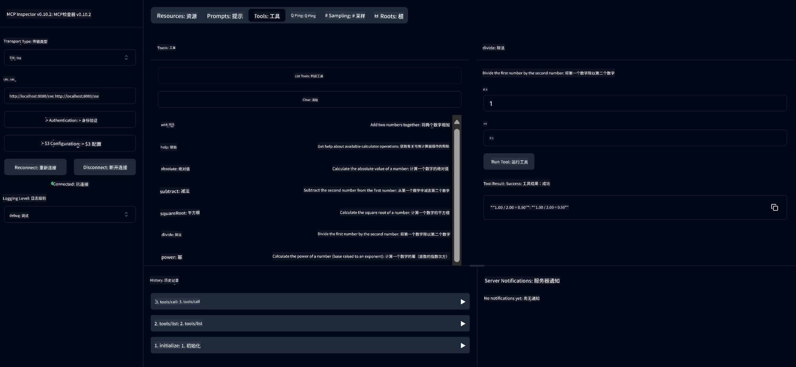

<!--
CO_OP_TRANSLATOR_METADATA:
{
  "original_hash": "7bf9a4a832911269a8bd0decb97ff36c",
  "translation_date": "2025-07-21T16:42:31+00:00",
  "source_file": "04-PracticalSamples/mcp/calculator/README.md",
  "language_code": "zh"
}
-->
# 基础计算器 MCP 服务

>**注意**: 本章包含一个[**教程**](./TUTORIAL.md)，指导您运行完成的示例。

欢迎体验您的第一个 **模型上下文协议 (MCP)** 实践项目！在前几章中，您已经学习了生成式 AI 的基础知识并设置了开发环境。现在是时候构建一些实用的东西了。

这个计算器服务展示了 AI 模型如何通过 MCP 安全地与外部工具交互。与其依赖 AI 模型有时不可靠的数学能力，我们将展示如何构建一个稳健的系统，让 AI 调用专业服务以获得准确的计算结果。

## 目录

- [您将学到什么](../../../../../04-PracticalSamples/mcp/calculator)
- [先决条件](../../../../../04-PracticalSamples/mcp/calculator)
- [关键概念](../../../../../04-PracticalSamples/mcp/calculator)
- [快速开始](../../../../../04-PracticalSamples/mcp/calculator)
- [可用的计算器操作](../../../../../04-PracticalSamples/mcp/calculator)
- [测试客户端](../../../../../04-PracticalSamples/mcp/calculator)
  - [1. 直接 MCP 客户端 (SDKClient)](../../../../../04-PracticalSamples/mcp/calculator)
  - [2. AI 驱动的客户端 (LangChain4jClient)](../../../../../04-PracticalSamples/mcp/calculator)
- [MCP Inspector (Web UI)](../../../../../04-PracticalSamples/mcp/calculator)
  - [分步说明](../../../../../04-PracticalSamples/mcp/calculator)

## 您将学到什么

通过完成本示例，您将了解：
- 如何使用 Spring Boot 创建兼容 MCP 的服务
- 直接协议通信与 AI 驱动交互的区别
- AI 模型如何决定何时以及如何使用外部工具
- 构建工具支持的 AI 应用程序的最佳实践

非常适合初学者学习 MCP 概念并准备构建他们的第一个 AI 工具集成！

## 先决条件

- Java 21+
- Maven 3.6+
- **GitHub Token**: AI 驱动客户端所需。如果尚未设置，请参阅[第 2 章：设置开发环境](../../../02-SetupDevEnvironment/README.md)中的说明。

## 关键概念

**模型上下文协议 (MCP)** 是一种标准化方式，用于让 AI 应用程序安全地连接到外部工具。可以将其视为一座“桥梁”，允许 AI 模型使用像我们的计算器这样的外部服务。与其让 AI 模型自己尝试进行数学运算（可能不可靠），它可以调用我们的计算器服务以获得准确的结果。MCP 确保这种通信安全且一致。

**服务器发送事件 (SSE)** 实现了服务器与客户端之间的实时通信。与传统的 HTTP 请求（请求后等待响应）不同，SSE 允许服务器持续向客户端发送更新。这非常适合 AI 应用程序，尤其是需要流式响应或处理时间较长的场景。

**AI 工具与函数调用** 使 AI 模型能够根据用户请求自动选择并使用外部函数（如计算器操作）。当您问“15 + 27 等于多少？”时，AI 模型会理解您需要进行加法运算，自动调用我们的 `add` 工具并传入正确的参数（15, 27），然后以自然语言返回结果。AI 充当一个智能协调者，知道何时以及如何使用每个工具。

## 快速开始

### 1. 进入计算器应用程序目录
```bash
cd Generative-AI-for-beginners-java/04-PracticalSamples/mcp/calculator
```

### 2. 构建并运行
```bash
mvn clean install -DskipTests
java -jar target/calculator-server-0.0.1-SNAPSHOT.jar
```

### 3. 使用客户端测试
- **SDKClient**: 直接 MCP 协议交互
- **LangChain4jClient**: AI 驱动的自然语言交互（需要 GitHub Token）

## 可用的计算器操作

- `add(a, b)`，`subtract(a, b)`，`multiply(a, b)`，`divide(a, b)`
- `power(base, exponent)`，`squareRoot(number)`，`absolute(number)`
- `modulus(a, b)`，`help()`

## 测试客户端

### 1. 直接 MCP 客户端 (SDKClient)
测试原始 MCP 协议通信。运行命令：
```bash
mvn test-compile exec:java -Dexec.mainClass="com.microsoft.mcp.sample.client.SDKClient" -Dexec.classpathScope=test
```

### 2. AI 驱动的客户端 (LangChain4jClient)
展示与 GitHub 模型的自然语言交互。需要 GitHub Token（参见[先决条件](../../../../../04-PracticalSamples/mcp/calculator)）。

**运行命令：**
```bash
mvn test-compile exec:java -Dexec.mainClass="com.microsoft.mcp.sample.client.LangChain4jClient" -Dexec.classpathScope=test
```

## MCP Inspector (Web UI)

MCP Inspector 提供了一个可视化的 Web 界面，用于测试您的 MCP 服务，无需编写代码。非常适合初学者理解 MCP 的工作原理！

### 分步说明：

1. **启动计算器服务器**（如果尚未运行）：
   ```bash
   java -jar target/calculator-server-0.0.1-SNAPSHOT.jar
   ```

2. **在新终端中安装并运行 MCP Inspector**：
   ```bash
   npx @modelcontextprotocol/inspector
   ```

3. **打开 Web 界面**：
   - 查找类似“Inspector running at http://localhost:6274”的消息
   - 在浏览器中打开该 URL

4. **连接到您的计算器服务**：
   - 在 Web 界面中，将传输类型设置为“SSE”
   - 将 URL 设置为：`http://localhost:8080/sse`
   - 点击“Connect”按钮

5. **浏览可用工具**：
   - 点击“List Tools”查看所有计算器操作
   - 您将看到诸如 `add`、`subtract`、`multiply` 等函数

6. **测试一个计算器操作**：
   - 选择一个工具（例如“add”）
   - 输入参数（例如 `a: 15`，`b: 27`）
   - 点击“Run Tool”
   - 查看您的 MCP 服务返回的结果！

这种可视化方法可以帮助您在构建自己的客户端之前，准确理解 MCP 通信的工作原理。



---
**参考资料:** [MCP Server Boot Starter 文档](https://docs.spring.io/spring-ai/reference/api/mcp/mcp-server-boot-starter-docs.html)

**免责声明**：  
本文档使用AI翻译服务[Co-op Translator](https://github.com/Azure/co-op-translator)进行翻译。尽管我们努力确保翻译的准确性，但请注意，自动翻译可能包含错误或不准确之处。原始语言的文档应被视为权威来源。对于重要信息，建议使用专业人工翻译。我们对因使用此翻译而产生的任何误解或误读不承担责任。